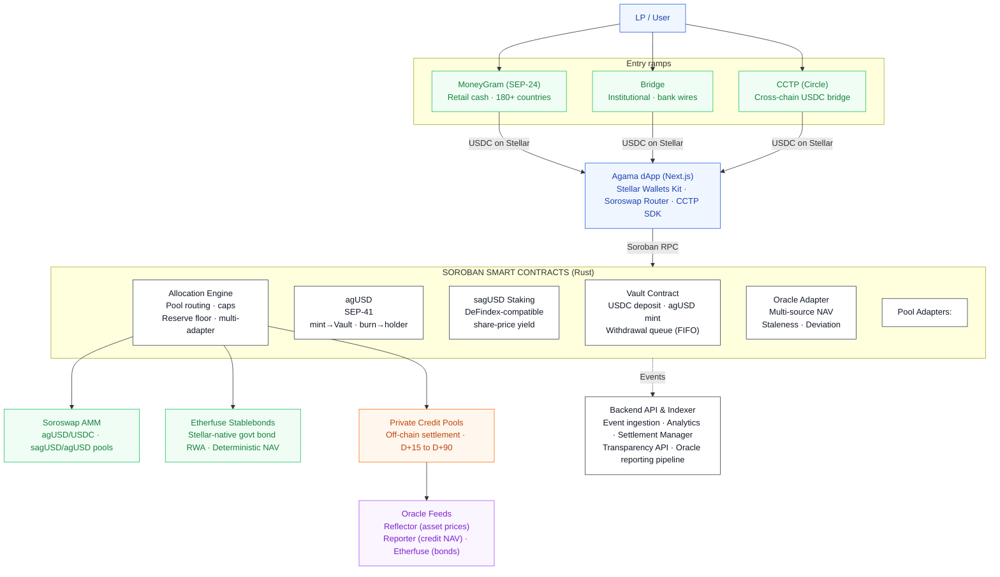

# Agama Finance Soroban Contracts

Private Credit Yield Vaults on Stellar · **[Try the app](https://app.agama.finance/stellar)**

Users deposit USDC into curated vaults and receive **agUSD**, a composable synthetic dollar backed by diversified real-world credit pools. Staking agUSD produces **sagUSD**, a yield-bearing token that appreciates as private credit repayments and on-chain strategies generate returns.

All contracts are written in Rust for the Soroban smart contract platform.

## Architecture

Entry ramps, the dApp, the Soroban contract set, allocation targets, the oracle feeds and the off-chain indexer.



Legend, as coloured in the diagram: green = Integration List protocol · orange = Off-chain component · purple = Oracle / data feed · dark outline = Core Agama contract.

The same flowchart, and the reasoning behind every box in it, is in [`docs/ARCHITECTURE.md`](docs/ARCHITECTURE.md) and in [`docs/Agama_Technical_Architecture.pdf`](docs/Agama_Technical_Architecture.pdf). The two copies of the diagram are byte identical, so they cannot drift.

## Live on Testnet

Network: **Stellar Testnet** · RPC: `https://soroban-testnet.stellar.org`

**[Test the app at app.agama.finance/stellar](https://app.agama.finance/stellar)**

### Core Contracts

| Contract | Address |
|---|---|
| USDC (Circle) | [`CBIELTK6...XQDAMA`](https://stellar.expert/explorer/testnet/contract/CBIELTK6YBZJU5UP2WWQEUCYKLPU6AUNZ2BQ4WWFEIE3USCIHMXQDAMA) |
| agUSD | [`CDO7WPJH...V2L6PL`](https://stellar.expert/explorer/testnet/contract/CDO7WPJHUFTM3Q6ZLT5FRQIK4OYX5ZG7ERDC2B5W3BWXBRPPMXV2L6PL) |
| sagUSD | [`CALOJ3UH...SRQWKX`](https://stellar.expert/explorer/testnet/contract/CALOJ3UHHZ7V4LU5J4WY3DIFIXCTL37K36SZTIKSNGVB4TANNMSRQWKX) |
| Vault Contract | [`CAK7NGMF...AFCSSL`](https://stellar.expert/explorer/testnet/contract/CAK7NGMFYPAJKFY74TOQSCIJADCDCCMAOKEGFHI2O7BZBCQQTIAFCSSL) |
| Allocation Engine | [`CBM2RACB...G56HRT`](https://stellar.expert/explorer/testnet/contract/CBM2RACBNQU6YKRQAXWMGVFANCO3AJ4LOQONEY5O7IPMXPUBS6G56HRT) |
| Oracle Adapter | [`CCIABPQM...N4DWJG`](https://stellar.expert/explorer/testnet/contract/CCIABPQMPGS4HSDQYN46M67LV6B5LCYO6X2XLCI27JSOMKUMN3N4DWJG) |

### Pool Adapters

| Adapter | Originator | Jurisdiction | Address |
|---|---|---|---|
| Private Credit | QIRO | LU | [`CCDB2I75...CA4PSR`](https://stellar.expert/explorer/testnet/contract/CCDB2I753FQJCRMVQVSYMUU2UT2R2H2UQJ7I2OLESJ7EKHCZUWCA4PSR) |
| Etherfuse | ETHERFUS | MX | [`CADNIBDB...KF4ZFV`](https://stellar.expert/explorer/testnet/contract/CADNIBDB5LZHGOOSVTL2LF47XCRPEL53IHBES2Y4RIORI4I3VCKF4ZFV) |

Both adapters are registered with the Allocation Engine. `originator` and
`jurisdiction` are the buckets the concentration caps aggregate over, so two
pools fronted by the same counterparty count as one position.

The Etherfuse adapter, the Oracle Adapter and sagUSD are the same contracts as
before the second security review. None of the three changed, and none of them
had to be redeployed to follow the Vault and the Engine that did: the Etherfuse
adapter moved with `set_counterparties`, sagUSD with `set_agusd`, and the Oracle
Adapter binds neither counterparty and only had to be pointed at. Those setters
were added by the first review on the argument that a pointer with no way back
had already cost this protocol six contracts. This is the deployment that had a
use for them, and they saved three redeployments out of six.

### Superseded Contracts

Every address that has ever been live stays in this table and in
[`deployments/testnet.json`](deployments/testnet.json), with the reason it was
replaced. None of them is deleted, and none of them is quietly reused.

| Contract | Address | Why it was replaced |
|---|---|---|
| agUSD (`contracts/agusd`), first deployment | [`CCXEP6QA...HNQ6H3`](https://stellar.expert/explorer/testnet/contract/CCXEP6QAAYEMFMV2JGBULD2NS6AQB6KQSBHLPPBJSDBCN6HOYIHNQ6H3) | A self contained vault rather than a plain token: it mints only inside its own `deposit()` and exposes no `mint`, so the Vault Contract could never mint against a deposit. Still deployed, still held, and left exactly as it is. |
| Vault Contract, first deployment | [`CAVKHGBQ...5OFJW3`](https://stellar.expert/explorer/testnet/contract/CAVKHGBQUEPVTWHFJGU42ZVZA6VZSM6RZXFHCUXTT72JFRWNPF5OFJW3) | Wired to that token at `initialize()` with no setter and no upgrade path, so its `deposit()` could never mint. |
| Vault Contract, second deployment | [`CDQP7L5R...TR3KS4`](https://stellar.expert/explorer/testnet/contract/CDQP7L5RZ6AM4J2PZETMG7TC4M3CDTVQ6QAMYPLG43Z6GAOCB4TR3KS4) | Initialized with the first Allocation Engine as its allocation counterparty, and `settle_allocation` authorizes that address and no other. That Engine governs a different Vault, so this one could take deposits and pay its queue and never release a dollar to a pool. It carries `set_agusd` but not `set_engine`, so the pointer that mattered could not be corrected. |
| agUSD (`contracts/agusd-core`), first deployment | [`CCFICOHA...6H54WV`](https://stellar.expert/explorer/testnet/contract/CCFICOHAC4V6M5CDI62O5SWCZR43XG6JXNYFBZ4HAVQJBUCR4V6H54WV) | Names the second Vault as its only minter and has no `set_minter`, so issuance could not follow the Vault to its replacement. Retired at a zero supply. |
| Allocation Engine, first deployment | [`CANDJEHB...SL2SGS`](https://stellar.expert/explorer/testnet/contract/CANDJEHBZUPGBWQMWM567Z3NQR4AHJKJSMWB4LTXPT6SC7GSRKSL2SGS) | Stores the Vault it governs at `initialize()` with no setter, and that Vault had been superseded, so every cap it enforced was measured against a balance sheet nobody was depositing into. |
| Private credit adapter, first deployment | [`CCDZRKZD...CXT3VZ`](https://stellar.expert/explorer/testnet/contract/CCDZRKZDCWJWTFMLVJFW4LRALZEWRDKWOOD727EDO3EFFKLNDKCXT3VZ) | Stores both the Engine and the Vault at `initialize()` with no setters, and both addresses had been superseded. |
| Etherfuse adapter, first deployment | [`CBS3OGCV...KFLYKK`](https://stellar.expert/explorer/testnet/contract/CBS3OGCVYMI3XQN2ORZZNE2WKGYK24VSTVDUB3QS5HCZHBQQFWKFLYKK) | Stores both the Engine and the Vault at `initialize()` with no setters, and both addresses had been superseded. |
| sagUSD staking, first deployment | [`CABPYD4U...2XTALX`](https://stellar.expert/explorer/testnet/contract/CABPYD4U5FAYLBEBMY2MVGVF7BILXTNPWGLOPIXCMUK3QQGIAE2XTALX) | Accepts the first generation agUSD, stores it at `initialize()` with no setter, and has no re-initialization guard. Anyone can call its `initialize` a second time and take it over, so the 49.19 agUSD it still custodies should be treated as at risk; that is one of the reasons it is superseded rather than a footnote to it. |
| Vault Contract, third deployment | [`CAU54R4P...A33AFY`](https://stellar.expert/explorer/testnet/contract/CAU54R4PIHZXGCRZMJJCCIOFNMVXZHZF6BBNNSGWJT6A4UZ32MA33AFY) | Replaced within the day, after review of this branch. Its `set_engine` accepted any address, including an ordinary account, which made the pointer that releases the Vault's reserves a one call instruction to hand them over. |
| agUSD (`contracts/agusd-core`), second deployment | [`CD6OX76F...2TGYSK`](https://stellar.expert/explorer/testnet/contract/CD6OX76FZ54SNOKNR4D3JLHTVS5IO3TNVBE4WSSLR4DIS5VW3O2TGYSK) | Replaced with the Vault that mints it, since a token freezes its minter and cannot follow one. Retired at a zero supply, redeemed through its own Vault first. |
| Allocation Engine, second deployment | [`CBCLMUK4...HEAMKE`](https://stellar.expert/explorer/testnet/contract/CBCLMUK4R2CW3YVCX3OQ3GMGAXUNKA6JQWXH2AG3JW7U35FBNFHEAMKE) | Replaced with the Vault it governs. Its own guards were sound; it is here because the stack moved. |
| Private credit adapter, second deployment | [`CDKLN4NB...2RSMEV`](https://stellar.expert/explorer/testnet/contract/CDKLN4NBLLHYUOQEDLSKWM6BI7HSN4NL3W5B2MB4DUAPJG4IKA2RSMEV) | Replaced within the day, after review. Its Engine and Vault pointers moved independently and the emptiness check was retrospective only, so a repointed Vault would have misdirected repayments one allocation later. |
| Etherfuse adapter, second deployment | [`CCFYYCIH...2H6KGO`](https://stellar.expert/explorer/testnet/contract/CCFYYCIHEKQLFN5TZKGFBW3GAH6SBXA7YEWMETTR62TWPEC43X2H6KGO) | Replaced within the day, after review. Its Engine and Vault pointers moved independently and the emptiness check was retrospective only, so a repointed Vault would have misdirected repayments one allocation later. |
| sagUSD staking, second deployment | [`CDY3ED6T...BTC345`](https://stellar.expert/explorer/testnet/contract/CDY3ED6T72VJDX5RCMQOZNCV5XKJBHQVAYPNOXTWB66RNBVOS5BTC345) | Replaced within the day, after review. Its `set_agusd` keyed off the stake counter alone, and `accrue_yield` takes custody without touching it. |
| sagUSD staking, third deployment | [`CBMEW3QA...WFTHZF`](https://stellar.expert/explorer/testnet/contract/CBMEW3QALCS6FFJMK5FR7LVKUWX3MPIP26LQQQAFYMQFYVG6VUWFTHZF) | Exposes `accrue_yield` and `share_price`, the names this contract shipped with, rather than `distribute_yield` and `exchange_rate`, the names Agama committed to in its answer to the SCF panel. A wallet looking for the committed convention did not find it here. Superseded holding nothing: NAV and share supply were both zero at handover, so it strands no staker. |
| Vault Contract, fourth deployment | [`CCGPF36P...F5KVRR`](https://stellar.expert/explorer/testnet/contract/CCGPF36PDG2WBBK6ZROLMNMHD67UV4MNG6PHQCN2PXWLLRBXCYF5KVRR) | Replaced after an adversarial security review. It delegated the reserve floor entirely to whatever Allocation Engine it pointed at: `settle_allocation` released USDC on the Engine's say-so and checked nothing itself, and `set_engine`'s guard, which asks an incoming Engine whether it governs this Vault, is answered correctly by any contract that stores one address. It also counted queued withdrawals as free liquidity, and its withdrawal queue could be frozen for everyone by one claim whose owner never returned. |
| agUSD (`contracts/agusd-core`), third deployment | [`CCW763RT...U4ALZL`](https://stellar.expert/explorer/testnet/contract/CCW763RTVRDQTEEQ42XCAARSJ42AKWRB2DDM62QV4XVUJFCDAWU4ALZL) | Replaced with the Vault that mints it, since a token freezes its minter and cannot follow one. Retired at a zero supply, redeemed through its own Vault first. It also predates admin rotation, which every contract now carries. |
| Allocation Engine, third deployment | [`CAFJKWLU...SZ5HUX`](https://stellar.expert/explorer/testnet/contract/CAFJKWLUGUSYEC7L5ZBNFIFEPSO5MLI7SKDMVVJCGC6Z2TGVP5SZ5HUX) | Measured every cap and the reserve floor against the Vault's gross balance, which counts USDC already owed to queued withdrawals, so it would deploy against money the protocol was committed to paying out. It had no way to recognise a credit loss: exposure moved only through `allocate` and `deallocate`, and `deallocate` transfers before it decrements, so a defaulted originator left the book reporting face value indefinitely. `register_pool` also accepted an adapter that named a different Engine and Vault. |
| Oracle Adapter, second deployment | [`CDV5BC4X...XCSV7G`](https://stellar.expert/explorer/testnet/contract/CDV5BC4XCNT5ASOZNFXBQXRGKVXGKHLRVK5EDX6XP5J6EBIZWSXCSV7G) | Its guards were all relative to a previous value and it had no answer for the cases where there is not one, or where there are many in a row. The first NAV for a feed was accepted unconditionally, so `push_nav(i128::MAX)` landed and became the reference every later bound was measured against; the deviation bound was per push with no rate limit, so forty pushes of +5% moved a NAV sevenfold in forty seconds; and the reference point lived in temporary storage, so waiting out its TTL removed the monotonicity check, the deviation bound and the staleness reference together. |
| Private credit adapter, third deployment | [`CBAPY7KR...ZGFTOZ`](https://stellar.expert/explorer/testnet/contract/CBAPY7KRVIG3FPGSP3VKXXA6SCDKZUWBSFDWISRJXR5V7PYPVQZGFTOZ) | Replaced with the Engine and the Vault it names. It also had no way to write off a defaulted position: `deallocate` transfers the USDC before it decrements the book, and a defaulted originator leaves the adapter holding none. |
| Etherfuse adapter, third deployment | [`CBA3GQLH...AH7EWI`](https://stellar.expert/explorer/testnet/contract/CBA3GQLHCEOCCZIDVFZ74AG4FUCEO2SN7AMGY4RSAMN4DTHW2WAH7EWI) | Replaced with the Engine and the Vault it names. It also had no way to write off a defaulted position: `deallocate` transfers the USDC before it decrements the book, and a defaulted originator leaves the adapter holding none. |
| sagUSD staking, fourth deployment | [`CCBEDKRQ...L6HFO2`](https://stellar.expert/explorer/testnet/contract/CCBEDKRQHKAP2W3NC4UIYC4WZSMJVYRXN6EQERHFII45M3PD4JL6HFO2) | Carried `report_nav`, an admin setter that overwrote the NAV outright with any non-negative value, no bound and no event. The NAV is the denominator of both directions of the share price, so against 1000 agUSD staked the sequence `report_nav(1)`, stake 99 stroops for 99% of the share supply, `report_nav` back, unstake, walks away with 990 agUSD of somebody else's deposit. Superseded holding nothing. |

| Vault Contract, fifth deployment | [`CCW5EQCV...KDSIWP`](https://stellar.expert/explorer/testnet/contract/CCW5EQCVHXA2PTXN4Y4QMO4O4YMG6BRMB7M2PYASILFI53BL3CKDSIWP) | Replaced after a second adversarial security review. Its reserve floor was a share of net assets, and `record_writedown` lowers net assets with no cash moving, so every write-down handed back releasable headroom worth `floor_bps` of itself: allocate to the floor, write the position off, allocate to the new floor, and 999.9999999 of every 1000 USDC leaves a Vault holding a 25% floor with every individual call inside the limit. It also trapped on a withdrawal payout the USDC contract refused to deliver, and USDC is a Stellar Asset Contract, so a claimant with no trustline, a frozen one or a limit below the claim froze the whole FIFO queue permanently for everybody behind them. This is the contract the exploit in [The Second Security Review, On-Chain](#the-second-security-review-on-chain) is submitted against. |
| Allocation Engine, fourth deployment | [`CAOGJDWH...KJDONN`](https://stellar.expert/explorer/testnet/contract/CAOGJDWH5SZAVPGLBB2NCKGPT4OUFT3YEKUCKEJP6BVN3CR2WUKJDONN) | Replaced after a second adversarial security review. Its reserve floor was a share of net assets, and `record_writedown` lowers net assets with no cash moving, so every write-down handed back releasable headroom worth `floor_bps` of itself: allocate to the floor, write the position off, allocate to the new floor, and 999.9999999 of every 1000 USDC leaves a Vault holding a 25% floor with every individual call inside the limit. `get_reserve_ratio` had the same denominator, so recognising a loss made the reported liquidity ratio go up. |
| agUSD (`contracts/agusd-core`), fourth deployment | [`CANR4HJC...VJGIYG`](https://stellar.expert/explorer/testnet/contract/CANR4HJCDO7KDIUKTNGOJJUSZ45VB6EVR5IFHTOPQUCGAZ2XEDVJGIYG) | Replaced with the Vault that mints it, since a token freezes its minter at the first mint and cannot follow one. Retired at a zero supply, redeemed through its own Vault first. |
| Private credit adapter, fourth deployment | [`CBWFVABY...JT5BBT`](https://stellar.expert/explorer/testnet/contract/CBWFVABYRGKAGDN54MIN4GIXQO3ALVPJ3POSVFDFKUQSLYL4M4JT5BBT) | Not replaced because its code changed, and that is the point of the row. It could not follow the new Engine and Vault because `set_counterparties` refuses an adapter holding USDC, and it holds 0.2 USDC left over from a written-down position: the exposure is zero, `deallocate` is capped at zero, and there is no sweep entry point anywhere. The cash and the repair path are both stuck. That is finding M2 of the second review, recorded and left for triage, and this retirement is what it has cost. |
| sagUSD staking, fifth deployment | [`CDU7BYCE...GVYE7X`](https://stellar.expert/explorer/testnet/contract/CDU7BYCE535Y4WU6FAQTMNPLR3RD7HTGWR2NETW7EEPAQTLY2XGVYE7X) | Replaced with the agUSD it accepts. It had taken custody, which closes `set_agusd` for good, so it could not follow. Its stake was unwound and redeemed before the handover, so it strands nobody. Its successor had taken none and was repointed in place rather than redeployed again. |
| Vault Contract, sixth and seventh deployments | [`CCVFI7YG...DFIKXT`](https://stellar.expert/explorer/testnet/contract/CCVFI7YGBYL346U4NY2TSXGIH3766LKK74BJ5VDCKX5YZFJIUBDFIKXT) · [`CBIJCFWZ...27JDPK`](https://stellar.expert/explorer/testnet/contract/CBIJCFWZXCHMWBEDXBCCKIPVTPUI4TDMZOMMI6S7URU5GLTA5627JDPK) | Two intermediate generations from the second review, each byte for byte the contract that replaced it. They were retired because the on-chain smoke runs left them carrying `recognised_losses` from experiments rather than credit events, and that counter is deliberately permanent: it is what stops a write-down buying room under the reserve floor. A book whose floor is not tightened for good by a test is therefore only reachable through a fresh deployment. The permanence is the fix working, and these two rows are its price. |
| Allocation Engine, fifth and sixth deployments | [`CA2KUSVW...JJ7YAZ`](https://stellar.expert/explorer/testnet/contract/CA2KUSVWB6G5MTA32XXAGACXNHQQM3ETND3CWVJRVTNPLG2PXIJJ7YAZ) · [`CB45BH7X...2EEK4K`](https://stellar.expert/explorer/testnet/contract/CB45BH7XYH6QWWSOI67Z4IEK6VYF7TO53OYQIFKLIMJ6ZZOBXJ2EEK4K) | Two intermediate generations from the second review, each byte for byte the contract that replaced it. They were retired because the on-chain smoke runs left them carrying `recognised_losses` from experiments rather than credit events, and that counter is deliberately permanent: it is what stops a write-down buying room under the reserve floor. A book whose floor is not tightened for good by a test is therefore only reachable through a fresh deployment. The permanence is the fix working, and these two rows are its price. |
| agUSD (`contracts/agusd-core`), fifth and sixth deployments | [`CAT5VV5B...QR3FXA`](https://stellar.expert/explorer/testnet/contract/CAT5VV5BTSFZEIAT37NRTHWSYS6LQCIZ7AIERGSFK2GRWY7VLNQR3FXA) · [`CCS3LZIN...NA2YZD`](https://stellar.expert/explorer/testnet/contract/CCS3LZINQQRRQQSSVXGPNEOIAGNMB6AR7UAVJEK7MZ6RGVSPVZNA2YZD) | Each replaced with the Vault that mints it. Both retired at a zero supply, redeemed through their own Vault first. |
| Private credit adapter, fifth and sixth deployments | [`CDPFTGS6...TWQFYQ`](https://stellar.expert/explorer/testnet/contract/CDPFTGS62IZHPZEGK6ENVTBLUKMLOD4OEPD7UVMJG3FCNDWS65TWQFYQ) · [`CANRYN2H...ZQUIIQ`](https://stellar.expert/explorer/testnet/contract/CANRYN2HGYU6SBQOYKCL52LSNSXKOK54ECK2UFAZTMHNPK47VUZQUIIQ) | Each replaced with the Engine and the Vault it names, and each holding USDC from a written-down position that no entry point can move, which is finding M2 again. |

Two events account for the last sixteen rows. The first seven of them are an
adversarial security review of this repository, ahead of the OtterSec audit;
the findings and the fixes are in
[The Security Review, On-Chain](#the-security-review-on-chain) below. The nine
after them are a second review, run against the fixes the first one produced, on
the reasoning that a large set of changes to a custodian is where the next bug
will be; those are in
[The Second Security Review, On-Chain](#the-second-security-review-on-chain).

One missing setter cost six contracts. The Engine could not follow its Vault,
the Vault could not follow its Engine, the token could not follow the Vault
that mints it, the adapters could not follow either, and sagUSD could not
follow the token. Every replacement carries the setter it was missing, each of
them admin gated and each closed once the contract holds state the move would
invalidate. USDC, the Oracle Adapter and the six credit vaults were not
redeployed: the Oracle Adapter binds no Vault and no Engine, so it was never
part of the problem.

**One thing is left behind.** 1.2 USDC of working capital sits in the first
Vault Contract. It was never minted against, so no agUSD claims it, and the
only path out of that Vault is its withdrawal queue, which burns first
generation agUSD. Recovering it would mean reducing the supply of a token that
is deployed, held by other people and deliberately left untouched, for 1.2 USDC
of testnet float. It stays where it is, and it is recorded here rather than
netted out of a balance somewhere.

### Deployed Configuration

The Allocation Engine ships fail closed, every cap at zero and the reserve
floor at 100%, so these are the values it was opened up to. They are recorded
in [`deployments/testnet.json`](deployments/testnet.json) and are readable
on-chain through `caps()` and `reserve_floor_bps()`.

| Limit | Value | Enforced by |
|---|---|---|
| Per-pool cap | 4000 bps (40%) | Allocation Engine |
| Per-originator cap | 4500 bps (45%) | Allocation Engine |
| Per-jurisdiction cap | 5000 bps (50%) | Allocation Engine |
| Free USDC reserve floor | 2500 bps (25%) | Allocation Engine **and** the Vault |

The floor is enforced twice, and that is deliberate rather than an oversight
waiting to be tidied away. The Engine checks it because the Engine decides
whether an allocation is a good idea. The Vault checks it because the Vault
holds the money, and the Engine is simply an address the Vault authorizes: a
limit enforced only in the Engine is a limit any contract holding that
authorization can skip. The two are set to the same number, and if they ever
differ the tighter one binds, which is the safe direction. The Vault ships with
its own floor closed at 10000 bps, the same way the Engine ships with its caps
at zero.

It is measured on **free** reserves, not the gross balance.
`request_withdrawal` burns the agUSD immediately and leaves the USDC in the
Vault until the claim is paid, so between those two moments the money is on the
balance sheet and already belongs to somebody. `outstanding_liabilities()` is
the running total of it, `free_reserves()` is idle reserves minus that, and
`get_net_assets()` is free reserves plus deployed capital.

The denominator is **`floor_base()`**, which is net assets plus everything the
protocol has ever written off, and the difference between those two numbers is
the whole of the second review's first finding. `record_writedown` lowers
deployed capital with no cash moving anywhere, so a floor that is a share of net
assets is a floor whose absolute size the admin can lower at will: allocate to
the floor, write the position off, allocate to the new floor, and the reserves
walk out of the Vault in slices that are each individually inside the limit.
Forty rounds of that left one stroop of a 1000 USDC book behind a 25% floor
while the pool adapter kept every dollar. `recognised_losses()` on the Vault and
`written_off()` on the Engine are cumulative, never fall, and stay in the
denominator for the life of the contract, so a write-down buys nothing.

That is also the more correct base under a real default, which is the test of
whether a guard is a patch or a fix. agUSD is redeemed one for one, so losing a
quarter of the assets does not reduce by a stroop what the Vault owes: a book in
that state should be holding more cash against its liabilities, not concluding
that it may now lend out more. New deposits raise the base and release headroom
in the ordinary way, so it fails closed without stranding the contract.
`get_reserve_ratio()` moved onto the same base, which fixes a reporting bug in
the other direction: with net assets underneath it, recognising a loss made the
reported liquidity ratio go **up**.

The caps moved because the old set could not both matter. Two pools capped at
30% can deploy at most 60% of the book, so 40% stays idle whatever the operator
does and a 20% floor is arithmetically unreachable: the per-pool cap fires
first, every time, and the floor is a guard that passes its own unit test and
never refuses anything on-chain.

A floor binds only when the registered pool caps sum to more than it is willing
to release. Two pools at 40% can absorb 80% of the book; the floor releases
75%; the last 5% belongs to the floor alone. Filling private credit to its 40%
cap and Etherfuse to 35% lands idle reserves exactly on the floor, and 500 bps
more into Etherfuse is inside its own cap, inside the global pool cap, inside
the originator cap and inside the jurisdiction cap, and is still refused. That
state is reached by ordinary allocations, it is a unit test, and it was
executed and refused on testnet in the run below.

The caps stay nested, pool under originator under jurisdiction, so the per-pool
limit remains the tightest concentration constraint.

Which means, said plainly: with the two pools registered today the originator
and jurisdiction caps cannot bind either. Each pool has an originator and a
jurisdiction of its own, and the 40% per-pool cap is strictly tighter than both,
so neither aggregate limit can be the one that refuses an allocation until a
second Qiro pool or a second Luxembourg pool is registered. That is the same
critique that motivated moving the reserve floor, and it applies to two of the
four limits. It is left as it is rather than papered over, because the aggregate
caps exist for the book the protocol is being built towards rather than the two
pools it has today, and a cap that binds only when a third pool arrives is
honest as long as nobody claims otherwise.

The Oracle Adapter carries the three feeds documented below, each registered
with its own staleness window, deviation bound, absolute band and minimum
interval, and the admin address as the sole authorized reporter. The Vault
reads NAV from `PC_NAV`.

| Feed | Staleness | Deviation | Band | Interval |
|---|---|---|---|---|
| `USDC_USD` | 1 hour | 200 bps | 0.90 to 1.10 | 5 min |
| `PC_NAV` | 7 days | 500 bps | 0.50 to 2.00 | 1 hour |
| `EF_BOND` | 48 hours | none (deterministic) | 0.50 to 2.00 | 1 hour |

The band and the interval are new. A deviation bound is a bound on a move, and
a move needs something to move from, so it cannot reach the first report for a
feed: before the band existed, `push_nav(i128::MAX)` was accepted and became the
reference every later bound was measured as a percentage of. And a per-push
bound says nothing about how many pushes there can be, so forty of them at +5%
moved a NAV sevenfold in forty seconds with every single one inside the bound.
The interval is measured in ledger time between accepted values rather than in
the timestamps the reporter supplies, because the reporter chooses those.

### The Security Review, On-Chain

An adversarial security review of this repository, ahead of the OtterSec audit,
found three critical issues, two high, and four medium. Every one of them is
fixed, every fix has a test that fails without it, and the fixes are proven
against the live deployment by `scripts/smoke-hardening.sh`, which makes 58
assertions and prints a transaction hash for every state change. From the run
of 9 September 2026:

| Finding | Severity | What the fix does | Transaction |
|---|---|---|---|
| A bare NAV setter let the staking admin take the whole pool | Critical | `report_nav` is removed. NAV now moves only through `stake`, `request_unstake` and `distribute_yield`, all three backed by a transfer | interface check: `report_nav` is absent from the deployed contract |
| The Vault trusted the Engine for its own solvency | Critical | The Vault keeps its own reserve floor and its own deployed capital book, and `settle_allocation` enforces the floor itself. With the Engine opened to 100% on every cap and 0% on its floor, the allocation still stops dead at 25% free reserves | [`0a91190e`](https://stellar.expert/explorer/testnet/tx/0a91190e1dc5505257b9437ef00e9e6484049ad0cc285145b3fce68d54f867b4), [`da2b5485`](https://stellar.expert/explorer/testnet/tx/da2b5485907883420321214f97c46eccd611d773f656b850c4dd552eda578b8e) |
| The reserve floor ignored money already owed | Critical | Queued withdrawals are tracked on-chain and subtracted from free reserves and net assets, so they cannot be deployed | [`4c14ca6a`](https://stellar.expert/explorer/testnet/tx/4c14ca6a2c1ec2d0cc6735d31f245daaed02635f43999af08ea5ee793a1ecb4c) |
| One 1 agUSD claim froze every withdrawal forever | High | `settle_withdrawal` pays the head claim to its recorded owner and is callable by anyone. Proved by a second identity settling a claim it does not own | [`e8cfbd2a`](https://stellar.expert/explorer/testnet/tx/e8cfbd2aae45caf50d878b66ea9d63c137dc60d4b0cd39e9f23b11293d5a9a15) |
| A credit loss could not be recognised | High | `write_down` reduces the Engine's exposure, the adapter's exposure and the Vault's deployed capital in one admin-gated, evented call, with no cash required | [`a99fa301`](https://stellar.expert/explorer/testnet/tx/a99fa30170f73846ea1c3f30f2cfc8fd6ba557e505f36f4e7b5ad988e82f48b8) |
| A misconfigured adapter could repay a third party | Medium | `register_pool` requires the adapter to name this Engine and this Engine's Vault. A superseded adapter, still live on the ledger, is refused | refused with `AdapterMismatch` (414) |
| The pause flag blocked payouts on already-burned agUSD | Medium | The breaker stops deposits, requests and allocations, and never a payout. Proved by settling a queued claim while paused | [`1b5ffcf5`](https://stellar.expert/explorer/testnet/tx/1b5ffcf5ad7d2745ed30bd7cc1052ac94931e9caef8c4e56e39e70650e9e1b47) |
| The oracle's first value was unbounded and the rest unlimited | Medium | Every feed carries an absolute band and a minimum interval in ledger time, and the reference point is persistent rather than temporary | refused with `NavOutOfBand` (513) and `TooSoon` (514) |
| No contract had admin rotation | Medium | Two step handover on all seven contracts. Proved end to end: the role moves to a second identity that signs for it, the deployer's key stops working, and it is handed back | [`9f12379a`](https://stellar.expert/explorer/testnet/tx/9f12379a6506e33de0289807f816eaaabe269a7ebbebf877bc80d3d6674f069a), [`6b82f7c7`](https://stellar.expert/explorer/testnet/tx/6b82f7c717d0175bf4535dc60d3c0699a60117826a965d96af1c7a58015356e7) |

The reserve floor row is the one worth reading twice. The Engine is deliberately
opened to 100% on every concentration cap and 0% on its own floor before those
two allocations run, so nothing in the Engine is refusing anything. The
allocation still stops exactly at 25% free reserves, and one stroop more is
refused with the **Vault's** error code rather than the Engine's, because the
Vault is measuring it against a book the Engine cannot write to.

**A word on simulation.** Every state change above is a submitted transaction.
Refusals are shown by simulation with the contract error code asserted, because
the CLI will not submit a transaction whose simulation fails. That is sound for
a refusal, which is contract logic either way, and it would not be sound for
authorization, which simulation records rather than enforces. So every
authorization property is proved with a submitted transaction signed by the key
under test: a second identity settles a withdrawal claim it does not own, and
accepts the admin role with its own signature, after which the deployer's key is
refused with `NotAdmin` until the role is handed back.

**The write-down leg is a real loss.** It recognises 0.1 USDC as gone, and it is
gone: the adapter keeps the cash and the agUSD it backed has no USDC behind it
any more. The smoke script puts that 0.1 back at the end as an explicit operator
transfer, so the testnet deployment is not left with agUSD nobody can redeem,
and it says so in the output. Nothing in the contracts does that, and nothing
should be read as though something did. Who bears a credit loss is an open
product decision, and it has not been made.

### The Second Security Review, On-Chain

The fixes above added a lot of new surface to a custodian: a permissionless
`settle_withdrawal`, an admin-gated `write_down` that reduces recorded exposure
with no cash moving, four new accounting quantities that every cap and both
floors now read, and a two step admin rotation on seven contracts. So the
repository was reviewed a second time, adversarially, against exactly that
surface.

It found **two Critical issues and nothing at High**. Both are in the code the
first review produced. The Medium and Low findings are recorded in the pull
request and left for triage rather than fixed here.

`scripts/smoke-review2.sh` proves both fixes against the live deployment, in two
independently runnable stages: **52 assertions, no failures** (29 for the floor,
23 for the queue). From the run of 9 September 2026:

| Finding | Severity | What was wrong | What the fix does |
|---|---|---|---|
| A write-down made the reserve floor vacuous | Critical | The floor was a share of net assets and `record_writedown` lowers net assets with no cash moving, so every write-down handed back releasable headroom worth `floor_bps` of itself. Alternating `allocate` and `write_down` moved 9,999,999,999 of 10,000,000,000 stroops out of a Vault holding a 25 percent floor, one stroop where 250 USDC was promised, with every individual call inside both floors | `recognised_losses()` on the Vault and `written_off()` on the Engine are cumulative, never fall, and stay in `floor_base()` for good, so a write-down buys nothing. `get_reserve_ratio()` moved onto the same base |
| An undeliverable claim froze the whole withdrawal queue | Critical | USDC is a Stellar Asset Contract, so a payout fails whenever the destination has no trustline, has a frozen one, has a limit below the claim, or no longer exists. A failed payout trapped the whole call, `queue_head` never advanced, and the queue is FIFO with no admin path around it by design. One USDC and a lowered trustline limit froze every withdrawal in the protocol permanently, and the owner could not undo it either | `settle_withdrawal` attempts the delivery. A claim the token refuses is marked deferred and stepped over, unpaid, still counted in `outstanding_liabilities` so its cash stays reserved, and collected later by its owner through `claim_withdrawal` out of head order |

**The first finding is proved on-chain against the contracts that had it, not
only by a unit test that fails before the change.** The superseded Vault and
Engine are still live, so the exploit was run against them and submitted:

| Step, on the superseded contracts | Result | Transaction |
|---|---|---|
| Allocate everything the 25 percent floor releases | Idle reserves land on 1,250,000, exactly the floor | [`fb2ce4a7`](https://stellar.expert/explorer/testnet/tx/fb2ce4a7d0dc1ea63faef7c5e3aa85775a4a7b3c20019fa9a7f2eb0b2d8020c8) |
| One stroop more | Refused, `ReserveFloorBreached` (410) | simulated, error code asserted |
| Write the whole position off, no cash moving | The adapter still holds every dollar of it | [`0a422d69`](https://stellar.expert/explorer/testnet/tx/0a422d6932b615d2a39a6f9593cbb8826a8ca2735c5b5c5029848e75a45f57c6) |
| The identical allocation that was just refused | **Accepted.** The Vault ends holding 875,000 where its own floor promised 1,250,000 | [`6820cec4`](https://stellar.expert/explorer/testnet/tx/6820cec478b6b518bf4bcd74f90378a4d5f9c095dfccd638c168013ee46802c7) |

The same sequence against the live contracts is refused with
`ReserveFloorBreached`, `floor_base()` does not move when the loss is
recognised, and the reserve ratio stays at 2500 bps instead of jumping upwards.

| Step, on the live contracts | Result | Transaction |
|---|---|---|
| Allocate to the floor across both pools | Free reserves land on the floor to the stroop | [`7cf49114`](https://stellar.expert/explorer/testnet/tx/7cf4911490cc74a58a38d936e32f308ea949f1e10f7426bbe3d49fcbed87edb2), [`ef5fc7c0`](https://stellar.expert/explorer/testnet/tx/ef5fc7c08ecc2f8272cf3ff537ff87d11efd6c7ca70d982e3ddae62eda157705) |
| Write the private credit leg off entirely | `recognised_losses` rises by exactly the loss, `floor_base` does not move at all | [`521bbf1d`](https://stellar.expert/explorer/testnet/tx/521bbf1dcf65acf263339aa56f4776ee3e37e7557df99851e7cb640542e38dbe) |
| The allocation the superseded Engine accepted | Refused, `ReserveFloorBreached` (410) | simulated, error code asserted |

**The second finding is proved by transactions signed by the keys under test,**
because simulation records authorization rather than enforcing it. `bob` holds
agUSD and no USDC trustline, which is the whole asymmetry: agUSD is a Soroban
contract token and needs no trustline, USDC is a Stellar Asset Contract and
does.

| Step | Result | Transaction |
|---|---|---|
| bob queues 1 agUSD, alice queues behind him | Both counted as liabilities | [`af84b8f0`](https://stellar.expert/explorer/testnet/tx/af84b8f02733f569c633555ba7457ff3cb9c5f384103c3c695d5c626714127cc), [`c5f67958`](https://stellar.expert/explorer/testnet/tx/c5f67958be11c8b9f0c5645199879a3d9ca6f975d158019c2e42dad1168d4dd1) |
| bob tries to collect his own claim | Refused, `PaymentRejected` (322), which tells the one party who can fix it | simulated, error code asserted |
| alice, who owns nothing at the head and holds no role, settles it | bob's claim is deferred, unpaid, still owed, and out of the way | [`b785c0b7`](https://stellar.expert/explorer/testnet/tx/b785c0b7b36a19a6381d0043cb624f4bbaf7d5c1f37dce96b4f4853d69d6fc46) |
| alice collects the claim behind it | Paid. The queue moved past a head nobody could pay | [`b6d03157`](https://stellar.expert/explorer/testnet/tx/b6d031576acf8f2157a1b1c22eac24a21623bbed664d6a93bc62a9d3b518c31a) |
| alice tries to collect bob's deferred claim | Refused, `NotClaimOwner` (307) | simulated, error code asserted |
| bob adds the trustline and collects, out of head order | Paid to the owner recorded on the claim, once, and the head pointer does not move backwards | [`ca28d12b`](https://stellar.expert/explorer/testnet/tx/ca28d12b5c2bb23875e828770182737fe7578bbbc0cb9745bad82cdb8d560585) |

**On the residue this leaves.** The exploit demonstration re-mints a small
amount of the superseded agUSD against the superseded Vault, and the exploit is
precisely what leaves it unbacked; it is held by the operator key alone. USDC
written off during the smoke runs stays in the pool adapters, because an adapter
with zero exposure has no entry point that can send it back. That is a Medium
finding of this review, left for triage, and it is why the private credit
adapter had to be redeployed rather than repointed.

### The Whole Journey, On-Chain

`scripts/smoke-journey.sh` runs the complete user path against the live
deployment with real Circle USDC, in one reproducible script, with 54
assertions. From the run of 8 September 2026:

| Step | What it proves | Transaction |
|---|---|---|
| Deposit | 2 USDC in, 2 agUSD minted 1:1 | [`735c1403`](https://stellar.expert/explorer/testnet/tx/735c1403183abd120c301d3fce8a412ff9289787337f9aa257bbad0badd1f1e6) |
| Stake | 1 agUSD staked, sagUSD issued at a share price of 1.0 | [`e921a1bf`](https://stellar.expert/explorer/testnet/tx/e921a1bf984ed2cd1c626f9164bf5b42d8e9871d2f0ff509a5f1d62eeb7ddd66) |
| Allocate | 4000 bps into private credit, the Vault releases and the adapter books it | [`d0347f1f`](https://stellar.expert/explorer/testnet/tx/d0347f1f968e53f7639c8e92c115839e6c0428cb76987571581669745a193385) |
| NAV | A 1% revaluation pushed on `PC_NAV`, read back through the Vault | [`1f946a98`](https://stellar.expert/explorer/testnet/tx/1f946a98587c3099611c1e582b8de4cc8a67e47b876f82d3476b55bc5c01bf36) |
| Yield | Yield delivered, sagUSD share price rises to 1.1, no shares minted | [`609a6ffc`](https://stellar.expert/explorer/testnet/tx/609a6ffcc2925979672ade3d725b74189524f74528c0c10a0c6db025f30d6ed0) |
| Allocate | 3500 bps into Etherfuse, landing idle reserves exactly on the floor | [`36ce0dba`](https://stellar.expert/explorer/testnet/tx/36ce0dba3789ecca34a624f09c5ca476d3858cee88685ae26f97260608df0173) |
| Unstake | Shares burned at request, the appreciated position locked behind the cooldown | [`e2571d0b`](https://stellar.expert/explorer/testnet/tx/e2571d0bd62ed52fa3c78004554b760ebbaf066735182cba9d38ecbcd76b877e) |
| Unstake claim | 1.1 agUSD returned for 1.0 staked, after the cooldown | [`70678eb4`](https://stellar.expert/explorer/testnet/tx/70678eb46029a2d82ebc8d3e548c9e570b3ce060629e38740231ad71ae1daf13) |
| Withdrawal request | agUSD burned at request time, claim queued and not yet payable | [`7a2b6048`](https://stellar.expert/explorer/testnet/tx/7a2b6048eab3e99251de1072ed1e46c1920cd97dfec121edad64c3c456800f4f) |
| Deallocate | Capital returns from Etherfuse and the claim becomes payable | [`74488e22`](https://stellar.expert/explorer/testnet/tx/74488e2231ae647c7970f78491e73a78014d1be7e52eca9f25b3e2bbc1eb5253) |
| Withdrawal claim | Claim paid, USDC back to the holder, queue empty | [`6bf56410`](https://stellar.expert/explorer/testnet/tx/6bf56410af8e0ba513e0d2708620ad90b40d5fbaab548d93a48ca801520bdf85) |
| Unwind | Private credit repaid, the book back to 100% reserves | [`26016d59`](https://stellar.expert/explorer/testnet/tx/26016d596f766e1728a97f99dea7ae421f05f59849510bb3b9fca2c3dbdfd850) |

And the four refusals, each one a failed transaction on the ledger rather than a
claim in a log:

| Refusal | Ledger record | Transaction |
|---|---|---|
| A caller that is not the Vault cannot mint agUSD | authorization failure | [`6cd17ab3`](https://stellar.expert/explorer/testnet/tx/6cd17ab3982105278b25e05f60aa028e147c6243dfcee0a009e2d0b20fa7ea9c) |
| A caller that is not the Engine cannot release the Vault's USDC | authorization failure | [`f7cba464`](https://stellar.expert/explorer/testnet/tx/f7cba464fb723180a7fd0a7f1e37fb035161094c81ef45434367b259f575fd0e) |
| An allocation of 4250 bps into a pool capped at 4000 is refused | contract error 407, `PoolCapExceeded` | [`7861c0d8`](https://stellar.expert/explorer/testnet/tx/7861c0d87aff15e9aaeb7f73f8cf1d9ac23a5db1fb1789d2d415c8bd294f318c) |
| An allocation inside every cap that would breach the reserve floor is refused | contract error 410, `ReserveFloorBreached` | [`30c6bfa7`](https://stellar.expert/explorer/testnet/tx/30c6bfa747008f7c2662c047f1eaf3a925fabcdae24fac56389af96109b0cfbb) |

All four were submitted, not simulated, and the script reads the failure reason
back off the ledger before it calls any of them passed. Simulation records
authorization instead of enforcing it, so the first two only fail for real when
they apply. The last two fail during simulation, which is why the Stellar CLI
would never send them: [`scripts/tx-patch.py`](scripts/tx-patch.py) takes a
transaction the CLI did prepare, for a smaller allocation that simulates
cleanly, and rewrites the amount in the operation and in its matching
authorization entry. The footprint stays valid because a refused allocation
reads the same ledger entries and writes none of them.

### The DeFindex Naming, On-Chain

sagUSD was redeployed on 9 September 2026 so that the contract on the ledger
carries the names Agama committed to. `scripts/deploy-sagusd.sh` deploys and
wires it, checking the deployed WASM's own interface rather than the source
tree, because a wallet reads the former. `scripts/smoke-sagusd.sh` then proves
the yield path against it with 26 assertions, every state change submitted:

| Step | What it proves | Transaction |
|---|---|---|
| Deploy | sagUSD deployed and initialized on the live agUSD, at an exchange rate of 1.0 | [`d88f8144`](https://stellar.expert/explorer/testnet/tx/d88f8144f738e4c62829668367c55cd7160dbc824ed7b523517bc4ebf996a2de) |
| Stake | 1 agUSD staked, shares issued at the rate that was showing, custody moved | [`11844e00`](https://stellar.expert/explorer/testnet/tx/11844e006fd8cf70a971675f7c15cd060443b286d7e6d5b11c3c2f6c8ae9c7e3) |
| `distribute_yield` | 0.1 agUSD delivered under the committed name; NAV and `exchange_rate()` rise from 1.0 to 1.1, no share minted, no balance changed | [`3cf2744d`](https://stellar.expert/explorer/testnet/tx/3cf2744d641a3c0aa2277ac6a77d565833c6b411a0845bb7bde7a1df88796008) |
| Unstake request | Shares burned at request time and the appreciated 1.1 agUSD locked behind the 60s cooldown | [`955c4dd3`](https://stellar.expert/explorer/testnet/tx/955c4dd37454c2f69ae5e14de5e065b49d2399be134605cafa7b0a237ae4d66a) |
| Unstake claim | 1.1 agUSD returned for 1.0 staked, after the cooldown; the contract back to holding nothing | [`b6985d62`](https://stellar.expert/explorer/testnet/tx/b6985d626cf0b9337b8f63583c8bed8abf7b06f97698eadac2f3387eca9efde1) |

The smoke script also reads the deployed interface back off the network and
asserts that `distribute_yield` and `exchange_rate` are on it, that
`accrue_yield` is not, and that `share_price()` returns the same number as
`exchange_rate()` at every point where the two could differ. The claim being
checked is about what the contract publishes, so it is checked against what the
contract publishes.

Nothing else was redeployed. sagUSD is a leaf: no other contract in the stack
stores its address, so replacing it strands no pointer, which is why this was a
one contract deployment where the rewire below was a six contract one. The
`Stake`, `Yield` and `Unstake` rows in the journey table above were run against
the superseded sagUSD and remain on the ledger as a record of it.

### The Rewire Itself

Each contract was deliberately initialized against the superseded counterpart it
would have been stuck to, and then corrected. That is on purpose: it puts every
setter on the ledger, applied to the exact address that caused the incident, at
a moment when its guard still permitted the move. The recovery path is a
transaction hash rather than a paragraph.

| Setter | What it corrected | Transaction |
|---|---|---|
| `AgUsdCore::set_minter` | Issuance moved from the superseded Vault to the new one, at a zero supply | [`db46e40e`](https://stellar.expert/explorer/testnet/tx/db46e40e5083632c3a190c4745c196b5eefd1e29ce9cb00dab776c9589538288) |
| `AllocationEngine::set_vault` | The Engine repointed at the Vault it actually governs, with an empty book | [`7e0e51c2`](https://stellar.expert/explorer/testnet/tx/7e0e51c2584f0ff26e35092c1e89500c9126d054e20e4e35c05fb44d504180d9) |
| `Vault::set_agusd` | The Vault repointed at the new agUSD, before its first deposit | [`3f5bcd0e`](https://stellar.expert/explorer/testnet/tx/3f5bcd0eea01c39ab5524172921329ab7f5fc2041c72f2d31d7ea9a3d10a2346) |
| `Vault::set_engine` | The Vault repointed away from an Engine that governs a different Vault, onto one that names it back | [`111faa6d`](https://stellar.expert/explorer/testnet/tx/111faa6d95faed454a06d02931acc647fddb660e896b848e83e6811fd70d9673) |
| `PrivateCreditAdapter::set_counterparties` | Engine and Vault moved together, holding nothing | [`4ba96771`](https://stellar.expert/explorer/testnet/tx/4ba96771fb7006256d93fbfa7712648e7d0af55c1fc5b7664351f80c0ca4b84a) |
| `EtherfuseAdapter::set_counterparties` | Engine and Vault moved together, holding nothing | [`e014feb2`](https://stellar.expert/explorer/testnet/tx/e014feb2c271b2dc7dc36b908f9a0aa99316d3eb4814b1759be49a08409bd541) |
| `Staking::set_agusd` | sagUSD repointed at the agUSD the protocol issues, before its first stake | [`36ee7f08`](https://stellar.expert/explorer/testnet/tx/36ee7f080531d437f97b15c76f28d1cd47c8646114e8de48fdc134246b410986) |

`Vault::set_engine` is where the guards meet. It was applied while the Vault was
pointed at an Engine with a live, non-empty exposure book, every stroop of which
had been funded by a different Vault: a guard that only asked whether the Engine
had capital deployed would have refused it, and refused it in precisely the case
the setter exists for, so the guard asks whose capital it is. And it refuses any
address that does not answer that it governs this Vault, which is why the Engine
had to be configured first and which is what stops the pointer that releases the
reserves being aimed at an ordinary account.

Each superseded generation was wound down before it was replaced rather than
abandoned. Every agUSD it had issued was redeemed to a zero supply through the
Vault that minted it, so no token is retired holding somebody's claim
([`96a43e4b`](https://stellar.expert/explorer/testnet/tx/96a43e4ba6733107b1d35a37f323d17169294664f3a2652ca6646d4efc6ad7c6),
[`44d95d66`](https://stellar.expert/explorer/testnet/tx/44d95d662d26314ab6c5bf4d473e3486ea1d6ef979055171f1c58ff2bc2addc8)
for the first, and
[`355f3b49`](https://stellar.expert/explorer/testnet/tx/355f3b4975c4f20d5a598881daca64a3417bc075d9618282bfd673201ba053d4),
[`880d91da`](https://stellar.expert/explorer/testnet/tx/880d91da2605472a1f1f2eb71b72e58a6b51027a6aeba93d6d60b826e269c6ac)
for the second). The first Engine's book was unwound to zero
([`7390dc2e`](https://stellar.expert/explorer/testnet/tx/7390dc2e93b0d5e2fba93f7c39956e7d644cad777fbf483627e33b190f0440ac)),
so nothing reads as deployed on a stack nobody drives.

**Why there are two of them.** The first rewire was reviewed before this branch
was merged, and the review found that its `Vault::set_engine` would accept any
address at all. That made the pointer which releases the Vault's reserves a one
call instruction to hand them to an ordinary account, and the pool adapters had
the mirror image: two independently settable pointers behind an emptiness check
that only looked backwards. The contracts were tightened and the stack was
redeployed the same day, before it held anything but the deploying admin's own
working capital. The addresses are in the table above with that reason next to
them, because a deployment that quietly replaces itself is exactly the habit
this branch exists to break.

### Credit Vaults (Allocation Pools)

6 credit vaults live on testnet, curated by [Qiro](https://www.qiro.fi/investor) and [Tenka](https://tenka.fi/):

| Vault | Curator | Strategy | Share Token | Address |
|---|---|---|---|---|
| Payment Financing | [Qiro](https://www.qiro.fi/investor) | Short Term Payment Receivables · 14% APY | qPAY | [`CAUFXVGK...YQEF4`](https://stellar.expert/explorer/testnet/contract/CAUFXVGKB2OKEDDO6SDWH4ZSWXJ37T2WYKEVUTBOCWZAFEUTGCFYQEF4) |
| Private Credit | [Qiro](https://www.qiro.fi/investor) | Diversified Credit Fund · 13% APY | qPCV | [`CADVWAZ3...VECN3`](https://stellar.expert/explorer/testnet/contract/CADVWAZ324KZYLDGYJVHPLQ5BXSQWTWZLH64OHIHIDYPX76BRL7VECN3) |
| Institutional Credit | [Qiro](https://www.qiro.fi/investor) | Institutional Lender Financing · 12% APY | qICV | [`CC3MOBKH...MJBK2`](https://stellar.expert/explorer/testnet/contract/CC3MOBKHGNTHGALTQKZHICW5MYD4VYPGZEA3UC7GFYRK3VYK47EMJBK2) |
| Flagship | [Tenka](https://tenka.fi/) | ABF Senior · 8-9% APY | tFLAG | [`CBOF52TX...ULKKS`](https://stellar.expert/explorer/testnet/contract/CBOF52TX36HR62LX7HVMWMYVPUDBZXTRD74H2Q7NZKLUGAVBNBJULKKS) |
| High Yield | [Tenka](https://tenka.fi/) | ABF Mezzanine · 15-20% APY | tHY | [`CCWXOUPQ...NHOPG`](https://stellar.expert/explorer/testnet/contract/CCWXOUPQFZLGENWWT3JLMXOBDE6N6EE5STS7IHESCADX72DDFUSNHOPG) |
| Deal Vaults | [Tenka](https://tenka.fi/) | Deal-by-Deal · 7-15% APY | tDEAL | [`CBXKGXB4...2IDO5G`](https://stellar.expert/explorer/testnet/contract/CBXKGXB46PD2NDGPS6YRIWJ33A5YEJP5YPYGRBJZTTGWBQ7ASY2IDO5G) |

Each credit vault is an independent Soroban contract with its own share token. The on-chain Allocation Engine, with concentration caps and a minimum idle USDC reserve floor, is deployed on testnet at the address in the Core Contracts table above and configured with the limits listed there.

The protocol uses native Circle USDC on Stellar (issuer `GBBD47IF6LWK7P7MDEVSCWR7DPUWV3NY3DTQEVFL4NAT4AQH3ZLLFLA5`), not a wrapped or synthetic asset. All contracts are verifiable on [Stellar Expert](https://stellar.expert/explorer/testnet).

## Repository Structure

```
agama-soroban/
├── contracts/
│   ├── agusd-core/         ✅ agUSD SEP-41 token, minted by the Vault (deployed testnet)
│   ├── agusd/              ✅ agUSD generation 1, superseded (deployed testnet)
│   ├── staking/            ✅ sagUSD (deployed testnet)
│   ├── vault/              ✅ Vault Contract (deployed testnet)
│   ├── allocation-engine/  ✅ Allocation Engine (deployed testnet)
│   ├── oracle-adapter/     ✅ Oracle Adapter (deployed testnet)
│   └── mock_usdc/          Test USDC faucet, used by the test suites
├── adapters/
│   ├── etherfuse/          ✅ Etherfuse adapter (deployed testnet)
│   └── private-credit/     ✅ Private credit adapter (deployed testnet)
├── crates/
│   └── token/              Shared SEP-41 token utilities
├── deployments/
│   └── testnet.json        Live addresses, engine configuration, and every
│                           address that has been superseded and why
└── scripts/                Deploy and test scripts
```

## Contracts

### agUSD (`contracts/agusd-core`) (deployed on testnet)

Composable synthetic dollar minted 1:1 against USDC deposits. Full [SEP-41](https://github.com/stellar/stellar-protocol/blob/master/ecosystem/sep-0041.md) token interface: `transfer`, `approve`, `transfer_from`, `balance`, `allowance`.

`mint` checks the minter address recorded at initialization, which is the Vault Contract, and nothing else. There is no admin mint and no pause that could create supply, so one agUSD in circulation means one USDC was deposited into the Vault, and an auditor can check that rather than take it on trust.

`set_minter` exists and freezes at the first mint. The earlier version had no setter at all, on the argument that an admin who can rotate the minter can point it at itself and print. That is true of a token with a book and false of a token with no supply, and paying for it cost a token migration when the Vault named at initialization turned out to be unusable. So the guard is the mint counter: zero mints and the minter is configuration, one mint and it is frozen for the life of the contract, readable in one call as `mints()`. Burning the supply back to zero does not reopen it, because having issued is not the same as holding.

Be precise about what that rules out. It does not stop an admin naming itself minter and printing, because the two conditions are sequential and both hold at a zero supply. It stops doing that to a token anybody is holding, and it stops doing it quietly: every rotation emits `MinterSet`. And which token is the protocol's agUSD is decided by the Vault that names it and by the deployment record, both public, so a token whose `minter()` is not the Vault above is not this protocol's agUSD, and an admin who wanted one could always have deployed it.

`burn` and `burn_from` stay on the standard SEP-41 semantics, authorized by the holder. That is what the Vault's `request_withdrawal` calls, and restricting the burn path would buy nothing: destroying your own balance harms nobody else. Supply goes up only through the Vault and down only through the holder.

### agUSD generation 1 (`contracts/agusd`) (deployed on testnet, superseded)

The first agUSD is not a plain token, it is a self contained vault: it takes the USDC in, mints against it, keeps a `buffer_bps` liquidity buffer for instant redemption and pushes the excess into the credit vaults at the Allocation Engine's target weights, inside the same deposit call. Custody, routing and issuance all live in one contract, which is why it exposes no `mint` for the Vault Contract to call.

It is left exactly as it is rather than rewritten underneath the people holding it. It stays deployed and it keeps its holders. It was also, until the rewire, the only token the deployed sagUSD staking contract would accept, because that contract stored its token address at initialization and had no setter.

### sagUSD (`contracts/staking`) (deployed on testnet)

Yield-bearing staked agUSD. Share-based vault accounting: yield accrues by increasing the sagUSD/agUSD exchange rate through `distribute_yield()`, which moves real agUSD into the contract, so there is nothing to claim and no rebasing. Two-step unstake, `request_unstake()` then `claim()`, with a configurable cooldown; the shares are burned and priced at request time, so the cooldown is not a free option on the rate.

**The committed naming convention.** Agama's answer to the SCF panel says sagUSD adopts the `distribute_yield` / assets-per-share convention, and that this is an interface compatibility rather than a protocol-level integration. The contract now honours that: `distribute_yield()` is the entry point that raises assets-per-share, and `exchange_rate()` is the view that reports it. It previously exposed `accrue_yield()` and `share_price()` and so did not, which is why the deployed sagUSD was replaced rather than the sentence edited.

`share_price()` is kept as an alias of `exchange_rate()`, returning the same number from the same computation. It has a live on-chain caller: the generation 1 agUSD prices its positions in the six credit vaults through `share_price`, and those vaults are instances of this contract. Dropping the name would break a caller for no gain, since nothing looking for `exchange_rate` cares that a second name also answers. The yield entry point was a hard rename instead, because it has no on-chain caller anywhere in this workspace and two ways to move real money into a contract is one more than an auditor should have to check.

One correction, recorded because the claim is checkable and this repository is going to audit. DeFindex's own vault publishes neither of these names. Its interface is multi-asset (`fetch_total_managed_funds`, `get_asset_amounts_per_shares`, `distribute_fees`, and strategy-level `harvest`), it exposes no scalar price-per-share getter at all, and it has no vault-level yield distribution entry point. So this is a naming convention Agama has adopted on its own side, matching DeFindex's economics — shares are never rebased, nothing is pushed to holders, a position appreciates because the assets behind each share grow — and not call compatibility with a DeFindex vault. It should not be described as the latter.

`set_agusd` repoints the token this contract accepts and closes the moment it has taken custody of anything: a stake counter rather than the share supply, because a position that has been fully unstaked is not the same as one that never existed and the pending unstake queue can outlive the shares that created it, plus the NAV and the balance, because `distribute_yield` takes custody without going near the counter.

`initialize` refuses a second call, which the first deployed generation did not: a second call could name a new admin and repoint the staked asset, which between them are enough to strand every share against a token the contract does not hold.

**`report_nav` is gone.** It was an admin setter that overwrote the reported NAV with any non-negative value, no bound and no event, and it was described as being for demo and reconciliation. NAV is the denominator of both directions of the share price: `stake` mints `amount * supply / nav`, `request_unstake` returns `shares * nav / supply`. So it was not a reporting convenience, it was an instruction to reprice every share in the contract. Against 1000 agUSD staked, `report_nav(1)` collapses the NAV to one stroop, staking 99 stroops then buys 99% of the share supply, restoring the NAV restores the value behind those shares, and unstaking walks away with 990 agUSD of somebody else's deposit. Two calls, no cash, no event.

`distribute_yield` was always the entry point meant to be used, and it cannot do that: it moves real agUSD in from an account that signed for it and raises the NAV by exactly what arrived. Once it existed there was no remaining reason for a bare setter, so the setter is removed rather than bounded. NAV now moves in exactly three ways, all backed by a transfer: `stake` in, `request_unstake` out, `distribute_yield` in. The six deployed credit vaults are older instances of this contract and keep their own copy on-chain; removing it here takes it out of everything deployed from this source.

### Vault Contract (`contracts/vault`) (deployed on testnet)

USDC entry point. Accepts deposits, mints agUSD 1:1, routes capital through the Allocation Engine, and manages a two-step FIFO withdrawal queue (`request_withdrawal` / `claim_withdrawal`). Queries Oracle Adapter for NAV. Includes a circuit-breaker (`set_paused`).

The queue is paid strictly in order and there is no admin path around it: `claim_withdrawal` refuses any claim that is not at the head. agUSD is burned when the withdrawal is requested, not when it is claimed, so a queued position cannot be sold or re-requested while it waits. A minimum withdrawal of 1 agUSD keeps dust requests from crowding the queue.

**FIFO does not depend on the head claimant showing up.** `settle_withdrawal` pays whichever claim is at the head to the owner recorded on it, and any address may call it. It is not a privileged path around the ordering, because the caller chooses neither the claim nor the recipient: there is no `claim_id` argument and the payment always goes to `claim.owner`, so the only thing it can do is what that owner's own `claim_withdrawal` would have done. Without it, one claim at the 1 agUSD minimum whose owner simply never came back froze every withdrawal in the protocol for as long as they cared to wait, and they kept the agUSD at the end of it.

**And the head that cannot be paid, rather than will not.** Paying a claim is a token transfer, and the Vault's USDC is a Stellar Asset Contract over a classic asset, so the transfer fails whenever the destination has no trustline for USDC, has had it frozen by the issuer, has a limit below the claim, or no longer exists. Any of those used to trap the whole invocation, so the head never advanced and every withdrawal behind it stopped for good, with no admin path around it because there deliberately is not one. It cost an attacker one USDC and a lowered trustline limit, and it happened by accident the first time an issuer froze a claimant. Delivery is now attempted rather than assumed: if the token refuses, `settle_withdrawal` writes nothing about the payment, marks the claim deferred, advances the head over it and says so in an event. The claim stays unpaid and stays counted in `outstanding_liabilities`, so its cash stays reserved, and its owner collects it through `claim_withdrawal` out of head order once the obstruction is gone. `claim_withdrawal` called by the owner still fails, with `PaymentRejected` rather than a trap, because the owner is the one party who can fix the cause. The trade is real and stated: a deferred claim loses its place in the queue, which falls on the only party who can do anything about it.

**A queued claim is a liability, and the Vault counts it.** Between the request and the payment the USDC is still on the Vault's balance and is no longer anybody's to lend out. `outstanding_liabilities()` is the running total, `free_reserves()` is idle reserves minus it, and `get_net_assets()` is free reserves plus deployed capital. Every limit that asks how much may be deployed reads those rather than the gross balance. Before that, a Vault with 1000 deposited and all 1000 queued for withdrawal still reported a healthy reserve ratio and would still let the Engine deploy against it, leaving a claim that could not be paid.

**The Vault is the last word on its own reserves.** `settle_allocation` used to release USDC on the Engine's say-so and check nothing itself, on the reasoning that duplicating the Engine's limits would mean two implementations that can disagree. That reasoning is wrong in one specific way: the Vault holds the money, and the Engine is an address the Vault authorizes, so a limit enforced only in the Engine is a limit any contract holding that authorization can skip. The Vault now keeps its own `reserve_floor_bps`, its own `deployed_capital()` book, and `outstanding_liabilities()`, and `settle_allocation` refuses any release that would take free reserves below the floor or below what the queue is owed. `deployed_capital` rises with every release the Vault performs and falls in exactly two ways: a repayment the Vault can see in its own balance, or a write-down carrying the admin's signature as well as the Engine's call. An honest Engine never meets the check, because it applied the same arithmetic to the same book one call earlier.

**And the floor is a share of a base a write-down cannot move.** Two signatures on `record_writedown` were never going to be enough on their own, because both of them are the same key and a legitimate loss and an invented one pass identically. The arithmetic has to be the thing that says no. The floor is measured against `floor_base()`, which is net assets plus `recognised_losses()`, a cumulative counter that never falls; under a protocol that has never taken a loss the two are the same number, and after one they part company. Without it, `record_writedown` lowered the base the floor is a percentage of, so allocating to the floor and writing the position off, over and over, took 999.9999999 of 1000 USDC out of a Vault holding a 25% floor while the adapter kept every dollar and every individual call passed both checks.

**Two pointers, two setters.** `initialize()` writes the agUSD address and the Allocation Engine address, the Vault is not upgradeable, and both of them used to be one way doors. Both have now been through one. The first Vault pointed at a token with no `mint` and could never issue agUSD. The second pointed at an Engine that governs a different Vault and could never release a dollar of capital, because `settle_allocation` authorizes the address `initialize()` wrote and nothing else. Each mistake cost a redeployment, and the second cost two contracts rather than one, because the token names the Vault as its only minter.

`set_agusd` and `set_engine` are that lesson. Both are admin gated and both close once the contract holds state the move would invalidate. For agUSD that line is the first deposit: repointing a Vault while agUSD is outstanding would leave holders backed by a token it no longer mints or burns. For the Engine it is an exposure book funded by this Vault, because the USDC behind it is out in the pool adapters and only the Engine that put it there can call it back. An Engine whose book belongs to a different Vault does not freeze the pointer, which matters, because that was exactly the state the live deployment was stuck in.

`set_engine` also refuses any address that does not answer that it governs this Vault and does not arrive with an empty book. That check is worth running and it is worth exactly what it can prove, which is less than it looks. An ordinary account has no `vault()` to answer with, so it cannot be named here. A contract that stores one address and returns it does answer, correctly, and forty lines of it with `total_allocated()` returning zero and a `steal()` that calls `settle_allocation` passes every question this function could ask. That contract is in the test suite. The guard catches the realistic failure, which is a mis-wiring rather than an attack; what bounds a hostile Engine is that `settle_allocation` enforces the reserve floor itself, against the Vault's own numbers, whoever is calling. It does not make the admin harmless and it is not offered as doing so: see the Security section for what the admin can still do and what actually constrains it.

**The circuit breaker does not block payouts.** `set_paused` stops deposits, withdrawal requests and new allocations. It does not stop `claim_withdrawal` or `settle_withdrawal`, and that asymmetry is deliberate: by the time a claim is queued the agUSD behind it has already been burned, so a pause that stopped payments would leave a user holding neither the token nor the cash for as long as the admin chose. Stopping the flows that create new obligations is what a breaker is for; refusing to honour the ones already recorded is something else.

**Testnet status.** Deposit, mint, stake, allocate, NAV, yield, unstake, withdrawal request and claim all run on-chain against real Circle USDC, in one script with every transaction hash, listed under [The Whole Journey, On-Chain](#the-whole-journey-on-chain) above. The queue behaviour is worth singling out: the withdrawal claim is deliberately requested while capital is still deployed, so it sits at the head of the queue and reads `Pending` until a pool repays, then becomes `Ready` without anyone touching it.

### Allocation Engine (`contracts/allocation-engine`) (deployed on testnet)

Routes vault capital across registered pool adapters with on-chain concentration caps (per pool, per originator, per jurisdiction). All pool types implement a uniform adapter interface so the Engine stays agnostic to pool type. Admin-gated in V1, off-chain optimizer in V2.

A fourth guard, `set_reserve_floor`, holds a minimum share of `floor_base` as free USDC in the Vault. `allocate()` reverts if a call would push reserves below it, which is where fast-exit liquidity now lives. Caps and floor start fully closed at deployment, so an Engine that has not been configured cannot deploy capital. The Vault enforces the same floor a second time when it releases the cash, on its own numbers; see the Vault section for why that is not redundancy.

Free reserves and net assets, not the gross balance and gross assets. USDC owed to a queued withdrawal sits in the Vault and is not the protocol's to deploy, because the agUSD that entitled anyone else to it has already been burned.

`register_pool` requires the adapter to name this Engine and this Engine's Vault. An adapter takes `allocate` and `deallocate` from the Engine it stores and sends repayments to the Vault it stores, and neither has to be the pair registering it: registered without the check, an adapter pointed at somebody else's Vault takes capital from this one and repays a third party while `deallocate` here decrements the book as though the money had come home, with nothing reverting.

`write_down(admin, pool_id, amount, reason)` recognises a credit loss, and adds the amount to `written_off()`, which never falls and stays in the denominator of the reserve floor for good. That last part is not bookkeeping: without it the floor was a share of total assets, `write_down` lowers total assets with no cash moving, and every write-off handed back releasable headroom worth `floor_bps` of itself. The concentration caps deliberately keep the old denominator, because adding to a cap's denominator loosens the cap, and the floor is the only limit here that a larger base makes tighter. Until it existed, one could not be recognised at all: exposure moved only through `allocate` and `deallocate`, and `deallocate` transfers the USDC before it decrements the book, so a defaulted originator leaves the adapter holding nothing, the transfer panics, and the exposure reports full face value for the life of the contract, with every reserve ratio derived from it overstated by exactly the size of the loss. The write-down moves three books in one transaction, this Engine's exposure record, the adapter's own and the Vault's deployed capital, so they cannot disagree, and it emits an event carrying a reason. It deliberately does not decide who bears the loss; see [Where a loss lands](#where-a-loss-lands).

`deallocate` reports the repayment to the Vault, which checks the cash reached it before its own book is allowed to fall. A repayment that went somewhere else fails there and takes the whole deallocation with it, rather than settling the Engine's book against money the protocol never received.

Whether the floor can ever bind is a property of the configuration, not of the code, and the previous configuration got it wrong: two pools capped at 30% could deploy at most 60% of the book, so 40% stayed idle whatever the operator did and a 20% floor could never be the reason anything was refused. The deployed limits are now chosen so the registered pool caps sum to more than the floor will release, and the state where the floor is the only limit saying no is both a unit test and an on-chain transaction. See [Deployed Configuration](#deployed-configuration).

`set_vault` repoints the Engine and is refused while `total_allocated()` is non-zero. That is not ceremony: every cap and the floor are a ratio of booked exposure to total assets, and total assets are the Vault's idle USDC plus that exposure. Moving the Vault mid-book would put the numerator and the denominator on two different balance sheets, so the limits would still be computed and would no longer mean anything.

### Oracle Adapter (`contracts/oracle-adapter`) (deployed on testnet)

Multi-source NAV pipeline:

| Feed | Source | Staleness | Deviation Bound | Band | Interval |
|---|---|---|---|---|---|
| USDC/USD | [Reflector](https://reflector.network) | 1 hour | 2% | 0.90 to 1.10 | 5 min |
| Private credit NAV | Off-chain reporter via Backend | 7 days | 5% | 0.50 to 2.00 | 1 hour |
| Etherfuse bond price | Etherfuse API / on-chain | 48 hours | Deterministic | 0.50 to 2.00 | 1 hour |

Validates caller authorization, timestamp freshness, the absolute band, the minimum interval and the deviation bound on every update. Vault reverts with `OracleStale` if a feed is expired. Timestamps must be strictly increasing per feed and never ahead of ledger time, so a stale feed cannot be made to look fresh.

The band and the interval exist because the deviation bound is relative and cannot cover two cases on its own. It cannot reach the first report for a feed, since a bound on a move needs something to move from: `push_nav(i128::MAX)` was accepted and became the reference every later bound was a percentage of. And it says nothing about how many reports there can be, so forty pushes of +5% moved a NAV sevenfold in forty seconds with every one inside the bound. The interval is measured in ledger time between accepted values rather than in reported timestamps, because the reporter picks those and can space them however it likes while submitting them all in the same minute.

The reference point is in persistent storage. It was temporary, on the reasoning that the latest NAV is replaced on every update and history belongs in the event stream. Both are true and it was the wrong storage anyway: an expired reference does not weaken the monotonicity check, the deviation bound and the rate limit, it removes all three at once, and waiting out a TTL is not an attack anybody has to work at.

Two report paths share one validation. `push_nav()` fails the transaction on a deviation breach; `submit_nav()` returns a rejection outcome and emits `nav_rejected` instead. The split exists because Soroban discards the events of an invocation that errors, so a single entry point cannot both fail the caller and leave the refusal in the ledger event stream.

## Adapter Interface

All pool types share the same interface, keeping the Allocation Engine pool-agnostic:

```rust
fn allocate(amount: i128)     // Deploy capital into the pool
fn deallocate(amount: i128)   // Return capital to the Vault
fn write_down(amount: i128)   // Write off capital that is not coming back
fn get_exposure() -> i128     // Current allocated amount
fn engine() -> Address        // The Engine this adapter answers to
fn vault() -> Address         // The Vault this adapter repays
```

`engine()` and `vault()` are read by `register_pool`, which refuses an adapter that does not name the Engine registering it and that Engine's Vault.

| Adapter | Underlying | Settlement | Oracle |
|---|---|---|---|
| Etherfuse | Stablebond contracts | Instant (on-chain) | Etherfuse feed (48h) |
| Private Credit | Off-chain originator | D+15 to D+90 | Custom reporter (7d) |

Only the Engine can move capital: there is no admin path that allocates or deallocates behind it, because that path would bypass every concentration cap and the reserve floor.

Both adapters carry `set_counterparties`, which moves the Engine and the Vault together in one call and refuses unless three things hold: the caller is the admin, the adapter is holding nothing (no booked exposure and no USDC), and the Engine offered says it governs the Vault offered. One call rather than two because the addresses are only meaningful as a pair, and an adapter halfway between two generations takes capital on one authority and returns it to another. The emptiness check alone would not be enough, because being empty today says nothing about tomorrow: repoint the Vault while empty, let the Engine allocate afterwards, and every repayment would go to the address that was written here while the Engine's book decremented all the same, with nothing reverting.

Be precise about what the symmetry check rules out. It rules out an address that cannot answer the question, and one that answers it with a different Vault: a plain account, and a real Engine that governs somebody else. It does not rule out a contract built to answer it, which returns whatever address it was written to return. The check is worth running because the realistic failure here is a mis-wiring rather than an attack, and this is admin gated either way; it should not be read as proof that the counterparty is what it says it is.

## Build and Test

Requirements: [Rust](https://rustup.rs) + [Stellar CLI](https://developers.stellar.org/docs/tools/developer-tools/stellar-cli)

```bash
# Install Stellar CLI
cargo install --locked stellar-cli --features opt

# Build every contract to wasm
cargo build --target wasm32-unknown-unknown --release --workspace

# Or a single one
cargo build --target wasm32-unknown-unknown --release -p vault

# Run tests
cargo test --workspace

# Redeploy and rewire the whole stack: Vault, agUSD, Allocation Engine, both
# pool adapters and sagUSD, every one of them pointing at the others. Reuses
# the live USDC and Oracle Adapter, winds the superseded generation down to a
# zero supply and an empty book first, and writes the new addresses and the
# reason each old one was retired into deployments/testnet.json.
bash scripts/deploy-rewire.sh

# Run the complete user journey against that deployment with real Circle USDC:
# deposit, stake, allocate, NAV, yield, unstake, withdrawal request and claim,
# plus the four refusals, submitted rather than simulated
bash scripts/smoke-journey.sh

# Redeploy sagUSD alone, so the deployed contract carries the distribute_yield
# and exchange_rate names Agama committed to. Refuses to run if the contract it
# is retiring still owes a staker anything, and checks the names against the
# deployed WASM's interface rather than against the source tree.
bash scripts/deploy-sagusd.sh

# Prove the sagUSD yield path against that deployment: stake, distribute_yield
# raising the exchange rate, and the two step unstake through the cooldown
bash scripts/smoke-sagusd.sh

# Redeploy the whole stack with the security review fixes: Vault, agUSD,
# Allocation Engine, Oracle Adapter, both pool adapters and sagUSD. Winds the
# superseded generation down to a zero supply and an empty book first, opens
# both reserve floors from their closed defaults, and writes the new addresses
# and the reason each old one was retired into deployments/testnet.json.
bash scripts/deploy-hardening.sh

# Prove those fixes against that deployment with real Circle USDC: 58
# assertions, every state change submitted. Uses a second, unprivileged
# identity to settle a withdrawal claim it does not own and to accept the admin
# role with its own signature, because simulation records authorization rather
# than enforcing it.
bash scripts/smoke-hardening.sh

# Redeploy the two contracts the second security review changed, the Vault and
# the Allocation Engine, plus the agUSD that names the Vault as its minter.
# Reuses the Oracle Adapter, the Etherfuse adapter and sagUSD in place through
# their own setters rather than redeploying them, and says why anything it
# could not reuse could not be reused.
bash scripts/deploy-review2.sh

# Prove those two fixes against that deployment with real Circle USDC: 52
# assertions in two independently runnable stages, every state change
# submitted. Runs the reserve floor exploit against the SUPERSEDED contracts,
# which are still live, and submits the transaction the fixed ones refuse.
bash scripts/smoke-review2.sh          # both
bash scripts/smoke-review2.sh floor    # finding 1 only
bash scripts/smoke-review2.sh queue    # finding 2 only

# Deploy the agUSD + sagUSD + credit vault set (already live on testnet)
cp .env.example .env
bash scripts/deploy.sh
```

`scripts/deploy-rewire.sh`, `scripts/smoke-journey.sh`, `scripts/deploy-sagusd.sh`,
`scripts/smoke-sagusd.sh`, `scripts/deploy-core.sh`, `scripts/deploy-agusd-core.sh`,
`scripts/smoke-core.sh` and `scripts/smoke-agusd-core.sh` are earlier generations' scripts. They are
kept because the addresses and transactions they produced are still on the
ledger and still recorded, and each one now says so in its header.
`scripts/smoke-journey.sh` covers everything the two smoke scripts did, against
the current deployment.

## Roadmap

| Deliverable | Contracts | ETA | Status |
|---|---|---|---|
| Tranche 1, MVP | Vault, agUSD, sagUSD | November 2026 | Live on testnet, deposit, stake, yield and withdrawal all proven on-chain |
| Tranche 2, Testnet | Allocation Engine, Etherfuse and private credit adapters, Oracle Adapter | December 2026 | Live on testnet, delivered early, allocation and both guards proven on-chain |
| Tranche 3, Mainnet | All contracts, audit remediation | February 2027 | Pending |

## Ecosystem Integrations

From the [SCF Integration List](https://communityfund.stellar.org/integration-list):

| Protocol | Role |
|---|---|
| [DeFindex](https://defindex.io) | sagUSD assets-per-share accounting convention |
| [Soroswap](https://soroswap.finance) | agUSD/USDC and sagUSD/agUSD AMM pools |
| [Etherfuse](https://etherfuse.com) | Stellar-native government bond RWA collateral |
| [Reflector](https://reflector.network) | Decentralized XLM/USD and USDC/USD price feeds |

> **Revision, September 2026.** Blend v2 was previously an allocation target for idle capital and the instant-withdrawal liquidity buffer. It has been removed following the Comet BLND-USDC exploit and Blend's removal from the SCF Integration List. It is not replaced by another protocol: fast-exit liquidity is now a minimum idle USDC reserve floor enforced by the Allocation Engine, where `allocate()` reverts if a call would push vault reserves below the floor.

## Security

- `mint` restricted to the Vault Contract via `require_auth()`, with the minter frozen at the first mint: no admin mint, no rotation once supply exists, and burning left to the holder
- Every counterparty pointer that has caused an incident is now admin settable, and every one of those setters closes once the contract holds state the move would invalidate: the Vault's agUSD at its first deposit, the Vault's Engine once that Engine holds this Vault's capital, the Engine's Vault once its book is non-empty, an adapter's Engine and Vault once it holds exposure or USDC, sagUSD's agUSD once it has taken custody, and agUSD's minter at its first mint. Two stored addresses are not settable and are not claimed to be: the Vault's USDC, which has no setter at all, and the Vault's Oracle Adapter, whose setter never closes because a stale or wrong NAV feed is a reporting problem and not a custody one
- Every one of those setters emits an event, so a change to the highest-privilege state in the protocol is never a silent storage write
- The Vault's USDC leaves only through the Allocation Engine or a queued withdrawal claim
- The Vault enforces the reserve floor itself, against its own deployed capital book, so no Allocation Engine can pull reserves below it. `set_engine` asks an incoming Engine whether it governs this Vault, and that question is answered correctly by any contract that stores one address, so the guard catches mis-wiring and is not relied on for anything more
- The floor is a share of `floor_base`, which is net assets plus everything ever written off, and not of net assets alone. `record_writedown` lowers net assets with no cash moving, so a floor measured against them is a floor the admin can lower at will, and alternating `allocate` with `write_down` emptied a Vault past a 25% floor a slice at a time. `recognised_losses` and `written_off` are cumulative and never fall, so recognising a loss buys nobody any room. It is also the right base under a real default, because agUSD redeems one for one and a loss does not reduce what the Vault owes
- Queued withdrawals are tracked on-chain and subtracted wherever a deployment limit is computed, so the floor measures free liquidity rather than a gross balance that includes money already owed
- The withdrawal queue is strictly FIFO and cannot be stalled by either kind of absent claimant. `settle_withdrawal` pays the head claim to its recorded owner and is callable by anyone, with no argument that could redirect the payment or skip ahead, which covers the claimant who will not come back. The claimant who cannot be paid is stepped over: USDC is a Stellar Asset Contract, so a payout fails whenever the destination has no trustline, has a frozen one, has a limit below the claim or no longer exists, and a failed payout used to trap the call and freeze the queue for everybody behind it forever. Delivery is now attempted, and a claim the token refuses is marked deferred, left unpaid and still counted, and collected later by its owner out of head order
- A credit loss can be recognised on-chain: `write_down` is admin gated, evented, and moves the Engine's exposure, the adapter's exposure and the Vault's deployed capital together, and adds the amount to a cumulative loss counter that never falls. It does not decide who bears the loss, and it does not buy its caller any room under the reserve floor
- Every contract carries a two step admin handover, `propose_admin` then `accept_admin`, with the successor authorizing the second step itself. A lost or compromised admin key used to be unrecoverable everywhere
- **The admin is a trusted role in V1 and the contracts do not pretend otherwise.** The admin sets the caps and both reserve floors and chooses which pools are registered, so an admin willing to register a pool it controls can move up to what the floor releases to itself. The floor is a limit on the size of that, not a prohibition. What protects depositors from the admin is the 2-of-3 multi-signature admin in V1 and governance with a 48h timelock in V2, both below, not a check in a contract
- Oracle reporter set: `push_nav()` validates caller, rotation requires admin + event
- NAV guards: a deviation bound per push (2% Reflector, 5% private credit), an absolute band that also covers the first report for a feed, and a minimum interval in ledger time between accepted values
- On-chain concentration caps: `allocate()` reverts if any cap exceeded
- Pause circuit breaker: deposits, withdrawal requests and new allocations blocked. Payouts and staking continue, because a queued claim has already burned its agUSD
- Admin: 2-of-3 multi-sig in V1, governance + 48h timelock in V2
- V1 contracts are immutable, upgrades require redeployment + migration

### Where a loss lands

Recognising a credit loss and deciding who pays for it are two different
things, and only the first is implemented. `write_down` makes the loss visible
on-chain and stops the reserve ratio overstating the book. It does not touch
agUSD supply, the withdrawal queue or the sagUSD share price, because none of
those is the protocol's answer to the question.

As the code stands, a shortfall lands on whoever is at the back of the FIFO
queue when the cash runs out: `deposit` mints exactly `amount`,
`claim_withdrawal` pays exactly `claim.amount`, and NAV is read on neither
path. That is a first-mover advantage and a run incentive, and it is stated
here rather than glossed, because a document that describes a loss as
"socialised across all holders" while the code pays the queue in order is
describing a protocol that does not exist.

**How losses should be allocated between agUSD and sagUSD holders is an open
product decision.** sagUSD is the yield-bearing layer and takes the upside; the
symmetrical arrangement would have it take the first loss too, which is a
tranching decision with legal and disclosure consequences. It has not been made,
and inventing one in a contract would be putting an answer on-chain that nobody
has agreed to.

## License

Apache 2.0 ([LICENSE](./LICENSE))

All Soroban contracts are open-sourced from day one. Contracts deployed on Stellar Testnet are available for public review now.

## Links

- App: [app.agama.finance/stellar](https://app.agama.finance/stellar)
- X: [@agamafinance](https://x.com/agamafinance)
- Technical Architecture: [Markdown](docs/ARCHITECTURE.md) · [PDF](docs/Agama_Technical_Architecture.pdf)
