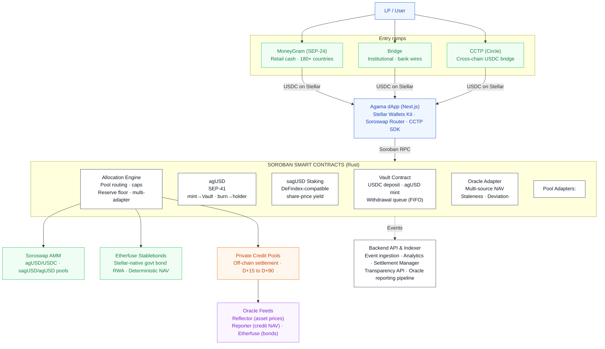

# Agama Finance — Technical Architecture

**Private Credit Yield Vaults on Stellar**  
June 2026, revised September 2026 · Confidential

`Soroban` · `SEP-41` · `Soroswap` · `Etherfuse` · `CCTP` · `DeFindex` · `MoneyGram`

**The same architecture, elsewhere in this repository:**  
[`Agama_Technical_Architecture.pdf`](Agama_Technical_Architecture.pdf) — this document as a rendered PDF ·  
[`../contracts`](../contracts) and [`../adapters`](../adapters) — the Soroban sources described below ·  
[`../deployments/testnet.json`](../deployments/testnet.json) — where those contracts are deployed on testnet.

---

> **Revision note · September 2026**
>
> The Blend v2 integration described in earlier versions of this document has been removed, following the Comet BLND-USDC exploit and Blend's removal from the SCF Integration List, where Blend V2 is being wound down. It is not replaced by another protocol.
>
> The instant-withdrawal liquidity role Blend played is now an on-chain reserve floor enforced by the Allocation Engine. The floor is a **share of total assets, expressed in basis points**, not a fixed sum of USDC: `allocate()` reverts if the call would leave the Vault holding less idle USDC than `floor_bps` of everything the protocol holds, idle plus deployed. It is set to **2500 bps — 25%** — on testnet.
>
> The unit is the substance of the replacement, not a detail of it. A liquidity buffer parked in a lending protocol is only as instant as that protocol's utilization on the day it is needed; USDC that never left the Vault has no such dependency. But a buffer denominated as a fixed amount stops meaning anything as the book moves — it is most of a small vault and a rounding error in a large one — and it is the *ratio* of cash to obligations that decides whether a withdrawal can be paid. Expressing the floor as a share is what makes it scale with the book it is protecting, and it is why the guarantee survives growth instead of being re-tuned by hand after it.
>
> Fast-exit liquidity is therefore a protocol parameter anyone can read on-chain, in the same units the caps are written in, not a dependency on a third party's solvency.

## 1. Introduction

### 1.1 High-Level Overview

Agama is a private-credit yield infrastructure for tokenized real-world assets, built natively on Stellar using Soroban smart contracts (Rust). Users deposit USDC into curated vaults and receive **agUSD**, a composable synthetic dollar backed by diversified credit pools. Staking agUSD produces **sagUSD**, a yield-bearing token whose value appreciates as private credit repayments and on-chain strategies generate returns.

Both agUSD and sagUSD are issued as Soroban/**SEP-41** tokens. The on-chain Allocation Engine distributes capital across vetted pools—including **Etherfuse Stablebonds** for Stellar-native government-bond exposure and off-chain private credit pools from vetted originators—while enforcing concentration caps by pool, originator, and jurisdiction.

The protocol composes existing Stellar ecosystem primitives rather than reimplementing solved problems: **Soroswap** for AMM liquidity, **DeFindex** for yield vault patterns, **CCTP** for cross-chain USDC bridging, and **MoneyGram** (SEP-24) and **Bridge** for fiat on/off-ramps. agUSD functions as a composable building block for other Soroban protocols, bringing sticky, real-yield-backed TVL to the Stellar ecosystem.

### 1.2 Core Components

- **Agama dApp** — Web application for deposits, staking, and portfolio transparency. Wallet connection via the Stellar Wallets Kit (Freighter, xBull, Albedo, Ledger). Bridge tab for CCTP cross-chain deposits. Swap interface via Soroswap Router API.
- **Backend API & Indexer** — Node.js services ingesting Soroban contract events for NAV history, yield accrual, portfolio analytics, transparency reporting, and settlement management.
- **Soroban Smart Contracts (Rust)** — On-chain core: Vault (deposits/withdrawals, agUSD mint/redeem), agUSD and sagUSD SEP-41 tokens, Allocation Engine (pool routing, caps, multi-adapter), and Oracle Adapter (multi-source NAV validation).
- **Allocation Engine** — Routes deposited capital across Etherfuse Stablebonds and private credit pools via a uniform adapter interface, enforcing on-chain concentration caps.
- **Oracle Integration** — Multi-source NAV pipeline: Reflector for asset prices, custom reporter for private credit NAV, Etherfuse feed for bond pricing. Staleness and deviation checks on-chain.
- **On/Off-Ramp & Cross-Chain** — MoneyGram (SEP-24) for retail fiat ramp. Bridge for institutional wires. CCTP for native USDC bridging from Ethereum/Arbitrum.
- **Liquidity** — agUSD/USDC and sagUSD/agUSD pools on Soroswap. Stellar DEX order books as secondary liquidity venue.

### 1.3 Definitions and Acronyms

| Term | Definition |
|---|---|
| USDC | USD Coin, fiat-backed stablecoin by Circle, native on Stellar. Vault deposit asset. |
| Soroban | Stellar's smart contract platform. Contracts written in Rust, compiled to WASM. |
| SEP-41 | Standard token interface for Soroban contracts. agUSD and sagUSD implement SEP-41. |
| agUSD | Agama's synthetic dollar, minted 1:1 against USDC deposits. |
| sagUSD | Staked agUSD. Yield accrues via increasing sagUSD/agUSD exchange rate. |
| NAV | Net Asset Value — on-chain reported value of the portfolio backing agUSD. |
| Allocation Engine | Soroban contract routing vault capital across pool adapters with cap enforcement. |
| Reserve Floor | Minimum share of total assets the Vault must retain as idle USDC, in basis points. Enforced by the Allocation Engine at allocation time. 2500 bps (25%) on testnet. |
| Originator | Vetted private credit counterparty receiving vault allocations. |
| Reflector | Decentralized push-based oracle network on Stellar. |
| DeFindex | Yield infrastructure for Stellar. sagUSD uses DeFindex-compatible vault accounting. |
| Soroswap | Primary AMM on Soroban. Provides agUSD liquidity pools. |
| CCTP | Circle Cross-Chain Transfer Protocol. Native 1:1 USDC bridge between blockchains. |
| Etherfuse | Stablebonds — Stellar-native tokens backed by government bonds with embedded yield. |
| SEP-24 | Interactive deposit/withdrawal flows with anchors (used for MoneyGram). |
| SEP-57 | T-REX — Token for Regulated Exchanges. Standard for compliance-controlled RWA tokens on Stellar. |
| TTL | Time To Live — Soroban storage lifetime, managed with archival thresholds and periodic bumps. |

## 2. Architecture Overview

### 2.1 C1 Context

**External Actors**

- **LP / Depositor** — Deposits USDC into Agama vaults, receives agUSD, optionally stakes into sagUSD.
- **Asset Originator** — Private credit counterparty receiving allocations and servicing repayments.
- **Curator / Risk Committee** — Whitelists pools and originators, sets concentration caps, manages risk parameters.

**External Systems**

| System | Role | Integration List |
|---|---|---|
| Stellar Network | All on-chain operations: USDC settlement, Soroban execution | — |
| Circle (USDC) | Issuer of native USDC on Stellar | — |
| Reflector Oracle | Decentralized price feeds (USDC, XLM) | — |
| DeFindex | Yield vault patterns for sagUSD accounting | Integration List |
| Soroswap | AMM liquidity pools + Router API | Integration List |
| Etherfuse | Stablebonds — Stellar-native RWA collateral | Integration List |
| CCTP (Circle) | Native cross-chain USDC bridge | Integration List |
| MoneyGram | Fiat cash on/off-ramp (SEP-24), 180+ countries | Integration List |
| Bridge | Institutional fiat ramp (bank wires, ACH) | — |

### 2.2 C2 Containers

| Container | Technology | Responsibility |
|---|---|---|
| **Agama dApp** | TypeScript / Next.js | User-facing: deposits, staking, swaps (Soroswap Router), bridge (CCTP), transparency dashboard. Connects wallets via Stellar Wallets Kit. Submits transactions via Soroban RPC. |
| **Backend API & Indexer** | Node.js / PostgreSQL | Event ingestion, analytics (APY, NAV, exposure), settlement management (off-chain → on-chain), oracle reporting pipeline, MoneyGram SEP-24 adapter, Bridge API integration. |
| **Soroban Contracts** | Rust → WASM | Vault, agUSD, sagUSD, Allocation Engine (with Etherfuse/private credit adapters), Oracle Adapter. |

### 2.3 C3 Components

**Agama dApp**

- Wallet module — Stellar Wallets Kit for auth and transaction signing.
- Deposit/withdraw and stake/unstake interfaces — Soroban contract calls.
- Swap interface — Soroswap Router API for agUSD/USDC trading.
- Bridge tab — CCTP via Circle Bridge Kit SDK.
- Transparency dashboard — NAV, yield, pool exposure from Backend API.

**Backend API & Indexer**

- **Event Ingestion Service** — Soroban events → PostgreSQL.
- **Analytics Service** — APY, share price history, concentration metrics.
- **Settlement Manager** — Bridges off-chain credit repayments back on-chain.
- **Originator Reporting Adapter** — Collects off-chain servicing data, reconciles with on-chain NAV.
- **On/Off-Ramp Adapters** — MoneyGram SEP-24 + Bridge REST API.

**Soroban Smart Contracts**

- **Vault Contract** — USDC deposits, agUSD mint/burn, FIFO withdrawal queue.
- **agUSD Token (SEP-41)** — `mint` restricted to the Vault. `burn` and `burn_from` are the standard SEP-41 holder-authorized paths.
- **sagUSD Staking Contract** — DeFindex-compatible share-based vault. Yield via exchange rate appreciation. Two-step unstake behind a cooldown.
- **Allocation Engine** — Pool routing with adapters (Etherfuse, private credit). Concentration caps.
- **Oracle Adapter** — Multi-source NAV validation (Reflector, custom reporter, Etherfuse feed).

### 2.4 Data Flows

1. User converts fiat → USDC via MoneyGram (SEP-24) or Bridge, or bridges USDC from Ethereum via CCTP, or acquires USDC on Soroswap / Stellar DEX.
2. User connects wallet (Freighter, xBull, Albedo) via Stellar Wallets Kit.
3. User deposits USDC into Vault Contract → receives agUSD 1:1.
4. User optionally stakes agUSD → sagUSD at current exchange rate.
5. Curator whitelists pools; Allocation Engine deploys capital:
   - Etherfuse Stablebonds → Stellar-native government bond yield
   - Private credit pools → off-chain originator allocations
6. Yield flows back: Etherfuse (bond interest), private credit (originator repayment → settlement → USDC on-chain).
7. Oracle Adapter receives NAV updates: Reflector for asset prices, Backend reporter for credit NAV, Etherfuse feed for bond pricing.
8. `distribute_yield()` increases sagUSD/agUSD exchange rate → sagUSD holders earn yield passively.
9. Backend Indexer captures all events → powers transparency dashboard + API.
10. User exits: `request_unstake()` then `claim()` after the cooldown returns sagUSD → agUSD; `request_withdrawal()` then `claim_withdrawal()` redeems agUSD → USDC through the Vault queue. Or swap on Soroswap without queueing. Off-ramp via MoneyGram or Bridge.

### 2.5 System Characteristics

- **Transparent** — All vault accounting, caps, and yield distribution enforced on-chain.
- **Non-Custodial Token Layer** — Users hold agUSD/sagUSD in their own wallets.
- **Risk-Constrained by Design** — Concentration caps checked at allocation time.
- **Composable** — SEP-41 tokens usable across Soroban protocols. DeFindex-compatible sagUSD.
- **Ecosystem-Native** — Built on Soroswap, Etherfuse, CCTP rather than standalone.
- **High-Frequency Yield** — Stellar's sub-cent fees enable frequent on-chain distribution.
- **Secure by Design** — Admin-gated functions, pausability, oracle guards, STRIDE-modeled threats.
- **Open Source** — All Soroban contracts Apache-2.0 at mainnet launch.

### 2.6 System Architecture Diagram

Entry ramps, Agama dApp, Soroban contracts, allocation targets, oracle feeds and the event path to the backend.



Legend, as coloured in the diagram: green = Integration List protocol · orange = Off-chain component · purple = Oracle / data feed · dark outline = Core Agama contract.


## 3. Ecosystem Integrations

Agama builds on proven Stellar ecosystem protocols drawn from the **SCF Integration List**. Each integration serves a specific architectural role and replaces or augments a component that would otherwise be built from scratch.

### 3.1 DeFindex — Yield Infrastructure

**Role:** sagUSD uses DeFindex-compatible vault accounting. `distribute_yield()` increases assets-per-share, the standard DeFindex share-price model. sagUSD shares are interoperable with any DeFindex-integrated wallet or protocol.

### 3.2 Soroswap — AMM Liquidity

**Role:** Primary liquidity venue for agUSD/USDC and sagUSD/agUSD on Soroban. The dApp integrates Soroswap's Router API for swap routing across all Stellar liquidity sources.

Agama seeds pools at mainnet launch. The agUSD/USDC pool enables peg arbitrage: mint at 1:1 via Vault and sell on Soroswap if above peg, or buy on Soroswap and redeem if below.

> **Classic/Soroban constraint:** Soroban transactions cannot include Classic operations (path payments, DEX offers) in the same transaction. Soroswap swaps are Soroban-native and composable with contract calls. Classic DEX trades require a separate transaction. Agama does not claim atomicity between them. See [Section 9](#9-classicsoroban-transaction-constraint).

### 3.3 CCTP — Cross-Chain USDC Bridge

**Role:** Native 1:1 USDC bridging from Ethereum/Arbitrum/Base. No wrapped tokens, no third-party bridge risk.

```text
LP on Ethereum
    ├── Initiates CCTP burn (USDC burned on source chain)
    ├── Circle attestation service confirms burn
    └── LP mints USDC on Stellar
            └── Deposits into Agama Vault → agUSD minted
```

The dApp includes a "Bridge" tab using Circle's Bridge Kit SDK.

### 3.4 Etherfuse — Stablebonds as Native RWA Collateral

**Role:** First-day RWA collateral on Stellar. Etherfuse Stablebonds are Stellar-native tokens backed by government bonds with embedded yield.

**Strategic value:**

- Live vault at mainnet launch without depending on off-chain credit tokenization.
- Low-risk base yield layer (government bonds) complementing higher-yield private credit.
- Proof that the Allocation Engine generalizes across RWA types.

**Oracle:** Stablebond NAV is deterministic (public bond pricing). Staleness threshold relaxed to 48h.

### 3.5 Bridge / MoneyGram — Fiat On-Ramp

**MoneyGram (SEP-24)** — Retail cash on/off-ramp in 180+ countries via interactive anchor flows. Integration at the Backend level via SEP-24 adapter.

**Bridge** — Multi-currency institutional ramp (bank wires, ACH). Backend integrates Bridge REST API for payout initiation and webhook callbacks.

## 4. Contract Overview

### 4.1 Vault Contract

**Purpose:** Entry point for capital. Accepts USDC deposits, mints agUSD 1:1, manages NAV-based accounting and the FIFO withdrawal queue.

**Key Functions**

| Function | Description |
|---|---|
| `initialize(admin, usdc_token, agusd_token, allocation_engine)` | One-time setup storing core addresses and admin. Refuses a second call. |
| `deposit(from, amount) → i128` | Transfers USDC, mints agUSD. Returns minted amount. |
| `request_withdrawal(from, amount) → u64` | Burns agUSD, enqueues claim. Returns claim_id. |
| `claim_withdrawal(from, claim_id)` | Pays USDC when Ready. FIFO order. |
| `settle_allocation(pool, amount)` | Releases idle USDC to a pool. Callable only by the Allocation Engine, which has already checked the caps and the floor. |
| `set_agusd(admin, agusd_token)` | Repoints the token the Vault mints. Closes at the first deposit. |
| `set_engine(admin, allocation_engine)` | Repoints the Engine allowed to release reserves. Refuses any address that does not answer that it governs this Vault. |
| `set_oracle(admin, oracle, feed_id)` | Points the Vault at an Oracle Adapter and the feed it reads NAV from. |
| `set_paused(admin, paused)` | Circuit breaker. |
| `idle_reserves() → i128` | USDC the Vault is holding. What the reserve floor protects and what claims are paid from. |
| `get_total_assets() → i128` | Idle reserves + deployed allocations (Etherfuse + credit). |
| `get_nav() → i128` | Latest validated NAV from Oracle Adapter. Propagates `OracleStale` rather than returning an old number. |
| `get_claim(claim_id) → Claim` | The stored claim record. |
| `claim_status(claim_id) → ClaimStatus` | Pending, Ready or Claimed. `Ready` is computed, not stored: a claim becomes payable when the queue reaches it and reserves cover it, without anyone touching it. |
| `queue_head() → u64` | Next claim id that may be paid. |
| `queue_tail() → u64` | Next claim id to be handed out. |
| `queue_length() → u64` | Claims requested and not yet paid. |
| `deposits() → u64` | Deposits taken since deployment. What `set_agusd` keys off. |

**Storage**

**Instance:** Admin, UsdcToken, AgusdToken, AllocationEngine, Paused, QueueHead, QueueTail.  
**Persistent:** Withdrawal claims (keyed by claim_id).  
TTL management with archival thresholds and periodic bump renewal.

**Events**

`Deposit(user, amount, minted)` · `WithdrawalRequested(user, claim_id, amount, queue_position)` · `WithdrawalClaimed(user, claim_id, amount)` · `PauseToggled(paused)` · `AgUsdRepointed(agusd)` · `EngineRepointed(engine)`

**Security**

Initialization guard · `require_auth()` on all state-changing calls · Zero/negative validation · Pause circuit breaker · Minimum withdrawal amount · FIFO queue (no priority).

### 4.2 agUSD Token Contract (SEP-41)

**Purpose:** Composable synthetic dollar. `mint` is restricted to the recorded minter, which is the Vault Contract address: it is the only address that can bring agUSD into existence, and `set_minter` stops working at the first mint, so every unit in circulation was created by the minter named in the deployment record.

`burn` and `burn_from` are **not** minter-gated. They are the standard SEP-41 holder-authorized paths: any holder can burn their own agUSD, and a spender can burn against an allowance. The Vault's `request_withdrawal` uses exactly that path, calling `burn` on the withdrawer in a transaction the withdrawer has already signed, rather than a privilege of its own. Supply can therefore only go up through the Vault, and can go down through anyone holding the token — which is the correct asymmetry for a redeemable synthetic dollar, since burning agUSD destroys a claim rather than creating one.

Standard SEP-41 interface: `transfer`, `transfer_from`, `approve`, `allowance`, `balance`, `burn`, `burn_from`, `decimals`, `name`, `symbol`, `total_supply`.

**Events:** `mint` · `burn` · `transfer` · `approve` (SEP-41) · `MinterSet(minter)`

### 4.3 sagUSD Staking Contract

**Purpose:** Yield-bearing staked agUSD. DeFindex-compatible share-based vault accounting. Yield increases the sagUSD/agUSD exchange rate.

**Key Functions**

| Function | Description |
|---|---|
| `stake(from, agusd_amount) → i128` | Locks agUSD, mints sagUSD shares at the current rate. Returns shares minted. |
| `request_unstake(from, shares) → i128` | Step 1 of 2. Burns the shares immediately, prices them at the current rate and locks the agUSD owed behind the cooldown. Returns the assets owed. |
| `claim(from) → i128` | Step 2 of 2. Pays out a matured unstake request. Reverts while the cooldown is still running. |
| `cooldown() → u64` | Seconds between a request and the moment it can be claimed. 60 on testnet. |
| `pending(addr) → Pending` | The caller's queued unstake: assets owed and the timestamp it becomes claimable. |
| `distribute_yield(amount)` | Deposits yield, increases assets-per-share. Authorized distributor only, which in V1 is the stored admin: the call takes no distributor argument and authorizes the recorded admin address, whose own agUSD is what moves. |
| `exchange_rate() → i128` | Current agUSD per sagUSD share (scaled to 7 decimals). |
| `share_price() → i128` | Alias of `exchange_rate()`, the name this contract shipped with. Same computation, retained because the generation 1 agUSD calls it on the credit vaults. |
| `nav() → i128` | Total agUSD the contract is accountable for. |
| `total_shares() → i128` | sagUSD in circulation. |

**Unstaking is two steps, not one.** There is no single `unstake()` call. `request_unstake` burns the shares at request time and prices them there, so a queued position cannot keep earning, be sold, or be re-requested while it waits; `claim` pays it out once `cooldown()` has elapsed. Pricing at request rather than at claim is what stops the cooldown being used as a free option on the exchange rate.

**Events:** `mint` · `burn` · `transfer` · `approve` (SEP-41, on the share token) · `AgUsdRepointed(agusd)`. Yield distribution is observable as the resulting change in `nav()` and `exchange_rate()` together with the underlying agUSD `transfer` into the contract; it does not currently emit a dedicated event of its own.

### 4.4 Allocation Engine Contract

**Purpose:** Routes vault capital across pool adapters (Etherfuse, private credit) with on-chain concentration cap enforcement and a reserve floor. All four limits are measured in basis points of total assets, so the floor is read in the same units as the caps and the two cannot be compared wrongly.

**Key Functions**

| Function | Description |
|---|---|
| `initialize(admin, vault)` | One-time setup. Ships fail-closed: every cap at zero and the reserve floor at 10000 bps, so an unconfigured Engine can deploy nothing. |
| `register_pool(admin, pool_id, originator, jurisdiction, cap_bps)` | Whitelists a pool with metadata and cap. |
| `set_caps(admin, pool_cap_bps, originator_cap_bps, jurisdiction_cap_bps)` | Updates global concentration limits, in bps of total assets. |
| `set_reserve_floor(admin, floor_bps: u32)` | Sets the minimum **share of total assets**, in basis points, that must stay as idle USDC in the Vault. Rejects anything above 10000. Admin-gated, emits an event on every change. |
| `set_vault(admin, vault)` | Repoints the Engine at a different Vault. Refused while any capital is deployed, so the exposure book and the balance sheet the caps are measured against always belong to the same Vault. |
| `allocate(admin, pool_id, amount)` | Deploys capital. Reverts if any cap is exceeded, or if the call would leave idle reserves below `floor_bps` of total assets. |
| `deallocate(pool_id, amount)` | Records repayments returning to vault. |
| `get_exposure(pool_id) → i128` | Current allocation per pool. |
| `get_exposures() → Map` | Full allocation state. Registered pools with no exposure appear as zero, so the map doubles as the whitelist. |
| `total_allocated() → i128` | Total booked as deployed across every pool. The Vault reads this to compute total assets. |
| `caps() → Caps` | The three concentration limits currently in force, in bps. |
| `reserve_floor_bps() → u32` | Current reserve floor, in bps of total assets. Readable by anyone. |
| `get_reserve_ratio() → u32` | Idle reserves as an actual share of total assets, in bps. This is the number the floor is a lower bound on, so floor and reality are read in the same units. |
| `get_pool(pool_id) → Pool` | A registered pool's originator, jurisdiction and cap. |
| `pools() → Vec<Address>` | Every registered pool adapter. |

**Adapter Interface**

All pool types implement a uniform adapter interface. The Engine is agnostic to pool type. Adapters handle oracle queries, token transfers, and position encoding specific to each pool type.

| Adapter | Underlying | Settlement | Oracle |
|---|---|---|---|
| Etherfuse | Stablebond contracts | Instant (on-chain) | Etherfuse feed (48h staleness) |
| Private Credit | Off-chain originator | D+15 to D+90 | Custom reporter (7d staleness) |

**Operational Model**

**V1 (grant scope):** Admin-directed allocation. The Curator calls `allocate()` manually. The Engine enforces constraints but does not decide autonomously.

**V2 (post-grant):** Off-chain optimizer computes target allocations and submits through the same admin-gated functions. Same cap enforcement, same governance guardrails.

### 4.5 Oracle Adapter

**Purpose:** Single source of truth for NAV data, bridging multiple feed types with unified validation.

**Data Sources**

| Feed | Source | Trust Model | Staleness |
|---|---|---|---|
| Asset prices (USDC, XLM) | Reflector | Decentralized | 1 hour |
| Private credit NAV | Off-chain report → Backend → Reporter key | Centralized (V1, disclosed) | 7 days |
| Etherfuse bond price | Etherfuse API / on-chain | Deterministic | 48 hours |

**Pipeline**

```text
Originator (servicing data)
    → Agama Backend (reconciliation + validation)
        → Reporter key calls push_nav(nav, timestamp)
            → Oracle Adapter validates:
                ✓ Caller in authorized reporter set
                ✓ Timestamp > last update
                ✓ Deviation ≤ 5% from previous NAV
                ✗ If exceeded → nav_rejected event
            → Vault Contract calls get_nav()
                → Reverts with OracleStale if feed older than threshold
```

**Failure Modes**

| Failure | Impact | Mitigation |
|---|---|---|
| Reporter offline | Withdrawals/allocations revert | Deposits/stakes continue. Admin assigns backup reporter. |
| Reporter compromised | False NAV pushed | Deviation bounds reject. V2: multi-reporter quorum. |
| Originator misreports | Incorrect NAV | Backend reconciliation. >5% requires admin confirmation. |
| Reflector offline | Display-only impact | Core operations do not depend on Reflector. |

**Test Coverage (all contracts)**

End-to-end flows (deposit → stake → yield → redeem) · Cap-violation rejection · Re-initialization guards · Access control · Zero/negative validation · Oracle staleness/deviation · Withdrawal queue ordering · Fuzzing on accounting invariants.

## 5. Settlement & Off-Chain Bridge

Private credit instruments settle off-chain. Repayments flow through traditional banking rails before conversion to USDC on Stellar. This is the structural bridge between real-world credit and DeFi accounting.

### 5.1 Settlement Flow

```text
Originator (fiat repayment: principal + interest)
    → Settlement Account (off-chain bank, Agama entity or custodian)
        → Fiat → USDC conversion (via Bridge API or MoneyGram)
            → Settlement Manager (backend)
                → deallocate(pool_adapter, amount) on Allocation Engine
                    → USDC returns to Vault idle reserves
                        → Withdrawal queue processed (FIFO)
```

### 5.2 Settlement Timing

| Pool Type | Settlement | Notes |
|---|---|---|
| Etherfuse Stablebonds | Instant | On-chain redemption |
| Private credit (invoice) | D+15 to D+30 | Originator payment terms |
| Private credit (venture) | D+30 to D+90 | Longer-dated instruments |

### 5.3 Default Handling

1. **Detection:** Backend flags missed payment. Oracle receives reduced NAV.
2. **NAV write-down:** agUSD share price declines proportionally.
3. **Loss distribution:** Socialized across all agUSD holders. No tranching in V1.
4. **Pool removal:** Admin delists defaulting pool. Existing exposure runs off naturally.
5. **Recovery:** Partial repayment later → NAV written back up.

### 5.4 Custody Model

| Component | Custody | Controller |
|---|---|---|
| USDC idle in Vault | Soroban contract | Non-custodial |
| Etherfuse Stablebonds | Vault adapter | Non-custodial |
| Private credit allocations | Off-chain (originator) | Originator + legal agreements |
| Settlement fiat | Off-chain bank account | Agama entity (custodial) |

> **Explicit trust assumption:** Private credit allocations involve custodial, off-chain components. Users are informed that this exposure carries counterparty risk (default, settlement delay, FX risk). This is fundamental to private credit and cannot be eliminated on-chain. Concentration caps limit exposure to any single originator. Etherfuse allocations are fully on-chain and non-custodial.

## 6. Withdrawal Queue

Two-step FIFO withdrawal queue:

**Step 1 — Request:** `request_withdrawal(from, amount) → claim_id`. Burns agUSD, creates persistent claim record {claim_id, from, usdc_amount, timestamp, Pending}. Joins back of FIFO queue.

**Step 2 — Claim:** `claim_withdrawal(from, claim_id)`. Checks status = Ready. Transfers USDC from Vault reserves. Updates to Claimed.

### 6.1 Reserve Floor

The Allocation Engine enforces the reserve floor as a contract-level invariant, and it enforces it **as a share of total assets rather than as an amount of USDC**. `set_reserve_floor(admin, floor_bps)` takes basis points; `reserve_floor_bps()` returns them; `get_reserve_ratio()` returns what idle reserves actually are as a share of total assets, in the same units, so the limit and the reality are read off the same scale. Testnet runs at **2500 bps, 25%**.

Total assets are idle reserves plus everything the Engine has booked as deployed. `allocate()` computes what the Vault would be left holding once the release settles and reverts if that is below `floor_bps` of the total, so the check happens in the same transaction as the transfer and a refused allocation moves no funds and books no exposure.

**Why a share and not a sum.** This is what replaced the Blend v2 liquidity buffer, and the unit is the reason the replacement is stronger rather than merely different. Blend gave fast-exit liquidity by holding a withdrawable position in someone else's lending market, which is only as instant as that market's utilization on the day it is needed. The floor gives it by never letting the USDC leave the Vault at all, which has no such dependency. But had the floor been written as a fixed number of dollars it would have inherited a different weakness: it would be most of a small book and a rounding error in a large one, and it would need re-tuning by hand every time the protocol grew. Withdrawal pressure scales with the size of the book, so the liquidity guaranteed against it has to scale too. A ratio does that on its own.

**A floor only binds if the caps can reach it.** That is a property of the configuration, not of the code. Two pools capped at 30% each can deploy at most 60% between them, so a 20% floor could never be the reason an allocation is refused: 40% would stay idle whatever the operator did, the pool cap would fire first every time, and the floor would pass its own unit test while doing nothing on-chain. The deployed configuration is chosen the other way round — pool caps of 4000 bps each, summing to 8000, against a floor that releases 7500 — so there are states reachable by ordinary allocations in which every concentration cap is satisfied and the floor is the only limit refusing the call. That case is exercised on testnet as a submitted transaction carrying the Engine's own error code, not asserted in prose.

The floor is set by the Curator through an admin-gated call, and every change emits a `ReserveFloorUpdated(floor_bps)` event. The Engine ships fail-closed: `initialize()` leaves every cap at zero and the floor at 10000 bps, so an Engine that has been deployed but not configured cannot deploy capital at all.

### 6.2 Liquidity Sources (priority order)

1. Idle USDC reserves in Vault
2. New deposits (increase idle reserves)
3. Etherfuse Stablebond redemption (on-chain, instant)
4. Private credit repayment (off-chain, D+15 to D+90)

### 6.3 Expected Wait Times

| Scenario | Wait |
|---|---|
| Vault has idle reserves | ~5 min (next keeper cycle) |
| Reserves depleted, Etherfuse available | Minutes |
| Reserves depleted, only private credit | Days to weeks |

### 6.4 Safeguards

- Minimum withdrawal amount (anti-dust).
- Queue depth monitoring — backend alerts trigger proactive Etherfuse redemptions.
- Strict FIFO — no priority, no jumping, including admin.
- No claim expiry — persistent storage with TTL bumps.

## 7. Security Model (STRIDE)

| Category | Threat | Mitigation |
|---|---|---|
| **Spoofing** | Unauthorized agUSD mint | `mint` restricted to the recorded minter (the Vault); `set_minter` closes at the first mint. `burn` is holder-authorized by design and cannot inflate supply. `require_auth()` on all functions. |
| **Spoofing** | Fake oracle reporter | Authorized reporter set. `push_nav()` validates caller. Rotation requires admin + event. |
| **Tampering** | NAV manipulation | Deviation bounds (>5% rejected). Two-step confirmation for large changes. |
| **Tampering** | Allocation to compromised pool | On-chain concentration caps (pool, originator, jurisdiction) and the reserve floor, all four in bps of total assets. `allocate()` reverts if any one is exceeded. |
| **Repudiation** | Originator denies allocation | Soroban events on every `allocate` / `deallocate`. Indexed with block provenance. |
| **Repudiation** | Disputed yield | Every distribution moves real agUSD into the contract, so it leaves a SEP-41 `transfer` event and a matching move in `nav()` and `exchange_rate()`. Fully reconstructable from the chain. A dedicated `yield_distributed` event carrying the amount and the resulting rate is planned, so the reconstruction does not depend on joining two sources. |
| **Info Disclosure** | LP position exposure | Public chain by design. No private data in contracts. |
| **DoS** | Withdrawal queue flood | Minimum amount + agUSD burn cost. TTL on claim records. |
| **DoS** | Oracle starvation | Deposits/stakes continue. Only withdrawals/allocations revert. Admin updates reporter set. |
| **Elev. of Privilege** | Admin key compromise | Admin cannot transfer USDC directly. Only `allocate()` (cap-bound and floor-bound) or `pause()`. Multi-sig (2-of-3) planned. |

### 7.1 Access Control

| Role | V1 Holder | Permissions | Evolution |
|---|---|---|---|
| Admin | 2-of-3 multi-sig | Pause, register pools, set caps, set the reserve floor in bps, repoint counterparties while the guards allow it, update reporters | Governance + 48h timelock |
| Reporter | Dedicated hot wallet | Push NAV to Oracle | Multi-reporter quorum (2-of-3) |
| Yield Distributor | = Admin in V1 | `distribute_yield()`, which moves the distributor's own agUSD | Dedicated service key, then keeper network |
| Curator | = Admin in V1 | Whitelist pools, risk params | Independent risk committee |

**Pausability:** When paused, deposits and withdrawals blocked. Staking/unstaking continue. Oracle updates continue.

**Upgrade path:** V1 contracts are immutable. Upgrades require redeployment + migration. V2 may introduce controlled upgrade proxy with timelock.

## 8. Soroban Storage Management

| Contract | Type | Data | Rationale |
|---|---|---|---|
| Vault | Instance | Admin, tokens, pause, queue pointers | Small, every call, contract lifetime |
| Vault | Persistent | Withdrawal claims (by claim_id) | Claims pending for weeks |
| agUSD | Instance | Metadata, supply, Vault address | Standard token data |
| agUSD | Persistent | Balances, allowances | Long-lived user data |
| sagUSD | Instance | Admin, staked token, NAV, cooldown, stake counter, display allocations | Every stake/unstake |
| sagUSD | Persistent | Share balances, pending unstake requests | Long-lived user data; a request outlives the shares that created it |
| Alloc. Engine | Instance | Admin, Vault, caps, reserve floor in bps, pool registry | Config, every allocation |
| Alloc. Engine | Persistent | Per-pool exposure records | Persist across settlement |
| Oracle | Instance | Reporter set, thresholds | Configuration |
| Oracle | Temporary | Latest NAV + timestamp | Replaced each update, auto-expires |

**Bump strategy:** Instance storage bumped automatically on invocation. Persistent hot data (balances, active claims, exposures) bumped on user interaction. Cold data (claimed withdrawals) archives naturally. Temporary storage (oracle NAV) auto-expires. Backend keeper handles periodic bumps for system-critical entries.

## 9. Classic/Soroban Transaction Constraint

> **Protocol constraint:** A Stellar transaction containing `InvokeHostFunction` (Soroban) CANNOT include Classic operations (path payments, DEX offers) in the same transaction.

| Path | Mechanism | Composable with contracts? |
|---|---|---|
| **Soroban (primary)** | Swaps via Soroswap Router — single Soroban tx | Yes (deposit + swap in same tx) |
| **Classic (secondary)** | Trading agUSD on Stellar DEX order book — separate Classic tx | No (separate transaction) |

The dApp supports both paths but does not claim atomicity between Soroban and Classic operations.

## 10. RWA Token Standards

| Token | Standard | Transfer Restrictions |
|---|---|---|
| agUSD / sagUSD | SEP-41 | None — permissionless, composable |
| Future RWA pool tokens | SEP-57 (T-REX) candidate | Whitelist, freeze, forced transfer, KYC hooks |

**V1:** RWA positions exist as Allocation Engine accounting entries + off-chain legal agreements. SEP-57 is referenced as the intended standard for future on-chain RWA tokenization. agUSD is the democratized access layer (anyone can hold it); underlying credit positions retain compliance controls.

## 11. Technology Stack

| Layer | Technology |
|---|---|
| Frontend | TypeScript, Next.js/React, Stellar Wallets Kit, Tailwind CSS |
| Backend | Node.js, Express, Redis |
| Blockchain | Soroban (Rust → WASM), Stellar SDK (JS), Horizon API, Soroban RPC |
| Database | PostgreSQL |
| Dev Tools | Rust + Stellar CLI, Docker, CI pipelines |
| Testing | soroban-sdk testutils, cargo test, fuzzing on invariants |
| Infrastructure | AWS/GCP, Grafana, Sentry |

### 11.1 Ecosystem Integrations

| Integration | Role | Integration List |
|---|---|---|
| DeFindex | Yield vault patterns for sagUSD | Yes |
| Soroswap | AMM pools + Router API | Yes |
| Etherfuse | Stablebonds — native RWA collateral | Yes |
| CCTP (Circle) | Cross-chain USDC bridge | Yes |
| MoneyGram | Fiat cash ramp (SEP-24) | Yes |
| Bridge | Institutional fiat ramp | — |
| Reflector | Oracle price feeds | — |
| Circle USDC | Native deposit asset | — |

### 11.2 Stellar Ecosystem Proposals

| SEP | Usage |
|---|---|
| SEP-41 | agUSD and sagUSD token interface |
| SEP-24 | MoneyGram interactive deposit/withdrawal |
| SEP-57 | Future RWA token compliance (T-REX) |

---

Agama Technical Architecture · June 2026, revised September 2026 · Confidential
