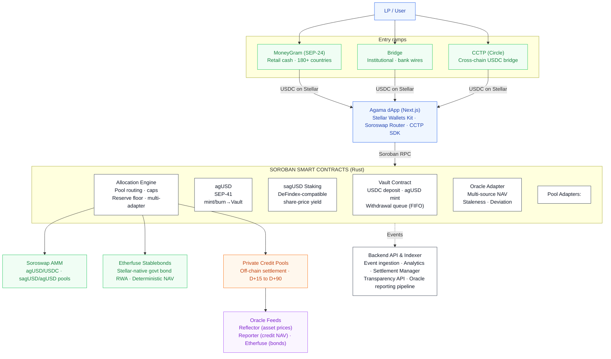
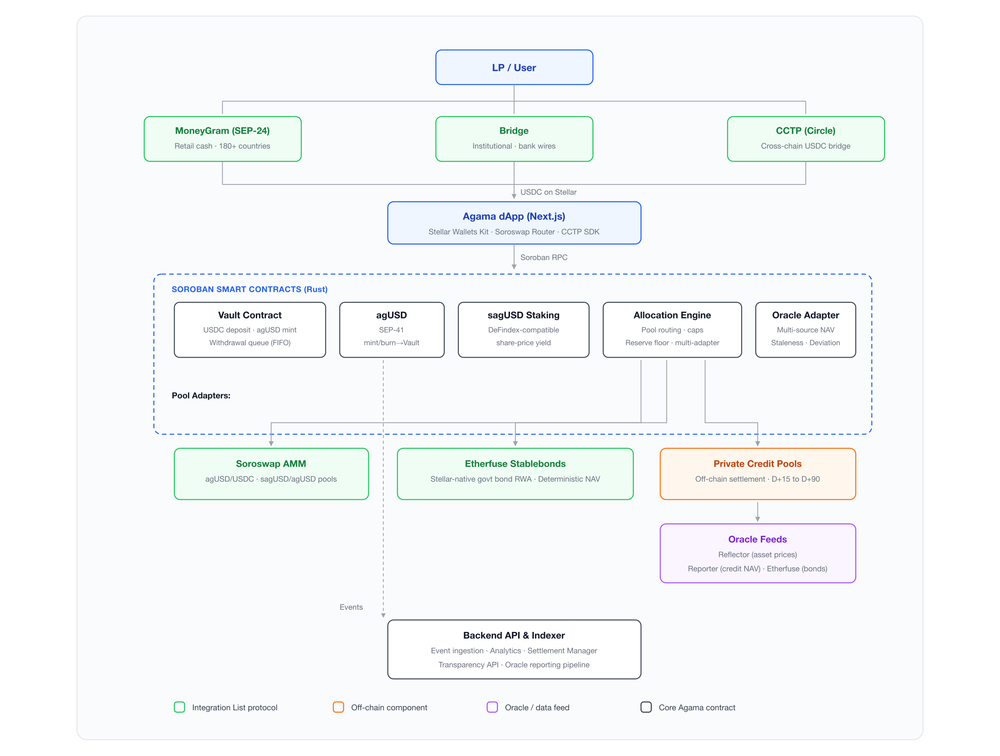

# Agama Finance — Technical Architecture

**Private Credit Yield Vaults on Stellar**  
June 2026, revised September 2026 · Confidential

`Soroban` · `SEP-41` · `Soroswap` · `Etherfuse` · `CCTP` · `DeFindex` · `MoneyGram`

**The same architecture, elsewhere in this repository:**  
[`Agama_Technical_Architecture.pdf`](Agama_Technical_Architecture.pdf) — this document as a rendered PDF ·  
[`../contracts`](../contracts) and [`../adapters`](../adapters) — the Soroban sources described below ·  
[`../deployments/testnet.json`](../deployments/testnet.json) — where those contracts are deployed on testnet.

---

> **Revision note · September 2026**
>
> The Blend v2 integration described in earlier versions of this document has been removed, following the Comet BLND-USDC exploit and Blend's removal from the SCF Integration List, where Blend V2 is being wound down. It is not replaced by another protocol.
>
> The instant-withdrawal liquidity role Blend played is now an on-chain reserve floor enforced by the Allocation Engine: `allocate()` reverts if a call would push vault reserves below a minimum idle USDC reserve. Fast-exit liquidity is therefore a protocol parameter anyone can read on-chain, not a dependency on a third party's solvency.

## 1. Introduction

### 1.1 High-Level Overview

Agama is a private-credit yield infrastructure for tokenized real-world assets, built natively on Stellar using Soroban smart contracts (Rust). Users deposit USDC into curated vaults and receive **agUSD**, a composable synthetic dollar backed by diversified credit pools. Staking agUSD produces **sagUSD**, a yield-bearing token whose value appreciates as private credit repayments and on-chain strategies generate returns.

Both agUSD and sagUSD are issued as Soroban/**SEP-41** tokens. The on-chain Allocation Engine distributes capital across vetted pools—including **Etherfuse Stablebonds** for Stellar-native government-bond exposure and off-chain private credit pools from vetted originators—while enforcing concentration caps by pool, originator, and jurisdiction.

The protocol composes existing Stellar ecosystem primitives rather than reimplementing solved problems: **Soroswap** for AMM liquidity, **DeFindex** for yield vault patterns, **CCTP** for cross-chain USDC bridging, and **MoneyGram** (SEP-24) and **Bridge** for fiat on/off-ramps. agUSD functions as a composable building block for other Soroban protocols, bringing sticky, real-yield-backed TVL to the Stellar ecosystem.

### 1.2 Core Components

- **Agama dApp** — Web application for deposits, staking, and portfolio transparency. Wallet connection via the Stellar Wallets Kit (Freighter, xBull, Albedo, Ledger). Bridge tab for CCTP cross-chain deposits. Swap interface via Soroswap Router API.
- **Backend API & Indexer** — Node.js services ingesting Soroban contract events for NAV history, yield accrual, portfolio analytics, transparency reporting, and settlement management.
- **Soroban Smart Contracts (Rust)** — On-chain core: Vault (deposits/withdrawals, agUSD mint/redeem), agUSD and sagUSD SEP-41 tokens, Allocation Engine (pool routing, caps, multi-adapter), and Oracle Adapter (multi-source NAV validation).
- **Allocation Engine** — Routes deposited capital across Etherfuse Stablebonds and private credit pools via a uniform adapter interface, enforcing on-chain concentration caps.
- **Oracle Integration** — Multi-source NAV pipeline: Reflector for asset prices, custom reporter for private credit NAV, Etherfuse feed for bond pricing. Staleness and deviation checks on-chain.
- **On/Off-Ramp & Cross-Chain** — MoneyGram (SEP-24) for retail fiat ramp. Bridge for institutional wires. CCTP for native USDC bridging from Ethereum/Arbitrum.
- **Liquidity** — agUSD/USDC and sagUSD/agUSD pools on Soroswap. Stellar DEX order books as secondary liquidity venue.

### 1.3 Definitions and Acronyms

| Term | Definition |
|---|---|
| USDC | USD Coin, fiat-backed stablecoin by Circle, native on Stellar. Vault deposit asset. |
| Soroban | Stellar's smart contract platform. Contracts written in Rust, compiled to WASM. |
| SEP-41 | Standard token interface for Soroban contracts. agUSD and sagUSD implement SEP-41. |
| agUSD | Agama's synthetic dollar, minted 1:1 against USDC deposits. |
| sagUSD | Staked agUSD. Yield accrues via increasing sagUSD/agUSD exchange rate. |
| NAV | Net Asset Value — on-chain reported value of the portfolio backing agUSD. |
| Allocation Engine | Soroban contract routing vault capital across pool adapters with cap enforcement. |
| Reserve Floor | Minimum idle USDC the Vault must retain. Enforced by the Allocation Engine at allocation time. |
| Originator | Vetted private credit counterparty receiving vault allocations. |
| Reflector | Decentralized push-based oracle network on Stellar. |
| DeFindex | Yield infrastructure for Stellar. sagUSD uses DeFindex-compatible vault accounting. |
| Soroswap | Primary AMM on Soroban. Provides agUSD liquidity pools. |
| CCTP | Circle Cross-Chain Transfer Protocol. Native 1:1 USDC bridge between blockchains. |
| Etherfuse | Stablebonds — Stellar-native tokens backed by government bonds with embedded yield. |
| SEP-24 | Interactive deposit/withdrawal flows with anchors (used for MoneyGram). |
| SEP-57 | T-REX — Token for Regulated Exchanges. Standard for compliance-controlled RWA tokens on Stellar. |
| TTL | Time To Live — Soroban storage lifetime, managed with archival thresholds and periodic bumps. |

## 2. Architecture Overview

### 2.1 C1 Context

**External Actors**

- **LP / Depositor** — Deposits USDC into Agama vaults, receives agUSD, optionally stakes into sagUSD.
- **Asset Originator** — Private credit counterparty receiving allocations and servicing repayments.
- **Curator / Risk Committee** — Whitelists pools and originators, sets concentration caps, manages risk parameters.

**External Systems**

| System | Role | Integration List |
|---|---|---|
| Stellar Network | All on-chain operations: USDC settlement, Soroban execution | — |
| Circle (USDC) | Issuer of native USDC on Stellar | — |
| Reflector Oracle | Decentralized price feeds (USDC, XLM) | — |
| DeFindex | Yield vault patterns for sagUSD accounting | Integration List |
| Soroswap | AMM liquidity pools + Router API | Integration List |
| Etherfuse | Stablebonds — Stellar-native RWA collateral | Integration List |
| CCTP (Circle) | Native cross-chain USDC bridge | Integration List |
| MoneyGram | Fiat cash on/off-ramp (SEP-24), 180+ countries | Integration List |
| Bridge | Institutional fiat ramp (bank wires, ACH) | — |

### 2.2 C2 Containers

| Container | Technology | Responsibility |
|---|---|---|
| **Agama dApp** | TypeScript / Next.js | User-facing: deposits, staking, swaps (Soroswap Router), bridge (CCTP), transparency dashboard. Connects wallets via Stellar Wallets Kit. Submits transactions via Soroban RPC. |
| **Backend API & Indexer** | Node.js / PostgreSQL | Event ingestion, analytics (APY, NAV, exposure), settlement management (off-chain → on-chain), oracle reporting pipeline, MoneyGram SEP-24 adapter, Bridge API integration. |
| **Soroban Contracts** | Rust → WASM | Vault, agUSD, sagUSD, Allocation Engine (with Etherfuse/private credit adapters), Oracle Adapter. |

### 2.3 C3 Components

**Agama dApp**

- Wallet module — Stellar Wallets Kit for auth and transaction signing.
- Deposit/withdraw and stake/unstake interfaces — Soroban contract calls.
- Swap interface — Soroswap Router API for agUSD/USDC trading.
- Bridge tab — CCTP via Circle Bridge Kit SDK.
- Transparency dashboard — NAV, yield, pool exposure from Backend API.

**Backend API & Indexer**

- **Event Ingestion Service** — Soroban events → PostgreSQL.
- **Analytics Service** — APY, share price history, concentration metrics.
- **Settlement Manager** — Bridges off-chain credit repayments back on-chain.
- **Originator Reporting Adapter** — Collects off-chain servicing data, reconciles with on-chain NAV.
- **On/Off-Ramp Adapters** — MoneyGram SEP-24 + Bridge REST API.

**Soroban Smart Contracts**

- **Vault Contract** — USDC deposits, agUSD mint/burn, FIFO withdrawal queue.
- **agUSD Token (SEP-41)** — mint/burn restricted to Vault.
- **sagUSD Staking Contract** — DeFindex-compatible share-based vault. Yield via exchange rate appreciation.
- **Allocation Engine** — Pool routing with adapters (Etherfuse, private credit). Concentration caps.
- **Oracle Adapter** — Multi-source NAV validation (Reflector, custom reporter, Etherfuse feed).

### 2.4 Data Flows

1. User converts fiat → USDC via MoneyGram (SEP-24) or Bridge, or bridges USDC from Ethereum via CCTP, or acquires USDC on Soroswap / Stellar DEX.
2. User connects wallet (Freighter, xBull, Albedo) via Stellar Wallets Kit.
3. User deposits USDC into Vault Contract → receives agUSD 1:1.
4. User optionally stakes agUSD → sagUSD at current exchange rate.
5. Curator whitelists pools; Allocation Engine deploys capital:
   - Etherfuse Stablebonds → Stellar-native government bond yield
   - Private credit pools → off-chain originator allocations
6. Yield flows back: Etherfuse (bond interest), private credit (originator repayment → settlement → USDC on-chain).
7. Oracle Adapter receives NAV updates: Reflector for asset prices, Backend reporter for credit NAV, Etherfuse feed for bond pricing.
8. `distribute_yield()` increases sagUSD/agUSD exchange rate → sagUSD holders earn yield passively.
9. Backend Indexer captures all events → powers transparency dashboard + API.
10. User exits: unstake sagUSD → agUSD, redeem agUSD → USDC via Vault queue, or swap on Soroswap. Off-ramp via MoneyGram or Bridge.

### 2.5 System Characteristics

- **Transparent** — All vault accounting, caps, and yield distribution enforced on-chain.
- **Non-Custodial Token Layer** — Users hold agUSD/sagUSD in their own wallets.
- **Risk-Constrained by Design** — Concentration caps checked at allocation time.
- **Composable** — SEP-41 tokens usable across Soroban protocols. DeFindex-compatible sagUSD.
- **Ecosystem-Native** — Built on Soroswap, Etherfuse, CCTP rather than standalone.
- **High-Frequency Yield** — Stellar's sub-cent fees enable frequent on-chain distribution.
- **Secure by Design** — Admin-gated functions, pausability, oracle guards, STRIDE-modeled threats.
- **Open Source** — All Soroban contracts Apache-2.0 at mainnet launch.

### 2.6 System Architecture Diagram

Entry ramps, Agama dApp, Soroban contracts, allocation targets, oracle feeds and the event path to the backend.



Legend, as coloured in the diagram: green = Integration List protocol · orange = Off-chain component · purple = Oracle / data feed · dark outline = Core Agama contract.



## 3. Ecosystem Integrations

Agama builds on proven Stellar ecosystem protocols drawn from the **SCF Integration List**. Each integration serves a specific architectural role and replaces or augments a component that would otherwise be built from scratch.

### 3.1 DeFindex — Yield Infrastructure

**Role:** sagUSD uses DeFindex-compatible vault accounting. `distribute_yield()` increases assets-per-share, the standard DeFindex share-price model. sagUSD shares are interoperable with any DeFindex-integrated wallet or protocol.

### 3.2 Soroswap — AMM Liquidity

**Role:** Primary liquidity venue for agUSD/USDC and sagUSD/agUSD on Soroban. The dApp integrates Soroswap's Router API for swap routing across all Stellar liquidity sources.

Agama seeds pools at mainnet launch. The agUSD/USDC pool enables peg arbitrage: mint at 1:1 via Vault and sell on Soroswap if above peg, or buy on Soroswap and redeem if below.

> **Classic/Soroban constraint:** Soroban transactions cannot include Classic operations (path payments, DEX offers) in the same transaction. Soroswap swaps are Soroban-native and composable with contract calls. Classic DEX trades require a separate transaction. Agama does not claim atomicity between them. See [Section 9](#9-classicsoroban-transaction-constraint).

### 3.3 CCTP — Cross-Chain USDC Bridge

**Role:** Native 1:1 USDC bridging from Ethereum/Arbitrum/Base. No wrapped tokens, no third-party bridge risk.

```text
LP on Ethereum
    ├── Initiates CCTP burn (USDC burned on source chain)
    ├── Circle attestation service confirms burn
    └── LP mints USDC on Stellar
            └── Deposits into Agama Vault → agUSD minted
```

The dApp includes a "Bridge" tab using Circle's Bridge Kit SDK.

### 3.4 Etherfuse — Stablebonds as Native RWA Collateral

**Role:** First-day RWA collateral on Stellar. Etherfuse Stablebonds are Stellar-native tokens backed by government bonds with embedded yield.

**Strategic value:**

- Live vault at mainnet launch without depending on off-chain credit tokenization.
- Low-risk base yield layer (government bonds) complementing higher-yield private credit.
- Proof that the Allocation Engine generalizes across RWA types.

**Oracle:** Stablebond NAV is deterministic (public bond pricing). Staleness threshold relaxed to 48h.

### 3.5 Bridge / MoneyGram — Fiat On-Ramp

**MoneyGram (SEP-24)** — Retail cash on/off-ramp in 180+ countries via interactive anchor flows. Integration at the Backend level via SEP-24 adapter.

**Bridge** — Multi-currency institutional ramp (bank wires, ACH). Backend integrates Bridge REST API for payout initiation and webhook callbacks.

## 4. Contract Overview

### 4.1 Vault Contract

**Purpose:** Entry point for capital. Accepts USDC deposits, mints agUSD 1:1, manages NAV-based accounting and the FIFO withdrawal queue.

**Key Functions**

| Function | Description |
|---|---|
| `initialize(admin, usdc_token, agusd_token, allocation_engine)` | One-time setup storing core addresses and admin. |
| `deposit(from, amount) → i128` | Transfers USDC, mints agUSD. Returns minted amount. |
| `request_withdrawal(from, amount) → u64` | Burns agUSD, enqueues claim. Returns claim_id. |
| `claim_withdrawal(from, claim_id)` | Pays USDC when Ready. FIFO order. |
| `get_nav() → i128` | Latest validated NAV from Oracle Adapter. |
| `get_total_assets() → i128` | Reserves + deployed allocations (Etherfuse + credit). |
| `set_paused(admin, paused)` | Circuit breaker. |

**Storage**

**Instance:** Admin, UsdcToken, AgusdToken, AllocationEngine, Paused, QueueHead, QueueTail.  
**Persistent:** Withdrawal claims (keyed by claim_id).  
TTL management with archival thresholds and periodic bump renewal.

**Events**

`deposit(from, usdc_amount, agusd_minted)` · `withdrawal_requested(from, claim_id, usdc_amount)` · `withdrawal_claimed(from, claim_id, usdc_amount)`

**Security**

Initialization guard · `require_auth()` on all state-changing calls · Zero/negative validation · Pause circuit breaker · Minimum withdrawal amount · FIFO queue (no priority).

### 4.2 agUSD Token Contract (SEP-41)

**Purpose:** Composable synthetic dollar. `mint` / `burn` restricted to the Vault Contract address.

Standard SEP-41 interface: `transfer`, `approve`, `transfer_from`, `balance`, `allowance`.

### 4.3 sagUSD Staking Contract

**Purpose:** Yield-bearing staked agUSD. DeFindex-compatible share-based vault accounting. Yield increases the sagUSD/agUSD exchange rate.

**Key Functions**

| Function | Description |
|---|---|
| `stake(from, agusd_amount) → i128` | Locks agUSD, mints sagUSD shares at current rate. |
| `unstake(from, shares) → i128` | Burns shares, returns agUSD at current rate. |
| `distribute_yield(distributor, amount)` | Deposits yield, increases assets-per-share. Authorized distributor only. |
| `exchange_rate() → i128` | Current agUSD per sagUSD share (scaled). |

**Events:** `stake` · `unstake` · `yield_distributed`

### 4.4 Allocation Engine Contract

**Purpose:** Routes vault capital across pool adapters (Etherfuse, private credit) with on-chain concentration cap enforcement and a minimum idle USDC reserve floor.

**Key Functions**

| Function | Description |
|---|---|
| `register_pool(admin, pool_id, originator, jurisdiction, cap_bps)` | Whitelists a pool with metadata and cap. |
| `set_caps(admin, pool_cap_bps, originator_cap_bps, jurisdiction_cap_bps)` | Updates global concentration limits. |
| `set_reserve_floor(admin, amount)` | Sets the minimum idle USDC reserve the Vault must retain. Admin-gated, emits an event on every change. |
| `allocate(admin, pool_id, amount)` | Deploys capital. Reverts if any cap exceeded, or if the call would push vault reserves below the reserve floor. |
| `deallocate(pool_id, amount)` | Records repayments returning to vault. |
| `get_exposure(pool_id) → i128` | Current allocation per pool. |
| `get_exposures() → Map` | Full allocation state. |
| `get_reserve_floor() → i128` | Current reserve floor. Readable by anyone. |

**Adapter Interface**

All pool types implement a uniform adapter interface. The Engine is agnostic to pool type. Adapters handle oracle queries, token transfers, and position encoding specific to each pool type.

| Adapter | Underlying | Settlement | Oracle |
|---|---|---|---|
| Etherfuse | Stablebond contracts | Instant (on-chain) | Etherfuse feed (48h staleness) |
| Private Credit | Off-chain originator | D+15 to D+90 | Custom reporter (7d staleness) |

**Operational Model**

**V1 (grant scope):** Admin-directed allocation. The Curator calls `allocate()` manually. The Engine enforces constraints but does not decide autonomously.

**V2 (post-grant):** Off-chain optimizer computes target allocations and submits through the same admin-gated functions. Same cap enforcement, same governance guardrails.

### 4.5 Oracle Adapter

**Purpose:** Single source of truth for NAV data, bridging multiple feed types with unified validation.

**Data Sources**

| Feed | Source | Trust Model | Staleness |
|---|---|---|---|
| Asset prices (USDC, XLM) | Reflector | Decentralized | 1 hour |
| Private credit NAV | Off-chain report → Backend → Reporter key | Centralized (V1, disclosed) | 7 days |
| Etherfuse bond price | Etherfuse API / on-chain | Deterministic | 48 hours |

**Pipeline**

```text
Originator (servicing data)
    → Agama Backend (reconciliation + validation)
        → Reporter key calls push_nav(nav, timestamp)
            → Oracle Adapter validates:
                ✓ Caller in authorized reporter set
                ✓ Timestamp > last update
                ✓ Deviation ≤ 5% from previous NAV
                ✗ If exceeded → nav_rejected event
            → Vault Contract calls get_nav()
                → Reverts with OracleStale if feed older than threshold
```

**Failure Modes**

| Failure | Impact | Mitigation |
|---|---|---|
| Reporter offline | Withdrawals/allocations revert | Deposits/stakes continue. Admin assigns backup reporter. |
| Reporter compromised | False NAV pushed | Deviation bounds reject. V2: multi-reporter quorum. |
| Originator misreports | Incorrect NAV | Backend reconciliation. >5% requires admin confirmation. |
| Reflector offline | Display-only impact | Core operations do not depend on Reflector. |

**Test Coverage (all contracts)**

End-to-end flows (deposit → stake → yield → redeem) · Cap-violation rejection · Re-initialization guards · Access control · Zero/negative validation · Oracle staleness/deviation · Withdrawal queue ordering · Fuzzing on accounting invariants.

## 5. Settlement & Off-Chain Bridge

Private credit instruments settle off-chain. Repayments flow through traditional banking rails before conversion to USDC on Stellar. This is the structural bridge between real-world credit and DeFi accounting.

### 5.1 Settlement Flow

```text
Originator (fiat repayment: principal + interest)
    → Settlement Account (off-chain bank, Agama entity or custodian)
        → Fiat → USDC conversion (via Bridge API or MoneyGram)
            → Settlement Manager (backend)
                → deallocate(pool_adapter, amount) on Allocation Engine
                    → USDC returns to Vault idle reserves
                        → Withdrawal queue processed (FIFO)
```

### 5.2 Settlement Timing

| Pool Type | Settlement | Notes |
|---|---|---|
| Etherfuse Stablebonds | Instant | On-chain redemption |
| Private credit (invoice) | D+15 to D+30 | Originator payment terms |
| Private credit (venture) | D+30 to D+90 | Longer-dated instruments |

### 5.3 Default Handling

1. **Detection:** Backend flags missed payment. Oracle receives reduced NAV.
2. **NAV write-down:** agUSD share price declines proportionally.
3. **Loss distribution:** Socialized across all agUSD holders. No tranching in V1.
4. **Pool removal:** Admin delists defaulting pool. Existing exposure runs off naturally.
5. **Recovery:** Partial repayment later → NAV written back up.

### 5.4 Custody Model

| Component | Custody | Controller |
|---|---|---|
| USDC idle in Vault | Soroban contract | Non-custodial |
| Etherfuse Stablebonds | Vault adapter | Non-custodial |
| Private credit allocations | Off-chain (originator) | Originator + legal agreements |
| Settlement fiat | Off-chain bank account | Agama entity (custodial) |

> **Explicit trust assumption:** Private credit allocations involve custodial, off-chain components. Users are informed that this exposure carries counterparty risk (default, settlement delay, FX risk). This is fundamental to private credit and cannot be eliminated on-chain. Concentration caps limit exposure to any single originator. Etherfuse allocations are fully on-chain and non-custodial.

## 6. Withdrawal Queue

Two-step FIFO withdrawal queue:

**Step 1 — Request:** `request_withdrawal(from, amount) → claim_id`. Burns agUSD, creates persistent claim record {claim_id, from, usdc_amount, timestamp, Pending}. Joins back of FIFO queue.

**Step 2 — Claim:** `claim_withdrawal(from, claim_id)`. Checks status = Ready. Transfers USDC from Vault reserves. Updates to Claimed.

### 6.1 Reserve Floor

The Allocation Engine enforces a minimum idle USDC reserve as a contract-level invariant. `allocate()` reverts if a call would push vault reserves below the floor, so fast-exit liquidity is a protocol parameter anyone can read on-chain rather than a position held inside a third-party protocol. The floor is set by the Curator through an admin-gated call, and every change emits an event.

### 6.2 Liquidity Sources (priority order)

1. Idle USDC reserves in Vault
2. New deposits (increase idle reserves)
3. Etherfuse Stablebond redemption (on-chain, instant)
4. Private credit repayment (off-chain, D+15 to D+90)

### 6.3 Expected Wait Times

| Scenario | Wait |
|---|---|
| Vault has idle reserves | ~5 min (next keeper cycle) |
| Reserves depleted, Etherfuse available | Minutes |
| Reserves depleted, only private credit | Days to weeks |

### 6.4 Safeguards

- Minimum withdrawal amount (anti-dust).
- Queue depth monitoring — backend alerts trigger proactive Etherfuse redemptions.
- Strict FIFO — no priority, no jumping, including admin.
- No claim expiry — persistent storage with TTL bumps.

## 7. Security Model (STRIDE)

| Category | Threat | Mitigation |
|---|---|---|
| **Spoofing** | Unauthorized agUSD mint | `mint` / `burn` restricted to Vault. `require_auth()` on all functions. |
| **Spoofing** | Fake oracle reporter | Authorized reporter set. `push_nav()` validates caller. Rotation requires admin + event. |
| **Tampering** | NAV manipulation | Deviation bounds (>5% rejected). Two-step confirmation for large changes. |
| **Tampering** | Allocation to compromised pool | On-chain concentration caps (pool, originator, jurisdiction) and reserve floor. `allocate()` reverts if exceeded. |
| **Repudiation** | Originator denies allocation | Soroban events on every `allocate` / `deallocate`. Indexed with block provenance. |
| **Repudiation** | Disputed yield | `yield_distributed` events with amount + resulting exchange rate. Fully reconstructable. |
| **Info Disclosure** | LP position exposure | Public chain by design. No private data in contracts. |
| **DoS** | Withdrawal queue flood | Minimum amount + agUSD burn cost. TTL on claim records. |
| **DoS** | Oracle starvation | Deposits/stakes continue. Only withdrawals/allocations revert. Admin updates reporter set. |
| **Elev. of Privilege** | Admin key compromise | Admin cannot transfer USDC directly. Only `allocate()` (cap-bound and floor-bound) or `pause()`. Multi-sig (2-of-3) planned. |

### 7.1 Access Control

| Role | V1 Holder | Permissions | Evolution |
|---|---|---|---|
| Admin | 2-of-3 multi-sig | Pause, register pools, set caps, set reserve floor, update reporters | Governance + 48h timelock |
| Reporter | Dedicated hot wallet | Push NAV to Oracle | Multi-reporter quorum (2-of-3) |
| Yield Distributor | Backend service key | `distribute_yield()` | Keeper network |
| Curator | = Admin in V1 | Whitelist pools, risk params | Independent risk committee |

**Pausability:** When paused, deposits and withdrawals blocked. Staking/unstaking continue. Oracle updates continue.

**Upgrade path:** V1 contracts are immutable. Upgrades require redeployment + migration. V2 may introduce controlled upgrade proxy with timelock.

## 8. Soroban Storage Management

| Contract | Type | Data | Rationale |
|---|---|---|---|
| Vault | Instance | Admin, tokens, pause, queue pointers | Small, every call, contract lifetime |
| Vault | Persistent | Withdrawal claims (by claim_id) | Claims pending for weeks |
| agUSD | Instance | Metadata, supply, Vault address | Standard token data |
| agUSD | Persistent | Balances, allowances | Long-lived user data |
| sagUSD | Instance | Exchange rate, total shares, distributor | Every stake/unstake |
| sagUSD | Persistent | Share balances | Long-lived user data |
| Alloc. Engine | Instance | Admin, caps, reserve floor, pool registry | Config, every allocation |
| Alloc. Engine | Persistent | Per-pool exposure records | Persist across settlement |
| Oracle | Instance | Reporter set, thresholds | Configuration |
| Oracle | Temporary | Latest NAV + timestamp | Replaced each update, auto-expires |

**Bump strategy:** Instance storage bumped automatically on invocation. Persistent hot data (balances, active claims, exposures) bumped on user interaction. Cold data (claimed withdrawals) archives naturally. Temporary storage (oracle NAV) auto-expires. Backend keeper handles periodic bumps for system-critical entries.

## 9. Classic/Soroban Transaction Constraint

> **Protocol constraint:** A Stellar transaction containing `InvokeHostFunction` (Soroban) CANNOT include Classic operations (path payments, DEX offers) in the same transaction.

| Path | Mechanism | Composable with contracts? |
|---|---|---|
| **Soroban (primary)** | Swaps via Soroswap Router — single Soroban tx | Yes (deposit + swap in same tx) |
| **Classic (secondary)** | Trading agUSD on Stellar DEX order book — separate Classic tx | No (separate transaction) |

The dApp supports both paths but does not claim atomicity between Soroban and Classic operations.

## 10. RWA Token Standards

| Token | Standard | Transfer Restrictions |
|---|---|---|
| agUSD / sagUSD | SEP-41 | None — permissionless, composable |
| Future RWA pool tokens | SEP-57 (T-REX) candidate | Whitelist, freeze, forced transfer, KYC hooks |

**V1:** RWA positions exist as Allocation Engine accounting entries + off-chain legal agreements. SEP-57 is referenced as the intended standard for future on-chain RWA tokenization. agUSD is the democratized access layer (anyone can hold it); underlying credit positions retain compliance controls.

## 11. Technology Stack

| Layer | Technology |
|---|---|
| Frontend | TypeScript, Next.js/React, Stellar Wallets Kit, Tailwind CSS |
| Backend | Node.js, Express, Redis |
| Blockchain | Soroban (Rust → WASM), Stellar SDK (JS), Horizon API, Soroban RPC |
| Database | PostgreSQL |
| Dev Tools | Rust + Stellar CLI, Docker, CI pipelines |
| Testing | soroban-sdk testutils, cargo test, fuzzing on invariants |
| Infrastructure | AWS/GCP, Grafana, Sentry |

### 11.1 Ecosystem Integrations

| Integration | Role | Integration List |
|---|---|---|
| DeFindex | Yield vault patterns for sagUSD | Yes |
| Soroswap | AMM pools + Router API | Yes |
| Etherfuse | Stablebonds — native RWA collateral | Yes |
| CCTP (Circle) | Cross-chain USDC bridge | Yes |
| MoneyGram | Fiat cash ramp (SEP-24) | Yes |
| Bridge | Institutional fiat ramp | — |
| Reflector | Oracle price feeds | — |
| Circle USDC | Native deposit asset | — |

### 11.2 Stellar Ecosystem Proposals

| SEP | Usage |
|---|---|
| SEP-41 | agUSD and sagUSD token interface |
| SEP-24 | MoneyGram interactive deposit/withdrawal |
| SEP-57 | Future RWA token compliance (T-REX) |

---

Agama Technical Architecture · June 2026, revised September 2026 · Confidential
