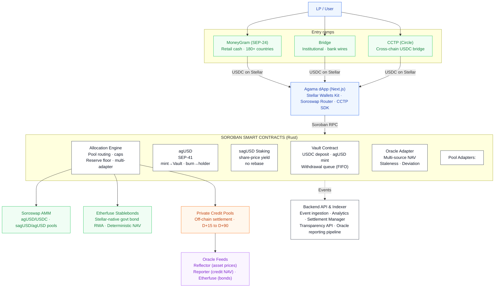

# Agama Finance — Technical Architecture

**Private Credit Yield Vaults on Stellar**  
June 2026, revised September 2026 · Confidential

`Soroban` · `SEP-41` · `Soroswap` · `Etherfuse` · `CCTP` · `MoneyGram`

**The same architecture, elsewhere in this repository:**  
[`Agama_Technical_Architecture.pdf`](Agama_Technical_Architecture.pdf) — this document as a rendered PDF ·  
[`../contracts`](../contracts) and [`../adapters`](../adapters) — the Soroban sources described below ·  
[`../deployments/testnet.json`](../deployments/testnet.json) — where those contracts are deployed on testnet.

---

> **Revision note · September 2026**
>
> The Blend v2 integration described in earlier versions of this document has been removed, following the Comet BLND-USDC exploit and Blend's removal from the SCF Integration List, where Blend V2 is being wound down. It is not replaced by another protocol.
>
> The instant-withdrawal liquidity role Blend played is now an on-chain reserve floor, enforced by the Allocation Engine and again by the Vault itself. The floor is a **share of a base, expressed in basis points**, not a fixed sum of USDC: an allocation reverts if the call would leave the Vault holding less free USDC than `floor_bps` of that base. The base is everything the protocol holds that the withdrawal queue has no claim on — free plus deployed — **plus everything it has ever written off**, because a write-down lowers recorded exposure with no cash moving and a base the caller can lower is not a floor. It is set to **2500 bps — 25%** — on testnet.
>
> The unit is the substance of the replacement, not a detail of it. A liquidity buffer parked in a lending protocol is only as instant as that protocol's utilization on the day it is needed; USDC that never left the Vault has no such dependency. But a buffer denominated as a fixed amount stops meaning anything as the book moves — it is most of a small vault and a rounding error in a large one — and it is the *ratio* of cash to obligations that decides whether a withdrawal can be paid. Expressing the floor as a share is what makes it scale with the book it is protecting, and it is why the guarantee survives growth instead of being re-tuned by hand after it.
>
> Fast-exit liquidity is therefore a protocol parameter anyone can read on-chain, in the same units the caps are written in, not a dependency on a third party's solvency.

## 1. Introduction

### 1.1 High-Level Overview

Agama is a private-credit yield infrastructure for tokenized real-world assets, built natively on Stellar using Soroban smart contracts (Rust). Users deposit USDC into curated vaults and receive **agUSD**, a composable synthetic dollar backed by diversified credit pools. Staking agUSD produces **sagUSD**, a yield-bearing token whose value appreciates as private credit repayments and on-chain strategies generate returns.

Both agUSD and sagUSD are issued as Soroban/**SEP-41** tokens. The on-chain Allocation Engine distributes capital across vetted pools—including **Etherfuse Stablebonds** for Stellar-native government-bond exposure and off-chain private credit pools from vetted originators—while enforcing concentration caps by pool, originator, and jurisdiction.

The protocol composes existing Stellar ecosystem primitives rather than reimplementing solved problems: **Soroswap** for AMM liquidity, **CCTP** for cross-chain USDC bridging, and **MoneyGram** (SEP-24) and **Bridge** for fiat on/off-ramps. sagUSD additionally follows the share-price yield economics established by **DeFindex**, without calling its contracts. agUSD functions as a composable building block for other Soroban protocols, bringing sticky, real-yield-backed TVL to the Stellar ecosystem.

### 1.2 Core Components

- **Agama dApp** — Web application for deposits, staking, and portfolio transparency. Wallet connection via the Stellar Wallets Kit (Freighter, xBull, Albedo, Ledger). Bridge tab for CCTP cross-chain deposits. Swap interface via Soroswap Router API.
- **Backend API & Indexer** — Node.js services ingesting Soroban contract events for NAV history, yield accrual, portfolio analytics, transparency reporting, and settlement management.
- **Soroban Smart Contracts (Rust)** — On-chain core: Vault (deposits/withdrawals, agUSD mint/redeem), agUSD and sagUSD SEP-41 tokens, Allocation Engine (pool routing, caps, multi-adapter), and Oracle Adapter (multi-source NAV validation).
- **Allocation Engine** — Routes deposited capital across Etherfuse Stablebonds and private credit pools via a uniform adapter interface, enforcing on-chain concentration caps.
- **Oracle Integration** — Multi-source NAV pipeline: Reflector for asset prices, custom reporter for private credit NAV, Etherfuse feed for bond pricing. Staleness and deviation checks on-chain.
- **On/Off-Ramp & Cross-Chain** — MoneyGram (SEP-24) for retail fiat ramp. Bridge for institutional wires. CCTP for native USDC bridging from Ethereum/Arbitrum.
- **Liquidity** — agUSD/USDC and sagUSD/agUSD pools on Soroswap. Stellar DEX order books as secondary liquidity venue.

### 1.3 Definitions and Acronyms

| Term | Definition |
|---|---|
| USDC | USD Coin, fiat-backed stablecoin by Circle, native on Stellar. Vault deposit asset. |
| Soroban | Stellar's smart contract platform. Contracts written in Rust, compiled to WASM. |
| SEP-41 | Standard token interface for Soroban contracts. agUSD and sagUSD implement SEP-41. |
| agUSD | Agama's synthetic dollar, minted 1:1 against USDC deposits. |
| sagUSD | Staked agUSD. Yield accrues via increasing sagUSD/agUSD exchange rate. |
| NAV | Net Asset Value — on-chain reported value of the portfolio backing agUSD. |
| Allocation Engine | Soroban contract routing vault capital across pool adapters with cap enforcement. |
| Reserve Floor | Minimum share of `floor_base` the Vault must retain as free USDC, in basis points. Enforced by the Allocation Engine at allocation time and by the Vault at release time, against its own book. 2500 bps (25%) on testnet. |
| `floor_base` | The denominator of the reserve floor: `booked_reserves + deployed_capital + recognised_losses - outstanding_liabilities`. The cash the Vault can account for from its own flows, plus what is out at a pool, plus what has been written off, less what the withdrawal queue is owed. A write-down cannot lower it and neither can cash arriving unannounced, which are the two things it exists to be invariant under. See 6.1, including the Engine's own reading, which is not the same number. |
| Free reserves | Idle USDC in the Vault less what the withdrawal queue is owed. Queued claims have already burned their agUSD, so the cash behind them is a liability rather than deployable capital. |
| Net assets | Free reserves plus deployed capital. The denominator every cap and the floor are measured against. |
| Originator | Vetted private credit counterparty receiving vault allocations. |
| Reflector | Decentralized push-based oracle network on Stellar. |
| DeFindex | Yield infrastructure for Stellar. sagUSD follows the same share-price yield economics, not DeFindex's contract interface. |
| Soroswap | Primary AMM on Soroban. Provides agUSD liquidity pools. |
| CCTP | Circle Cross-Chain Transfer Protocol. Native 1:1 USDC bridge between blockchains. |
| Etherfuse | Stablebonds — Stellar-native tokens backed by government bonds with embedded yield. |
| SEP-24 | Interactive deposit/withdrawal flows with anchors (used for MoneyGram). |
| SEP-57 | T-REX — Token for Regulated Exchanges. Standard for compliance-controlled RWA tokens on Stellar. |
| TTL | Time To Live — Soroban storage lifetime, managed with archival thresholds and periodic bumps. |

## 2. Architecture Overview

### 2.1 C1 Context

**External Actors**

- **LP / Depositor** — Deposits USDC into Agama vaults, receives agUSD, optionally stakes into sagUSD.
- **Asset Originator** — Private credit counterparty receiving allocations and servicing repayments.
- **Curator / Risk Committee** — Whitelists pools and originators, sets concentration caps, manages risk parameters.

**External Systems**

| System | Role | Integration List |
|---|---|---|
| Stellar Network | All on-chain operations: USDC settlement, Soroban execution | — |
| Circle (USDC) | Issuer of native USDC on Stellar | — |
| Reflector Oracle | Decentralized price feeds (USDC, XLM) | — |
| DeFindex | Share-price yield economics referenced by sagUSD, no contract calls | Integration List |
| Soroswap | AMM liquidity pools + Router API | Integration List |
| Etherfuse | Stablebonds — Stellar-native RWA collateral | Integration List |
| CCTP (Circle) | Native cross-chain USDC bridge | Integration List |
| MoneyGram | Fiat cash on/off-ramp (SEP-24), 180+ countries | Integration List |
| Bridge | Institutional fiat ramp (bank wires, ACH) | — |

### 2.2 C2 Containers

| Container | Technology | Responsibility |
|---|---|---|
| **Agama dApp** | TypeScript / Next.js | User-facing: deposits, staking, swaps (Soroswap Router), bridge (CCTP), transparency dashboard. Connects wallets via Stellar Wallets Kit. Submits transactions via Soroban RPC. |
| **Backend API & Indexer** | Node.js / PostgreSQL | Event ingestion, analytics (APY, NAV, exposure), settlement management (off-chain → on-chain), oracle reporting pipeline, MoneyGram SEP-24 adapter, Bridge API integration. |
| **Soroban Contracts** | Rust → WASM | Vault, agUSD, sagUSD, Allocation Engine (with Etherfuse/private credit adapters), Oracle Adapter. |

### 2.3 C3 Components

**Agama dApp**

- Wallet module — Stellar Wallets Kit for auth and transaction signing.
- Deposit/withdraw and stake/unstake interfaces — Soroban contract calls.
- Swap interface — Soroswap Router API for agUSD/USDC trading.
- Bridge tab — CCTP via Circle Bridge Kit SDK.
- Transparency dashboard — NAV, yield, pool exposure from Backend API.

**Backend API & Indexer**

- **Event Ingestion Service** — Soroban events → PostgreSQL.
- **Analytics Service** — APY, share price history, concentration metrics.
- **Settlement Manager** — Bridges off-chain credit repayments back on-chain.
- **Originator Reporting Adapter** — Collects off-chain servicing data, reconciles with on-chain NAV.
- **On/Off-Ramp Adapters** — MoneyGram SEP-24 + Bridge REST API.

**Soroban Smart Contracts**

- **Vault Contract** — USDC deposits, agUSD mint/burn, FIFO withdrawal queue.
- **agUSD Token (SEP-41)** — `mint` restricted to the Vault. `burn` and `burn_from` are the standard SEP-41 holder-authorized paths.
- **sagUSD Staking Contract** — Share-based vault on DeFindex's yield economics, not its interface. Yield via exchange rate appreciation. Two-step unstake behind a cooldown.
- **Allocation Engine** — Pool routing with adapters (Etherfuse, private credit). Concentration caps.
- **Oracle Adapter** — Multi-source NAV validation (Reflector, custom reporter, Etherfuse feed).

### 2.4 Data Flows

1. User converts fiat → USDC via MoneyGram (SEP-24) or Bridge, or bridges USDC from Ethereum via CCTP, or acquires USDC on Soroswap / Stellar DEX.
2. User connects wallet (Freighter, xBull, Albedo) via Stellar Wallets Kit.
3. User deposits USDC into Vault Contract → receives agUSD 1:1.
4. User optionally stakes agUSD → sagUSD at current exchange rate.
5. Curator whitelists pools; Allocation Engine deploys capital:
   - Etherfuse Stablebonds → Stellar-native government bond yield
   - Private credit pools → off-chain originator allocations
6. Yield flows back: Etherfuse (bond interest), private credit (originator repayment → settlement → USDC on-chain).
7. Oracle Adapter receives NAV updates: Reflector for asset prices, Backend reporter for credit NAV, Etherfuse feed for bond pricing.
8. `distribute_yield()` increases sagUSD/agUSD exchange rate → sagUSD holders earn yield passively.
9. Backend Indexer captures all events → powers transparency dashboard + API.
10. User exits: `request_unstake()` then `claim()` after the cooldown returns sagUSD → agUSD; `request_withdrawal()` then `claim_withdrawal()` redeems agUSD → USDC through the Vault queue. Or swap on Soroswap without queueing. Off-ramp via MoneyGram or Bridge.

### 2.5 System Characteristics

- **Transparent** — All vault accounting, caps, and yield distribution enforced on-chain.
- **Non-Custodial Token Layer** — Users hold agUSD/sagUSD in their own wallets.
- **Risk-Constrained by Design** — Concentration caps checked at allocation time.
- **Composable** — SEP-41 tokens usable across Soroban protocols. sagUSD priced by a single exchange rate.
- **Ecosystem-Native** — Built on Soroswap, Etherfuse, CCTP rather than standalone.
- **High-Frequency Yield** — Stellar's sub-cent fees enable frequent on-chain distribution.
- **Secure by Design** — Admin-gated functions, pausability, oracle guards, STRIDE-modeled threats.
- **Open Source** — All Soroban contracts Apache-2.0 at mainnet launch.

### 2.6 System Architecture Diagram

Entry ramps, Agama dApp, Soroban contracts, allocation targets, oracle feeds and the event path to the backend.



Legend, as coloured in the diagram: green = Integration List protocol · orange = Off-chain component · purple = Oracle / data feed · dark outline = Core Agama contract.

## 3. Ecosystem Integrations

Agama builds on proven Stellar ecosystem protocols drawn from the **SCF Integration List**. Each integration serves a specific architectural role and replaces or augments a component that would otherwise be built from scratch.

### 3.1 DeFindex — Shared Yield Accounting Convention

**Role:** sagUSD follows the same economic convention as DeFindex. `distribute_yield()` raises the assets behind each share rather than minting shares or rebasing balances, so a position is valued from a single exchange rate and there is no claim step.

**What this is not.** It is a shared economic model, not call-level compatibility. DeFindex's own vault interface publishes neither `distribute_yield` nor `exchange_rate`. It is multi-asset, `get_asset_amounts_per_shares` returns one amount per underlying asset rather than a scalar price per share, and it exposes no vault-level yield distribution entry point. Agama routes no funds through DeFindex vault contracts and depends on no DeFindex deployment, and a DeFindex-integrated wallet would need integration work to read sagUSD. What is genuinely shared is the economics: shares are never rebased, nothing is pushed to holders, and a position appreciates because the assets behind each share grow. Verified against `vault/src/interface.rs` in `defindex-io/stellar-contracts`, the live repository, in September 2026; the former `paltalabs/defindex` was archived in July 2026.

### 3.2 Soroswap — AMM Liquidity

**Role:** Primary liquidity venue for agUSD/USDC and sagUSD/agUSD on Soroban. The dApp integrates Soroswap's Router API for swap routing across all Stellar liquidity sources.

Agama seeds pools at mainnet launch. The agUSD/USDC pool enables peg arbitrage: mint at 1:1 via Vault and sell on Soroswap if above peg, or buy on Soroswap and redeem if below.

> **Classic/Soroban constraint:** Soroban transactions cannot include Classic operations (path payments, DEX offers) in the same transaction. Soroswap swaps are Soroban-native and composable with contract calls. Classic DEX trades require a separate transaction. Agama does not claim atomicity between them. See [Section 9](#9-classicsoroban-transaction-constraint).

### 3.3 CCTP — Cross-Chain USDC Bridge

**Role:** Native 1:1 USDC bridging from Ethereum/Arbitrum/Base. No wrapped tokens, no third-party bridge risk.

```text
LP on Ethereum
    ├── Initiates CCTP burn (USDC burned on source chain)
    ├── Circle attestation service confirms burn
    └── LP mints USDC on Stellar
            └── Deposits into Agama Vault → agUSD minted
```

The dApp includes a "Bridge" tab using Circle's Bridge Kit SDK.

### 3.4 Etherfuse — Stablebonds as Native RWA Collateral

**Role:** First-day RWA collateral on Stellar. Etherfuse Stablebonds are Stellar-native tokens backed by government bonds with embedded yield.

**Strategic value:**

- Live vault at mainnet launch without depending on off-chain credit tokenization.
- Low-risk base yield layer (government bonds) complementing higher-yield private credit.
- Proof that the Allocation Engine generalizes across RWA types.

**Oracle:** Stablebond NAV is deterministic (public bond pricing). Staleness threshold relaxed to 48h.

### 3.5 Bridge / MoneyGram — Fiat On-Ramp

**MoneyGram (SEP-24)** — Retail cash on/off-ramp in 180+ countries via interactive anchor flows. Integration at the Backend level via SEP-24 adapter.

**Bridge** — Multi-currency institutional ramp (bank wires, ACH). Backend integrates Bridge REST API for payout initiation and webhook callbacks.

## 4. Contract Overview

### 4.1 Vault Contract

**Purpose:** Entry point for capital. Accepts USDC deposits, mints agUSD 1:1, manages NAV-based accounting and the FIFO withdrawal queue.

**Key Functions**

| Function | Description |
|---|---|
| `__constructor(admin, usdc_token)` | Runs inside the deploy transaction, so there is no window between deployment and wiring for somebody else's `initialize` to land first. It takes USDC, which it checks answers the token interface, and deliberately not agUSD or the Engine: each of those is built against this Vault's address and cannot exist before it does, so each arrives afterwards through a setter that interrogates it. |
| `deposit(from, amount) → i128` | Transfers USDC, mints agUSD. Returns minted amount. |
| `request_withdrawal(from, amount) → u64` | Burns agUSD, enqueues claim. Returns claim_id. |
| `claim_withdrawal(from, claim_id)` | Pays USDC when Ready. FIFO order, or out of order for a claim the queue has already deferred. Fails with `PaymentRejected` rather than trapping if the token refuses to deliver. |
| `settle_withdrawal()` | Pays the head claim to its recorded owner. Permissionless: no claim id, no recipient, so the caller can neither redirect nor reorder. If the token refuses to deliver, the claim is marked deferred and stepped over, unpaid and still owed. |
| `is_deferred(claim_id) → bool` | Whether the queue stepped over this claim because it could not be delivered. Its owner collects it through `claim_withdrawal` whenever the obstruction is gone. |
| `set_reserve_floor(admin, floor_bps)` | The Vault's own copy of the floor, enforced in `settle_allocation`. Ships closed at 10000. |
| `record_repayment(amount)` | Engine-called. The Vault verifies the cash arrived in its own balance before reducing `deployed_capital`. |
| `record_writedown(admin, amount)` | Engine-called and admin-signed. Reduces `deployed_capital` with no cash arriving, and raises `recognised_losses` by the same amount so the floor's base does not move. |
| `record_recovery(admin, amount)` | Engine-called and admin-signed. Books capital that had been written off and has come back, and releases the recognised loss against it. Refuses any amount the Vault cannot see arriving in its own balance, and the loss it releases is matched stroop for stroop by cash entering free reserves — so `floor_base` does not move here either. What a write-down cannot buy, a recovery cannot buy back. |
| `bump_pending(addr)` | The same thing for a pending unstake on sagUSD, and permissionless for the same reason. `request_unstake` burns the shares and takes the assets out of `nav`, so the pending record is the whole of what says a departed staker is still owed anything; written with `set` alone it got 4095 ledgers, under six hours, against the ninety days a withdrawal claim gets. A cooldown makes that worse rather than better, because a cooldown is a period the staker has been told to go away for. |
| `bump_claim(claim_id)` | Postpones the archival of a claim record. Permissionless: it cannot shorten a TTL, cannot alter a claim, and the caller pays the rent, so extending a stranger's claim is a donation rather than an attack. It exists because claims are bumped only when they are written, and a claim waiting behind a queue that is allowed to stall is a claim nothing writes to. |
| `free_reserves() / outstanding_liabilities() / get_net_assets() / deployed_capital()` | The four numbers the book is computed from, all readable by anyone. |
| `recognised_losses() → i128` | Deployed capital written off and not recovered. Not an asset, and `get_net_assets()` correctly excludes it. It rises on a write-down and falls in exactly one way, `record_recovery`, which requires the cash to have arrived. |
| `floor_base() → i128` | The denominator the reserve floor is a share of: `booked_reserves + deployed_capital + recognised_losses - outstanding_liabilities`, summed unclamped and clamped once at zero. |
| `accounted_free_reserves() → i128` | `booked_reserves` net of what the queue is owed, never negative. What `settle_allocation` checks an allocation against, rather than `free_reserves`, which reads the real balance. The two differ by whatever cash reached the Vault without its books being told. |
| `propose_admin(admin, new_admin)` / `accept_admin(new_admin)` | Two-step admin handover. |
| `set_oracle(admin, oracle, feed_id)` | Points the Vault at an Oracle Adapter and a feed on it. Interrogates the pair before accepting it, which until now it was alone among this Vault's setters in not doing: the address has to answer `get_feed` for this exact feed, so it has to be a contract, it has to be an oracle, and it has to know the feed. It deliberately says nothing about whether that feed has reported yet or whether its last value is fresh, because pointing at a newly deployed oracle, or at one whose reporter is down, is an ordinary operation and often the reason for repointing. What no check reaches is a real feed that is the wrong one for this Vault's book, which is why the pair is now readable. |
| `oracle() → Address` / `oracle_feed() → Symbol` | The pair `get_nav()` reports from. Every other counterparty on this Vault could be read back and this one could not, so the only way to learn where it pointed was to call `get_nav()` and infer it from the number, and a wrong pointer produces a plausible number. The missing getter is what let the missing check go unnoticed. |
| `settle_allocation(pool, amount)` | Releases idle USDC to a pool. Callable only by the Allocation Engine, which has already checked the caps and the floor. |
| `set_agusd(admin, agusd_token)` | Points the Vault at the token it mints, and the only door that pointer has. The token must name this Vault as its minter — the first Vault ever deployed here pointed at one that exposed no `mint` at all and could never issue a unit — and the pointer closes at the first deposit. It must also count stroops the way this Vault's USDC does, which is the requirement the peg rests on and the easiest to miss: `deposit` mints one stroop of agUSD for one stroop of USDC, so a token with different decimals leaves the internal arithmetic perfectly self consistent, the round trip exact, and everything outside wrong. An AMM pool, an oracle or a lending market valuing a unit at a dollar would be out by a factor of ten with nothing on-chain contradicting it. Both are seven today; this is the check that says so rather than the assumption that they always will be. |
| `set_engine(admin, allocation_engine)` | Repoints the Engine allowed to release reserves. Refuses any address that does not answer that it governs this Vault with an empty book, and refuses to move at all while this Vault has capital deployed. |
| `set_paused(admin, paused)` | Circuit breaker. |
| `idle_reserves() → i128` | USDC the Vault is holding. What the reserve floor protects and what claims are paid from. |
| `get_total_assets() → i128` | Gross: idle reserves + deployed allocations. Counts USDC owed to the withdrawal queue, which is still an asset until it is paid. `get_net_assets()` is the figure the caps and the floor use. |
| `get_nav() → i128` | Latest validated NAV from Oracle Adapter. Propagates `OracleStale` rather than returning an old number. |
| `get_claim(claim_id) → Claim` | The stored claim record. |
| `claim_status(claim_id) → ClaimStatus` | Pending, Ready or Claimed. `Ready` is computed, not stored: a claim becomes payable when the queue reaches it and reserves cover it, without anyone touching it. |
| `queue_head() → u64` | Next claim id that may be paid. |
| `queue_tail() → u64` | Next claim id to be handed out. |
| `queue_length() → u64` | Claims the queue has not reached yet. A deferred claim is not counted here; it is still owed, and `outstanding_liabilities()` is the number that says so. |
| `deposits() → u64` | Deposits taken since deployment. What `set_agusd` keys off. |

**Storage**

**Instance:** Admin, PendingAdmin, UsdcToken, AgusdToken, AllocationEngine, Oracle, OracleFeed, Paused, QueueHead, QueueTail, Deposits, FloorBps, Deployed, Queued, Booked, WrittenOff.  
**Persistent:** Withdrawal claims (keyed by claim_id), and a deferred flag per claim id for the ones the queue has stepped over.  
Claim records carry a 90 day TTL, bumped whenever they are written and by `bump_claim` whenever anybody asks. That entry point is the difference between a documented keeper and a keeper with something to call: an archived persistent entry cannot be read at all, so a head claim that outlived its TTL used to stop the whole queue until an out-of-band `RestoreFootprint` put it back.

**Events**

`Deposit(user, amount, minted)` · `WithdrawalRequested(user, claim_id, amount, queue_position)` · `WithdrawalClaimed(user, claim_id, amount)` · `PauseToggled(paused)` · `Staked(staker, assets, shares, nav, supply)` · `UnstakeRequested(staker, shares, assets, claimable_at, nav, supply)` · `UnstakeClaimed(staker, assets)` · `YieldDistributed(amount, nav, supply)` · `AgUsdRepointed(agusd)` · `EngineRepointed(engine)` · `ReserveFloorSet(floor_bps)` · `RepaymentRecorded(amount, deployed)` · `WriteDownRecorded(amount, deployed, recognised_losses)` · `RecoveryRecorded(amount, applied_to_losses, recognised_losses)` · `WithdrawalDeferred(user, claim_id, amount)` · `AdminProposed(new_admin)` · `AdminChanged(admin)`

**Security**

Every state-changing entry point authorized, or on an explicit list of the ones that deliberately are not, checked by `scripts/check-authorization.sh` rather than by reading: it follows helpers, because several calls here authorize inside one, and it fails both on a new unauthorized entry point and on an allowlist entry that has outlived its reason · Overflow checks on in the release profile, so an i128 sum traps rather than wrapping in the build that reaches the ledger, pinned by a test against the manifest because the test profile is not the release profile · Constructor rather than a front-runnable `initialize` · `require_auth()` on all state-changing calls · Zero/negative validation · Pause circuit breaker on deposits, requests and allocations, never on payouts · Minimum withdrawal amount · FIFO queue (no priority, no stalling, and no freezing on a payout the token refuses) · The reserve floor enforced against the Vault's own book, so no Allocation Engine can take reserves below it, and against a base a write-down cannot move, so no admin can either · Two-step admin handover.

### 4.2 agUSD Token Contract (SEP-41)

**Purpose:** Composable synthetic dollar. `mint` is restricted to the recorded minter, which is the Vault Contract address: it is the only address that can bring agUSD into existence, and `set_minter` stops working at the first mint, so every unit in circulation was created by the minter named in the deployment record.

`burn` and `burn_from` are **not** minter-gated. They are the standard SEP-41 holder-authorized paths: any holder can burn their own agUSD, and a spender can burn against an allowance. The Vault's `request_withdrawal` uses exactly that path, calling `burn` on the withdrawer in a transaction the withdrawer has already signed, rather than a privilege of its own. Supply can therefore only go up through the Vault, and can go down through anyone holding the token — which is the correct asymmetry for a redeemable synthetic dollar, since burning agUSD destroys a claim rather than creating one.

Standard SEP-41 interface: `transfer`, `transfer_from`, `approve`, `allowance`, `balance`, `burn`, `burn_from`, `decimals`, `name`, `symbol`, `total_supply`.

**Events:** `mint` · `burn` · `transfer` · `approve` (SEP-41) · `MinterSet(minter)`

### 4.3 sagUSD Staking Contract

**Purpose:** Yield-bearing staked agUSD. Share-based vault accounting on the same share-price economics as DeFindex, not its contract interface. Yield increases the sagUSD/agUSD exchange rate.

**Key Functions**

| Function | Description |
|---|---|
| `stake(from, agusd_amount) → i128` | Locks agUSD, mints sagUSD shares at the current rate. Returns shares minted. |
| `request_unstake(from, shares) → i128` | Step 1 of 2. Burns the shares immediately, prices them at the current rate and locks the agUSD owed behind the cooldown. Returns the assets owed. |
| `claim(from) → i128` | Step 2 of 2. Pays out a matured unstake request. Reverts while the cooldown is still running. |
| `cooldown() → u64` | Seconds between a request and the moment it can be claimed. 60 on testnet. |
| `pending(addr) → Pending` | The caller's queued unstake: assets owed and the timestamp it becomes claimable. |
| `distribute_yield(amount)` | Deposits yield, increases assets-per-share. Authorized distributor only, which in V1 is the stored admin: the call takes no distributor argument and authorizes the recorded admin address, whose own agUSD is what moves. |
| `exchange_rate() → i128` | Current agUSD per sagUSD share (scaled to 7 decimals). |
| `share_price() → i128` | Alias of `exchange_rate()`, the name this contract shipped with. Same computation, retained because the generation 1 agUSD calls it on the credit vaults. |
| `nav() → i128` | Total agUSD the contract is accountable for. It moves only through `stake`, `request_unstake` and `distribute_yield`, all three backed by a transfer. |
| `total_shares() → i128` | sagUSD in circulation. |
| `set_allocations(allocations)` / `allocations() → Vec<Allocation>` | Admin-written list of `{name, target_bps, apy_bps}`, readable by anyone. **Display metadata, and nothing in this contract reads it.** No accounting, no yield computation and no guard depends on it, so a `target_bps` that does not sum to 10000 or an `apy_bps` that no pool earns is not caught and is not meant to be. It is an admin assertion published on-chain, and should be read as one. |

**There is no NAV setter.** The contract shipped with `report_nav(new_nav)`, admin-gated, accepting any non-negative value with no bound and no event, described as being for demo and reconciliation. NAV is the denominator of both directions of the share price — `stake` mints `amount * supply / nav`, `request_unstake` returns `shares * nav / supply` — so it was not a reporting convenience but an instruction to reprice every share in the contract. Against 1000 agUSD staked: `report_nav(1)`, stake 99 stroops and take 99% of the share supply, `report_nav` back, unstake, leave with 990 agUSD of somebody else's deposit. It has been removed rather than bounded, because `distribute_yield` already does the legitimate job and cannot overstate the book.

**Unstaking is two steps, not one.** There is no single `unstake()` call. `request_unstake` burns the shares at request time and prices them there, so a queued position cannot keep earning, be sold, or be re-requested while it waits; `claim` pays it out once `cooldown()` has elapsed. Pricing at request rather than at claim is what stops the cooldown being used as a free option on the exchange rate.

**Events:** `mint` · `burn` · `transfer` · `approve` (SEP-41, on the share token) · `AgUsdRepointed(agusd)`. Yield distribution is observable as the resulting change in `nav()` and `exchange_rate()` together with the underlying agUSD `transfer` into the contract; it does not currently emit a dedicated event of its own.

### 4.4 Allocation Engine Contract

**Purpose:** Routes vault capital across pool adapters (Etherfuse, private credit) with on-chain concentration cap enforcement and a reserve floor. All four limits are measured in basis points, so they are read in the same units and cannot be compared wrongly. The three caps are a share of net assets; the floor is a share of `floor_base`, which is net assets plus everything written off and not recovered. The difference is deliberate and it only ever runs one way: a larger base makes the floor *tighter* and would make a cap *looser*, so the write-off term belongs in one denominator and not in the other.

Write-offs reach the caps through the numerator instead. Every cap is measured on `charged_exposure`, which is what a pool holds plus what has been written off against it, and not on live exposure alone. Live exposure is a quantity `write_down` sets to zero while the adapter goes on holding the cash, so measuring against it let the same pool be filled to its cap, written off and filled again without limit: a pool capped at 40% could take everything the reserve floor would release, in slices that each read as inside the cap, with the originator and jurisdiction sums following it up because they are built from the same per-pool numbers. Charging the write-off is the numerator half of the fix the floor got in its denominator, and it is a product decision as much as a correction — a defaulted originator does not get its limit back by defaulting, and re-funding it takes an explicit decision rather than a side effect of recognising a loss.

**Key Functions**

| Function | Description |
|---|---|
| `__constructor(admin, vault)` | Runs inside the deploy transaction, closing the window an `initialize` left open. The Vault must answer `admin()`, which an ordinary account cannot, and must answer with this Engine's own admin, because the calls that recognise and reverse a loss need one signature that satisfies both contracts. Ships fail-closed besides: every cap at zero and the reserve floor at 10000 bps, so an unconfigured Engine can deploy nothing. |
| `register_pool(admin, pool_id, originator, jurisdiction, cap_bps)` | Whitelists a pool with metadata and cap. Refuses any adapter that does not name this Engine and this Engine's Vault: an adapter pointed elsewhere takes capital from this Vault and repays a third party while `deallocate` decrements the book as though the money had come home. This is the first time that check runs rather than the only time — half of the condition is a fact about the Engine, and `set_vault` can change it, so `allocate`, `deallocate` and `recover` each re-run it on the pool they touch. The other half of that finding was that the registry had no way to remove an entry at all, so a stale one could only be defended against; `unregister_pool` closes it, and runs no counterparty check itself, because the entry most worth removing is the one that would fail it. |
| `set_pool_cap(admin, pool_id, cap_bps)` | Moves a registered pool's own cap. A pool's effective limit is the tighter of this and `caps().pool_bps`, and until it existed only the second could move, so wherever a pool's own figure was the binding one it was binding for the life of the Engine. The useful direction is down: a cap of zero stops new capital reaching a pool without touching what it holds or releasing what it has been charged, which is the delisting that works on a pool in default. Lowering below current exposure is allowed on purpose, because caps are checked when capital is deployed and an operator watching a position deteriorate should not have to wait for it to shrink before being allowed to cap it. |
| The token edge | An adapter stores the token it transfers with, and `register_pool` and `set_counterparties` were both about which contracts are wired together rather than about the asset. An adapter with the right pointers and the wrong token is a one way door: the Vault sends what the Vault holds, so real USDC arrives, and `deallocate` then sends back the token the adapter stores, of which it has none, and traps. Both sides check it now. The adapter refuses at construction, which is earlier than the registry door and is the right place, and it never takes the token as a parameter again, so it is bound to its asset for life. The Engine re-runs the comparison on every call that moves capital, for the reason it re-runs the Vault edge: `set_vault` can point it at a Vault custodying a different asset. |
| `unregister_pool(admin, pool_id)` | Removes an entry. Refused while this Engine or the adapter still books capital in it, and refused while a write-off is still charged against it: the aggregate caps are built by walking this registry, so an entry leaving takes its charge out of them, and a defaulted pool could otherwise be delisted and replaced under the same originator with its whole limit back. A pool in default is therefore freezable but not delistable, and becomes delistable when the loss is recovered rather than when it is forgotten. It runs no counterparty check, deliberately: the entry most worth removing is the one whose adapter no longer names this Engine's Vault, and a check would refuse exactly that one. |
| `set_caps(admin, pool_cap_bps, originator_cap_bps, jurisdiction_cap_bps)` | Updates global concentration limits, in bps of net assets. |
| `set_reserve_floor(admin, floor_bps: u32)` | Sets the minimum **share of `floor_base`**, in basis points, that must stay as free USDC in the Vault. Rejects anything above 10000. Admin-gated; emits an event. The Vault keeps its own copy and enforces it independently. |
| `set_vault(admin, vault)` | Repoints the Engine at a different Vault, running the same interrogation the constructor runs, so a repair cannot leave the pair in a state the constructor would have refused to create. Refused while any capital is deployed, so the book and the balance sheet the caps measure it against stay one Vault's. An empty book is not the same as an empty registry, and this call cannot repair the second: every pool already registered goes on naming the outgoing Vault, and the adapters have to be brought across with `set_counterparties` before anything can be allocated to them again. |
| `allocate(admin, pool_id, amount)` | Deploys capital. Reverts if any cap is exceeded, or if the call would leave accounted free reserves below `floor_bps` of `floor_base`, both read off the Vault. The Vault applies the same floor again when it releases. Before any of that it re-runs `register_pool`'s check with `AdapterMismatch`, because a pool registered before a `set_vault` names a Vault this Engine no longer governs, and releasing the new Vault's USDC to it puts the cash somewhere only the old Vault could ever call it back from. |
| `write_down(admin, pool_id, amount, reason)` | Recognises a credit loss. Reduces this Engine's exposure, the adapter's own, and the Vault's deployed capital, in one transaction, with no cash required, and raises `written_off` by the same amount so the floor's base does not move. The amount is also charged against the pool's concentration cap until the cash comes back. Admin-gated, and it refuses with `AdminMismatch` rather than trapping four frames down if the Engine's admin and the Vault's have diverged. Emits an event carrying the reason. |
| `recover(admin, pool_id) → i128` | Brings home whatever an adapter holds above its booked exposure: a written-off position that recovers, and interest paid above principal. Both used to be unreachable, because `deallocate` is capped at booked exposure and a written-off position has none, and because an adapter holding USDC cannot be repointed — one stroop of stranded cash closed the only repair path the adapter had, and it cost three redeployments before it was worth fixing. The caller aims nothing: the destination is the adapter's stored Vault and the amount is the surplus, neither of them a parameter — which is a safety property only while that Vault is still the one this Engine governs, so this call re-runs the adapter check too. |
| `deallocate(pool_id, amount)` | Records repayments returning to the Vault, and tells the Vault, which verifies the cash arrived before its own book is allowed to fall. Re-runs the adapter check first, so a stale pairing is refused by name here rather than four frames down at the Vault, or, where the Vault happens to hold unannounced cash of the same size, not refused at all. |
| `propose_admin(admin, new_admin)` / `accept_admin(new_admin)` | Two-step admin handover. |
| `vault_admin() → Address` | The Vault's admin, as the Vault reports it. Read rather than stored, so the Engine cannot go on naming an admin the Vault has already rotated away from. |
| `get_exposure(pool_id) → i128` | Current allocation per pool. |
| `get_exposures() → Map` | Full allocation state. Pools with no exposure appear as zero, so the map doubles as the whitelist. |
| `total_allocated() → i128` | Total booked as deployed across every pool. |
| `caps() → Caps` | The three concentration limits currently in force, in bps. |
| `reserve_floor_bps() → u32` | Current reserve floor, in bps of `floor_base`. Readable by anyone. |
| `written_off() → i128` | Exposure written off and not recovered. Not an asset, and `total_allocated()` correctly excludes it. |
| `written_off_pool(pool_id) → i128` | Written off against one pool and not recovered. This is what a write-down costs that pool's cap. |
| `charged_exposure(pool_id) → i128` | The quantity the three caps are actually measured on: deployed plus written off. It differs from `get_exposure()` only after a write-down, and that difference is the whole reason a write-down can no longer reopen a cap. |
| `admin_aligned() → bool` | Whether this Engine's admin and the Vault's are the same address. It is false exactly when `write_down` and `recover` will refuse. Nothing can stop an operator rotating one key at a time, and nothing should — a rotation that needed a counterparty's cooperation would be one a hostile counterparty could block — but the divergence should be visible before an incident puts a number on it, and this is one call. |
| `floor_base() → i128` | `Vault::floor_base()`, read from the Vault rather than rebuilt here, so the limit the Engine enforces and the limit the Vault enforces are one number. |
| `get_reserve_ratio() → u32` | `Vault::accounted_free_reserves()` as a share of `Vault::floor_base()`, in bps: the number the floor is a lower bound on, read against the same base the floor is checked against. Cash the Vault's books cannot explain lifts neither term, so this does not report liquidity the Vault would refuse to deploy. |
| `get_pool(pool_id) → Pool` | A registered pool's originator, jurisdiction and cap. |
| `pools() → Vec<Address>` | Every registered pool adapter. |

**Adapter Interface**

All pool types implement a uniform adapter interface. The Engine is agnostic to pool type. Adapters handle oracle queries, token transfers, and position encoding specific to each pool type.

| Adapter | Underlying | Settlement | Oracle |
|---|---|---|---|
| Etherfuse | Stablebond contracts | Instant (on-chain) | Etherfuse feed (48h staleness) |
| Private Credit | Off-chain originator | D+15 to D+90 | Custom reporter (7d staleness) |

**Registry scale**

`unregister_pool` gave the pool registry a way to shrink; nothing bounds how large it can grow before that. Two limits apply, and they do not bind at the same place. The registry is a single instance-storage entry (`Cfg::Pools`), so it is bounded by the network's ledger entry size limit; measured directly from the host's own resource metering rather than estimated, that entry grows by exactly 144 bytes per registered pool. The `allocate` walk is bounded by the transaction's CPU instruction budget instead: it decodes the whole registry once and then walks it twice more, in `charged_where_originator` and `charged_where_jurisdiction`, each reading two persistent entries for every pool that shares the originator or the jurisdiction under test.

The worst case is every registered pool sharing one originator and one jurisdiction, which is also the concentration the caps exist to catch, so it is the case measured. Soroban-sdk's own test-harness default budget is 100,000,000 CPU instructions, its documented stand-in for the network's limit; it is used here because this repository's environment could not reach a live network endpoint to confirm the exact current mainnet figure. Against that budget, `allocate` succeeds at 276 same-bucket pools (99,516,940 instructions, 483,060 short of the limit) and exceeds it at 277, the marginal pool costing 648,847. Memory tracks the same shape and is not the binding dimension: 38,308,999 of the SDK's 40MB default at 276 pools, with more headroom left than the instruction budget has. The registry entry itself is about 40KB at that point, nowhere near a plausible byte-size ceiling; the instruction budget is what actually bites, and it bites first by a wide margin.

The cost is not linear in the worst case. Marginal instructions per pool roughly double as the pool count doubles: about 87,600 per pool between 5 and 20 pools, about 138,000 between 20 and 50, about 225,000 between 50 and 100, because both decoding the registry and reading two persistent entries per matching pool grow with the count. A realistic registry does not look like the worst case. With each pool under its own originator and its own jurisdiction, an `allocate` call matches nothing but the target pool in both aggregate sums, and the cost left is decoding the registry once. Measured that way, 1000 registered pools costs 18,686,325 instructions, 19% of the default budget.

`register_pool` is admin-gated, so this is an operational ceiling rather than a griefing surface; nobody outside the operator can grow the registry at all. Reaching 276 pools sharing one originator and jurisdiction would mean one counterparty operating that many separately deployed, separately wired pool adapters under one legal regime, which is not a shape this protocol's onboarding produces: `register_pool` is a manual, adapter-per-pool operation, and the originator and jurisdiction caps already limit how much capital that many pools could carry between them. Measured against any plausible number of pools for a private-credit book, and the deployed configuration runs two, the ceiling is comfortably out of reach, and nothing has been changed here for it. Native Rust execution understates what real WASM execution would cost, per soroban-sdk's own documentation of its cost model, so an operator planning to register pools at a scale approaching even the low hundreds under one originator and jurisdiction should re-measure against the network's actual limit rather than treat 276 as a safe number. The measurements above live in `contracts/allocation-engine/src/test.rs`, as `pool_registry_cost_by_pool_count`, `allocate_eventually_exceeds_the_default_instruction_budget`, `the_instruction_budget_binds_before_the_memory_budget` and `pool_registry_cost_with_one_originator_and_jurisdiction_per_pool`.

**Operational Model**

**V1 (grant scope):** Admin-directed allocation. The Curator calls `allocate()` manually. The Engine enforces constraints but does not decide autonomously.

**V2 (post-grant):** Off-chain optimizer computes target allocations and submits through the same admin-gated functions. Same cap enforcement, same governance guardrails.

### 4.5 Oracle Adapter

**Purpose:** Single source of truth for NAV data, bridging multiple feed types with unified validation.

**Data Sources**

| Feed | Source | Trust Model | Staleness | Deviation | Band | Interval |
|---|---|---|---|---|---|---|
| Asset prices (USDC) | Reflector | Decentralized | 1 hour | 200 bps | 0.90 to 1.10 | 5 min |
| Private credit NAV | Off-chain report → Backend → Reporter key(s) | Centralized (V1, disclosed) → 2-of-3 quorum (V2) | 7 days | 500 bps | 0.50 to 2.00 | 1 hour |
| Etherfuse bond price | Etherfuse API / on-chain | Deterministic | 48 hours | none | 0.50 to 2.00 | 1 hour |

The band and the interval exist because a deviation bound is relative and cannot cover two cases on its own. It cannot reach the **first** report for a feed, since a bound on a move needs something to move from: before the band, a `push_nav` carrying `i128::MAX` was accepted and became the reference every later bound was a percentage of. And it says nothing about **how many** reports there can be, so forty pushes of +5% moved a NAV sevenfold in forty seconds with every one of them inside the bound. The interval is measured in ledger time between accepted values rather than in reported timestamps, because the reporter chooses those and can submit forty of them, a day apart, in the same minute.

**V1 → V2: multi-reporter quorum.** V1 is a single disclosed reporter: one authorized address, one vote, and it lands. Every feed defaults to a quorum threshold of 1, which is exactly that. `set_quorum_threshold(admin, feed_id, n)` raises a feed above it, and once a feed's threshold is above 1, a value only commits after `n` distinct authorized reporters have submitted the same value for the same round, a round being identified by the feed and the reported timestamp. Each reporter gets one vote per round regardless of what it votes for, so a reporter cannot manufacture the second vote a round needs by signing twice. Partial agreement moves nothing: two reporters proposing two different values for the same round both sit short of quorum until enough of them converge on one. This is per-feed and reversible, an operating parameter the admin can raise or lower, not a write-once guard like a feed's staleness or deviation bound. The record of who has already voted in a round is kept for as long as the round can still be voted in, which is not the same as for as long as the round is unresolved: a round that commits advances the feed's timestamp, so monotonicity closes it behind the commit and the record is dropped, while a round that is refused moves no state at all and stays open, so the record is deliberately kept. Dropping it there would undo the feature. A reporter could seed a value of its own, wait for the round to be refused on some other value, vote for its own a second time and reach a quorum of two alone, which is a threshold above 1 buying no independence between reporters at all. A threshold of 1 is exempt by definition, one vote being the whole round. Once a round does reach quorum, the value it agreed on still has to clear every guard in this section, band, monotonicity, the rate limit, the deviation bound, unchanged: quorum decides how many reporters have to agree before a value is even evaluated, not whether it is evaluated.

Raising a feed's threshold defends against exactly one thing: a single reporter key being compromised or malfunctioning. It is not a defense against everything a NAV can get wrong. It does nothing against a colluding majority of that feed's reporter set, since collusion and honest agreement look identical to the contract. And it does nothing against reporters that are all honest and all wrong because they read the same bad upstream source, an incorrect servicer feed or a broken reconciliation job upstream of every reporter: three independent signatures on the same mistake are still a mistake, agreed upon. Quorum buys independence between reporters, not correctness of what they report.

**Pipeline**

```text
Originator (servicing data)
    → Agama Backend (reconciliation + validation)
        → Reporter calls push_nav(reporter, feed_id, nav, timestamp)
       or submit_nav(reporter, feed_id, nav, timestamp)
            → Oracle Adapter records the vote:
                ✓ Caller in authorized reporter set
                ✓ NAV inside the feed's absolute band (covers the first report)
                ✓ Timestamp not ahead of ledger time
                ✓ Caller has not already voted in this feed's round for this timestamp
                → Below the feed's quorum threshold: vote recorded, nothing else happens
                → At the threshold, nav_quorum_reached, then the value the round
                  agreed on is checked against the feed's state:
                    ✓ Timestamp > last committed update
                    ✓ Feed's minimum interval elapsed in ledger time
                    ✓ Deviation ≤ 5% from previous NAV
                    ✗ If exceeded → nav_rejected event
            → Vault Contract calls get_nav()
                → Reverts with OracleStale if feed older than threshold
```

**Failure Modes**

| Failure | Impact | Mitigation |
|---|---|---|
| Reporter offline | Withdrawals/allocations revert | Deposits/stakes continue. Admin assigns backup reporter. |
| One reporter compromised | False NAV pushed | Deviation bounds reject it regardless. With a feed's quorum threshold above 1, a lone compromised reporter cannot commit a value on its own at all. |
| A majority of a feed's reporters compromised or colluding | False NAV agreed upon and pushed | Not mitigated by quorum, which cannot distinguish collusion from honest agreement. Deviation bounds still apply. Detection is operational: reporter key custody and monitoring. |
| Originator misreports, all reporters relay it faithfully | Incorrect but internally consistent NAV | Not mitigated by quorum, since independent reporters agreeing on the same upstream mistake is exactly what quorum is designed to accept. Backend reconciliation. >5% requires admin confirmation. |
| Reflector offline | Display-only impact | Core operations do not depend on Reflector. |

**Entry Points**

| Function | Description |
|---|---|
| `register_feed(admin, feed_id, staleness, deviation_bps, band_lo, band_hi, interval)` | Creates a feed and fixes its guards. **Write once:** re-registering an existing feed is rejected, so a bound that needs retuning takes a new `feed_id` and the change is visible to every consumer instead of loosening silently under an unchanged name. |
| `push_nav(reporter, feed_id, nav, timestamp)` | Commits a value on a feed whose quorum threshold is 1. |
| `submit_nav(reporter, feed_id, nav, timestamp)` | Casts a vote in a feed's round. Below the threshold it records the vote and does nothing else; at the threshold the agreed value is put through every guard in this section. |
| `get_nav(feed_id) → i128` | The validated NAV. Reverts with `OracleStale` rather than returning an old number. |
| `last_update(feed_id) → NavPoint` | The raw stored point, staleness included. Monitoring has to be able to see how stale a feed is, which `get_nav` deliberately refuses to say. |
| `get_feed(feed_id) → FeedConfig` | A feed's guards, as registered. Also how the Vault's `set_oracle` interrogates a candidate oracle for the pair it is about to trust. |
| `add_reporter(admin, reporter)` / `remove_reporter(admin, reporter)` | Reporter set membership. Both emit, so rotations are auditable off-chain without replaying the ledger. |
| `is_reporter(addr) → bool` / `reporters() → Vec<Address>` | The set, readable by anyone. |
| `set_quorum_threshold(admin, feed_id, n)` / `quorum_threshold(feed_id) → u32` | A feed's threshold, 1 until raised. Per-feed and reversible, an operating parameter rather than a write-once guard. |
| `quorum_votes(feed_id, timestamp, nav) → u32` | Votes so far for one value in one round. Zero whether the round never started or nobody cast that value. |

**Test Coverage (all contracts)**

End-to-end flows (deposit → stake → yield → redeem) · Cap-violation rejection · Re-initialization guards · Access control, with targeted authorizations rather than a blanket mock · Zero/negative validation · Oracle staleness, deviation, band and rate limit · Oracle quorum: partial votes commit nothing, one vote per reporter per round, disagreeing values never reach quorum, every guard still binds on the value a round agreed on · Withdrawal queue ordering and permissionless settlement · A hostile Allocation Engine bounded by the Vault's own floor · Write-down accounting across three books · Two-step admin handover · The adapter solvency invariant, that an adapter never holds less USDC than it has booked, asserted after every call in a sequence that moves it · Property-based fuzzing over randomised operation sequences, on the Vault with the Allocation Engine and both adapters, on sagUSD, and on the oracle's quorum. It is what found that `Engine::book_recovery` could lower the reserve floor's base, in four operations, which is why that call no longer exists. Run harder than the committed case counts and the numbers written down: 1500 cases and sequences of up to 89 operations on the Vault, both clean. One property it is measured **not** to reach, a single reporter carrying a quorum by voting into a round twice, is pinned by a constructed test instead, and the oracle suite says so rather than letting its own existence imply otherwise.

### 4.6 Pool Adapters

**Purpose:** One contract per allocation target, holding that target's position and nothing else. The Engine never touches a pool directly; it calls an adapter, and the adapter is what knows how that pool converts cash. Two are deployed: private credit and Etherfuse.

Both expose the same interface, which is what lets the Engine treat a new RWA type as configuration rather than as code.

| Function | Description |
|---|---|
| `allocate(amount)` / `deallocate(amount)` | Engine-only. Move USDC into and out of the position. `deallocate` sends the cash to the adapter's stored Vault, not to a caller-supplied address. |
| `write_down(amount)` | Engine-only. Records a loss against this adapter's booked exposure. |
| `get_exposure() → i128` | What this adapter has booked as owed to the Vault. |
| `recover_surplus(caller) → i128` | Sweeps USDC the adapter holds beyond its booked exposure to the stored Vault, and returns what it swept. `caller` must be the stored Engine or this adapter's own admin and authorizes for itself; the admin path is how an adapter left pointing at superseded counterparties is unstuck without a working Engine. It aims nothing: the destination is the stored Vault and the amount is `balance - exposure`, neither a parameter. `NothingToRecover` when the surplus is not positive. |
| `set_counterparties(admin, engine, vault)` | Repoints the adapter. The token is deliberately **not** a parameter and is fixed at construction, so a repointing has to land on a Vault that custodies the asset this adapter already transfers with. Refuses unless the adapter is empty on both counts, zero booked exposure and zero USDC held, with `NotEmpty`, so a position is never left addressable only by a contract nobody points at. |
| `engine()` / `vault()` / `usdc()` | The three counterparties, readable both ways: the Engine checks these against its own before it releases anything to this adapter. |
| `pool_kind() → Symbol` | Which kind of pool this is, a constant. Read by the Engine and the UI. |
| `oracle_feed() → Symbol` | Which oracle feed prices this adapter's position. |
| `settlement_window() → (u32, u32)` (private credit) / `settlement_days() → u32` (Etherfuse) | Cash conversion time. **Nothing on-chain enforces either.** They are published so the Engine's operators and the withdrawal queue can be sized against the real settlement time of the book. Etherfuse reports 0: redemption is on-chain. |
| `propose_admin` / `accept_admin` / `admin` / `pending_admin` | The same two-step handover every contract here carries. |

The adapter solvency invariant, that an adapter never holds less USDC than it has booked, is asserted after every call in the fuzzer's sequences rather than argued for.

## 5. Settlement & Off-Chain Bridge

Private credit instruments settle off-chain. Repayments flow through traditional banking rails before conversion to USDC on Stellar. This is the structural bridge between real-world credit and DeFi accounting.

### 5.1 Settlement Flow

```text
Originator (fiat repayment: principal + interest)
    → Settlement Account (off-chain bank, Agama entity or custodian)
        → Fiat → USDC conversion (via Bridge API or MoneyGram)
            → Settlement Manager (backend)
                → deallocate(pool_adapter, amount) on Allocation Engine
                    → USDC returns to Vault idle reserves
                        → Withdrawal queue processed (FIFO)
```

### 5.2 Settlement Timing

| Pool Type | Settlement | Notes |
|---|---|---|
| Etherfuse Stablebonds | Instant | On-chain redemption |
| Private credit (invoice) | D+15 to D+30 | Originator payment terms |
| Private credit (venture) | D+30 to D+90 | Longer-dated instruments |

### 5.3 Default Handling

1. **Detection:** Backend flags the missed payment. The Oracle receives a reduced NAV on the pool's feed, within that feed's deviation bound and rate limit.
2. **Write-down:** `write_down(admin, pool_id, amount, reason)` on the Allocation Engine reduces the recorded exposure without requiring the cash back. It is admin-gated, it emits an event carrying a reason, and it moves three books in the same transaction so they cannot disagree: the Engine's exposure record, the adapter's own exposure, and the Vault's `deployed_capital`. The Vault leg additionally requires the Vault admin's signature, because reducing the Vault's deployed book with no cash arriving is the one move that would otherwise let an Engine reset the limit its releases are measured against.
3. **Why it has to exist:** without it a default could not be recognised on-chain at all. Exposure moved only through `allocate` and `deallocate`, and `deallocate` transfers the USDC to the Vault *before* it decrements the book. A defaulted originator leaves the adapter holding nothing, so the transfer panics, the deallocation reverts, and the exposure reports full face value for the life of the contract. Every reserve ratio derived from it is then overstated by exactly the size of the loss — and that ratio is the number the concentration caps and the reserve floor are measured against.
4. **What a write-down must not buy:** nothing. Two signatures were never going to be enough on their own, because both of them are the same key and a real loss and an invented one pass identically — the arithmetic has to be the thing that says no. So the amount is added to `written_off` on the Engine and `recognised_losses` on the Vault, both cumulative, neither ever reduced, and both inside the denominator of the reserve floor for the life of the contract. Without that, the floor was a share of net assets, a write-down lowers net assets, and every write-off handed back releasable headroom worth `floor_bps` of itself: allocate to the floor, write the position off, allocate to the new floor, and 999.9999999 of every 1000 USDC left a Vault holding a 25% floor while the adapter kept every dollar, with every individual call inside both floors. Keeping the loss in the base is also the more correct treatment under a genuine default, because agUSD is redeemed one for one, so a loss reduces the assets and not one stroop of what the Vault owes: a book in that state should hold *more* cash against its liabilities, not conclude that it may now lend out more. New deposits raise the base and release headroom in the ordinary way, so it fails closed without stranding the contract.
5. **Pool removal:** Admin delists the defaulting pool. Existing exposure runs off naturally.
6. **Recovery:** A partial repayment against a position that still has exposure is a normal `deallocate`. A recovery on a position already written down to zero is `recover(admin, pool_id)`, which sweeps whatever the adapter holds above its booked exposure to the Vault, and releases the recognised loss against it on both books. There is still no path that writes an exposure back *up*: the recovery lands as free reserves, not as redeployed capital, and `floor_base` does not move, because the loss it removes from the base is exactly the cash it adds. Before it existed, a recovery had nowhere to go — `deallocate` is capped at the exposure and there was none — so the money sat in the adapter, and because an adapter holding USDC cannot be repointed, a single stroop of it also bricked the adapter's only repair path. Three generations of the private credit adapter were retired for exactly that, each retirement recorded in `deployments/testnet.json`.

7. **A recovery whose cash is already home has no on-chain path, and that is M1 of the third review, open.** The adapter lets its own admin take `recover_surplus` as well as the Engine, which is how an adapter stuck to superseded counterparties is unstuck without a working Engine. Taken that way the cash reaches the Vault with no book moving, and `recover` then gets `NothingToRecover` from the adapter, so the write-down stays on `recognised_losses` and on the pool's concentration charge. An entry point that booked it directly was written and then removed: an invariant fuzzer showed it could lower `floor_base`, because the cash it books is cash the base counted the moment it arrived, so applying it against losses spends the same dollar twice. `recover` is immune because cash in an adapter is outside the base until the sweep brings it in. The base has since moved onto accounted cash, which removes the distortion rather than the gap: swept cash no longer raises the base on arrival, so it no longer raises the floor either. What is left is inert, not wrong. The cash sits in the Vault unaccounted and undeployable, and the write-down stays on the book, until something books it, and nothing does. That is the conservative direction and it is why this is still open rather than urgent.

8. **Why there is no matching `book_repayment`.** The mirror image, a repayment that reaches the Vault by some rail other than the adapter, cannot strand a position the way a recovery can, and the reason is an invariant rather than a judgement. USDC leaves an adapter through exactly two calls: `deallocate`, which lowers the booked exposure by precisely what it sends, and `recover_surplus`, which sends only what is above the exposure and therefore stops at equality. Nothing pays an adapter's balance out to an originator. From a start of zero and zero, an adapter therefore never holds less USDC than it has booked, and `deallocate` is never short for what it owes. `contracts/allocation-engine/src/test.rs` pins that as a property across an allocation, a deallocation, a write-down, two recoveries and a donation, so that the day this contract set grows a disbursement path the test fails rather than a settlement.

**Where the loss lands, stated as it actually is.** A write-down makes the loss visible and stops the reserve ratio lying. It does not distribute it, and nothing else in the contracts does either. agUSD is a synthetic dollar: `deposit` mints exactly `amount`, `claim_withdrawal` pays exactly `claim.amount`, and NAV is read on neither path, so there is no share price for a loss to flow through. The withdrawal queue is strictly first in, first out. Put together, a shortfall lands on whoever is at the back of the queue when the cash runs out. That is a first-mover advantage and it is a run incentive, and it is written down here rather than glossed.

> **Correction.** Earlier revisions of this document said that a NAV write-down makes the agUSD share price "decline proportionally", with the loss "socialized across all agUSD holders". Neither is true of these contracts, and neither was true when it was written. There is no mechanism that reduces what a queued claim is paid, and no mechanism that reduces agUSD supply against a loss. The paragraph above replaces it.

**How losses should be allocated between agUSD and sagUSD holders is an open product decision.** sagUSD is the yield-bearing layer and takes the upside; the symmetrical arrangement is for it to take the first loss, which is a tranching decision with legal and disclosure consequences attached. It has not been made. Putting a loss-socialisation scheme in a contract to make this section read better would be encoding an answer nobody has agreed to, so the contracts recognise losses and stop there.

### 5.4 Custody Model

| Component | Custody | Controller |
|---|---|---|
| USDC idle in Vault | Soroban contract | Non-custodial |
| Etherfuse Stablebonds | Vault adapter | Non-custodial |
| Private credit allocations | Off-chain (originator) | Originator + legal agreements |
| Settlement fiat | Off-chain bank account | Agama entity (custodial) |

> **Explicit trust assumption:** Private credit allocations involve custodial, off-chain components. Users are informed that this exposure carries counterparty risk (default, settlement delay, FX risk). This is fundamental to private credit and cannot be eliminated on-chain. Concentration caps limit exposure to any single originator. Etherfuse allocations are fully on-chain and non-custodial.

## 6. Withdrawal Queue

Two-step FIFO withdrawal queue:

**Step 1 — Request:** `request_withdrawal(from, amount) → claim_id`. Burns agUSD, creates persistent claim record {claim_id, from, usdc_amount, timestamp, Pending}. Joins back of FIFO queue.

**Step 2 — Claim:** `claim_withdrawal(from, claim_id)`. Checks status = Ready. Transfers USDC from Vault reserves. Updates to Claimed.

**Step 2, without the claimant:** `settle_withdrawal()`. Pays whichever claim is at the head of the queue to the owner recorded on it, and any address may call it. It takes no `claim_id` and no recipient, so the caller has no lever to redirect a payment or skip ahead: the only thing it can do is what the head claim's own owner could have done. Without it, the head advanced only when that owner returned, which gave the holder of the head a veto over everyone behind them that they could exercise by doing nothing at all — one claim at the 1 agUSD anti-dust minimum, never claimed, froze every withdrawal in the protocol for as long as its owner cared to wait.

**Step 2, when the claimant cannot be paid at all.** That covered the head claimant who *will not* come back. It did not cover the one who *cannot* be paid, which is worse, because their own return does not fix it either. Paying a claim is a token transfer, and USDC is a Stellar Asset Contract over a classic asset, so the transfer fails whenever the destination has no trustline for USDC, has had it frozen by the issuer, has a limit below the claim, or no longer exists. Any of those trapped the whole invocation, so the head pointer never moved and every withdrawal behind it stopped permanently, with no admin path around it because there deliberately is not one. It cost one USDC and a lowered trustline limit, and it also happens by accident the first time an issuer freezes a claimant.

Delivery is therefore attempted rather than assumed. If the token refuses, `settle_withdrawal` writes nothing about the payment, marks the claim **deferred**, advances the head over it and emits `WithdrawalDeferred`. The claim stays unpaid and stays counted in `outstanding_liabilities`, so the cash behind it stays reserved and undeployable, and its owner collects it through `claim_withdrawal` — out of head order, from the recorded owner and nobody else, once — whenever the obstruction is gone. Called by the owner, a refused delivery still fails the call, with `PaymentRejected` rather than a trap, because the owner is the one party who can fix a missing or frozen trustline and should be told so.

The trade this makes is real and belongs in the open: a deferred claim loses its place in the queue, so claims behind it may be paid first. That cost falls on the only party who can do anything about its cause, and the alternative is one unpayable claimant holding every other depositor hostage indefinitely.

### 6.1 Reserve Floor

The Allocation Engine enforces the reserve floor as a contract-level invariant, and it enforces it **as a share of net assets rather than as an amount of USDC**. `set_reserve_floor(admin, floor_bps)` takes basis points; `reserve_floor_bps()` returns them; `get_reserve_ratio()` returns what free reserves actually are as a share of the Engine's base, in the same units, so the limit and the reality are read off the same scale. Testnet runs at **2500 bps, 25%**.

The Engine's base is the Vault's `free_reserves()` plus everything this Engine has booked as deployed plus `written_off()`, and free reserves are the Vault's idle USDC less what the withdrawal queue is owed. `allocate()` computes what the Vault would be left holding once the release settles and reverts if that is below `floor_bps` of that base, so the check happens in the same transaction as the transfer and a refused allocation moves no funds and books no exposure.

**The base is not net assets, and it is not the balance either.** `floor_base` is
`booked_reserves + deployed_capital + recognised_losses - outstanding_liabilities`: everything the Vault has
accounted for from its own flows, plus what is out at a pool, plus what has been written off, less what the queue is
owed. Two separate findings pushed it here.

It is not net assets because `record_writedown` lowers net assets with no cash moving anywhere, so a floor measured
against them is a floor whose absolute size its own caller can lower at will. Allocating to the floor and then writing
the position off, over and over, walked the whole of the reserves out of a Vault a slice at a time with every individual
call inside the limit. `written_off` on the Engine and `recognised_losses` on the Vault never fall, so the base is
invariant under a write-down exactly as it is under an allocation.

And it is not the raw balance because `idle_reserves` reads the real token balance, so cash arriving without the books
being told, a misdirected repayment, an over-payment, an adapter admin's own surplus sweep, a donation, raises the base
the moment it lands. `record_recovery` books the same cash later and lowers `recognised_losses` as it does, and both
terms are in the base, so the dollar is counted on arrival and spent again on booking. An invariant fuzzer found that in
four operations through `Engine::book_recovery`, which was removed for it. Measured on accounted cash, unannounced cash
counts for nothing until something books it, and booking it moves one term up by exactly what it moves the other down.
`settle_allocation` measures the same way, for both its liquidity check and its floor check, or the two disagree and an
allocation stops being neutral on the base. The consequence is deliberate and conservative: capital nobody deposited is
not deployable until it is booked.

**The Engine measures it the same way, by asking rather than by rebuilding.** It did not, for a while.
`Engine::floor_base()` and `Engine::get_reserve_ratio()` built their base from `Vault::free_reserves()`, which reads
the real token balance, so for any unaccounted cash `U` the Engine's base ran higher by `U` and its free-reserves term
by `U` as well; asking for a fraction of the base then left the Engine more permissive by `(1 - floor_bps) * U`. The
direction was safe, because `settle_allocation` re-checks and refuses, but a limit enforced in two places against two
different numbers is one limit and one decoration, and `get_reserve_ratio()` is the number an integrator reads.

`allocate` now reads `Vault::accounted_free_reserves()` and `Vault::floor_base()` off the Vault, and so do both views.
Asking rather than rebuilding is deliberate: rebuilding the base from the Engine's own books reproduces it only while
no term is clamped, and the Vault clamps the sum once at the end precisely because clamping a term first drifts the
base down a stroop per deallocation. One number, read from the contract that owns it, cannot drift from itself. It is
also why the caps moved with it: their denominator is total assets, and a larger denominator loosens a cap, so
counting cash nobody deposited would have loosened exactly the limits that exist to be tight.

The cost is one extra cross-contract call per allocation, about 180,000 instructions, and it moves the registry's
worst-case ceiling from 277 same-bucket pools to 276. Two tests hold the result: a donation to the Vault moves neither
the Engine's base nor its ratio, and cash the books cannot explain is refused on liquidity by the Engine before the
Vault ever has to refuse it. Both fail if the Engine is put back on `free_reserves`.

The terms are summed unclamped and the total clamped once, which the same fuzzer also insisted on. Clamping the cash
term first lets a withdrawal request push it negative while capital is out, and a `deallocate` then raises the clamped
term by less than it lowers deployed capital, drifting the base down by a stroop per deallocation.

**Free, not gross.** `request_withdrawal` burns the agUSD immediately and leaves the USDC in the Vault until the claim is paid, so between those two moments the money sits on the balance sheet and already belongs to somebody. It appeared in no on-chain quantity at all: not in agUSD supply, which had been burned, not in idle reserves, not in total assets, not in the reserve ratio. Deposit 1000, queue all 1000 for withdrawal, and the Engine would still deploy 400 while `get_reserve_ratio()` reported a healthy 6000 bps, leaving a claim that could not be paid. `Vault::outstanding_liabilities()` is now the running total, `Vault::free_reserves()` is idle reserves net of it, and `Vault::get_net_assets()` is free reserves plus deployed capital. Every limit that asks how much may be deployed reads those.

**The Vault enforces the same floor, on its own numbers.** `settle_allocation` used to release USDC on the Engine's say-so and check nothing itself, on the reasoning that duplicating the Engine's limits would mean two implementations that can disagree. The Engine, however, is simply an address the Vault authorizes, and `set_engine`'s guard — which asks an incoming Engine whether it governs this Vault — is answered correctly by any contract that stores one address and returns it. So a floor enforced only in the Engine is a floor that any contract holding that authorization can skip. The Vault therefore keeps its own `reserve_floor_bps` and its own `deployed_capital()` book, incremented by every release it performs and reduced only by a repayment it can verify in its own balance or by a write-down carrying the admin's signature. The base is invariant under an allocation and under a write-down, so the limit holds across repeated calls and not only within one: a hostile Engine gets the first release an honest one would have been allowed, and then gets nothing. An honest Engine never meets the check at all, because it applied the same arithmetic to the same book one call earlier.

**Why a share and not a sum.** This is what replaced the Blend v2 liquidity buffer, and the unit is the reason the replacement is stronger rather than merely different. Blend gave fast-exit liquidity by holding a withdrawable position in someone else's lending market, which is only as instant as that market's utilization on the day it is needed. The floor gives it by never letting the USDC leave the Vault at all, which has no such dependency. But had the floor been written as a fixed number of dollars it would have inherited a different weakness: it would be most of a small book and a rounding error in a large one, and it would need re-tuning by hand every time the protocol grew. Withdrawal pressure scales with the size of the book, so the liquidity guaranteed against it has to scale too. A ratio does that on its own.

**A floor only binds if the caps can reach it.** That is a property of the configuration, not of the code. Two pools capped at 30% each can deploy at most 60% between them, so a 20% floor could never be the reason an allocation is refused: 40% would stay idle whatever the operator did, the pool cap would fire first every time, and the floor would pass its own unit test while doing nothing on-chain. The deployed configuration is chosen the other way round — pool caps of 4000 bps each, summing to 8000, against a floor that releases 7500 — so there are states reachable by ordinary allocations in which every concentration cap is satisfied and the floor is the only limit refusing the call. That case is exercised on testnet as a submitted transaction carrying the Engine's own error code, not asserted in prose.

The floor is set by the Curator through an admin-gated call, and every change emits a `ReserveFloorUpdated(floor_bps)` event. The Engine ships fail-closed: `__constructor()` leaves every cap at zero and the floor at 10000 bps, so an Engine that has been deployed but not configured cannot deploy capital at all.

### 6.2 Liquidity Sources (priority order)

1. Idle USDC reserves in Vault
2. New deposits (increase idle reserves)
3. Etherfuse Stablebond redemption (on-chain, instant)
4. Private credit repayment (off-chain, D+15 to D+90)

### 6.3 Expected Wait Times

| Scenario | Wait |
|---|---|
| Vault has idle reserves | ~5 min (next keeper cycle) |
| Reserves depleted, Etherfuse available | Minutes |
| Reserves depleted, only private credit | Days to weeks |

### 6.4 Safeguards

- Minimum withdrawal amount (anti-dust).
- Queue depth monitoring — backend alerts trigger proactive Etherfuse redemptions.
- Strict FIFO — no priority, no jumping, including admin.
- No stalling either — `settle_withdrawal()` is permissionless and pays the head claim to its recorded owner, so an absent claimant cannot hold the queue.
- And no freezing — a claim the USDC contract refuses to deliver, which for a Stellar Asset Contract means any claimant without a trustline, with a frozen one or with a limit below the claim, is deferred and stepped over rather than trapping the call. It stays unpaid, stays owed, stays counted, and is collected later by its owner out of head order.
- Queued claims are subtracted from free reserves, so the capital behind them cannot be deployed out from under them.
- Payouts are outside the circuit breaker — a queued claim has already burned its agUSD, so pausing it would leave the holder with neither the token nor the cash.
- No claim expiry by design, and now none by accident either. Claim records are persistent with a 90 day TTL that is bumped whenever the claim is written, which for a claim sitting behind a stalled queue is never; the book behind it settles at D+15 to D+90, so outliving the TTL is an ordinary event. An archived persistent entry cannot be read, so the head claim archiving used to stop every withdrawal until somebody paid to restore it. `bump_claim(claim_id)` is the permissionless entry point that keeps it readable, and it is what the keeper this document already described was supposed to be calling.

## 7. Security Model (STRIDE)

| Category | Threat | Mitigation |
|---|---|---|
| **Spoofing** | Unauthorized agUSD mint | `mint` restricted to the recorded minter (the Vault), and `set_minter` closes at the first mint. `burn` is holder-authorized and cannot inflate supply. `require_auth()` throughout. |
| **Spoofing** | Fake oracle reporter | Authorized reporter set. `push_nav()` validates caller. Rotation requires admin + event. A feed's quorum threshold, admin-settable and 1 by default, can require several distinct reporters to agree before a value commits, so spoofing a single key stops being enough on its own; see §4.5 for what that does and does not cover. |
| **Tampering** | NAV manipulation | Three guards, not one: a per-push deviation bound (>5% rejected), an absolute band per feed that also covers the first report, and a minimum interval in ledger time between accepted values. The reference point is persistent, so it cannot expire out from under the checks that read it. |
| **Tampering** | Allocation to compromised pool | On-chain concentration caps (pool, originator, jurisdiction) and the reserve floor, all four in bps of net assets. `allocate()` reverts if any is exceeded. `register_pool` refuses an adapter that does not name this Engine and this Engine's Vault, and `allocate`, `deallocate` and `recover` re-run that check rather than resting on it. |
| **Tampering** | An adapter left behind when the Engine follows its Vault to a new generation | The adapter check is a condition of use and not only of registration. `set_vault` moves the Engine's end of a pairing the registry cannot be cleared of, so a pool registered before it names a Vault the Engine no longer governs — and the next allocation would release the new Vault's USDC to an adapter that repays the old one, which in this protocol is a superseded Vault where nothing can move USDC at all. `allocate`, `deallocate` and `recover` refuse it with `AdapterMismatch` until `set_counterparties` brings the adapter across. |
| **Tampering** | Hostile or mis-wired Allocation Engine | The Vault enforces the reserve floor itself in `settle_allocation`, against its own deployed capital book, which no Engine can write to. `set_engine`'s interrogation of an incoming Engine catches mis-wiring and is not relied on for more than that. |
| **Tampering** | Exposure that no longer exists | `write_down` recognises a credit loss on-chain, admin-gated and evented, so the reserve ratio stops overstating the book by the size of the loss. |
| **Tampering** | An admin using a write-down to reset a concentration cap | Caps are measured on `charged_exposure`, deployed plus written off, so a write-off keeps consuming the pool's limit, and its originator's and its jurisdiction's, until `recover` brings the cash back. Filling a pool, writing it off and refilling it now fails the same cap the first allocation passed. |
| **Denial of Service** | Capital stranded in an adapter after a write-down | `recover` sweeps the surplus over booked exposure to the adapter's stored Vault. No destination parameter and no amount parameter, so it cannot be aimed, and the Vault verifies the arrival before it books it. |
| **Denial of Service** | A head claim archiving and stopping the queue | `bump_claim(claim_id)` is permissionless and extends a claim's TTL, so keeping the queue readable does not depend on any one keeper being alive. |
| **Elevation of Privilege** | Front-running the deploy to claim admin | Every protocol contract wires itself in a `__constructor` that runs inside the deploy transaction, so there is no uninitialized contract for a competing `initialize` to reach. |
| **Elevation of Privilege** | An admin using a write-down to create room under the reserve floor | Recognised losses stay in `floor_base` permanently, so a write-down moves net assets and does not move the floor's denominator. Alternating `allocate` and `write_down` releases nothing an honest single allocation would not have. |
| **Repudiation** | Originator denies allocation | Soroban events on every `allocate` / `deallocate`. Indexed with block provenance. |
| **Repudiation** | Disputed yield | Every distribution moves real agUSD in, so it leaves a SEP-41 `transfer` event and a matching move in `nav()` and `exchange_rate()`. Fully reconstructable from the chain. A dedicated `yield_distributed` event is planned. |
| **Info Disclosure** | LP position exposure | Public chain by design. No private data in contracts. |
| **DoS** | Withdrawal queue flood | Minimum amount + agUSD burn cost. TTL on claim records. |
| **DoS** | Withdrawal queue stall | `settle_withdrawal()` is permissionless and pays the head claim to its recorded owner, so a claimant who never returns cannot hold the queue behind them. |
| **DoS** | Withdrawal queue freeze on an undeliverable payout | Delivery is attempted rather than assumed. A claim the token refuses is deferred and stepped over, unpaid and still owed, so a claimant with no USDC trustline, a frozen one or a limit below the claim cannot stop everybody else's withdrawals. |
| **DoS** | Reserves lent out from under a queued claim | Queued liabilities are subtracted from free reserves and net assets before any cap or floor is computed. |
| **DoS** | Oracle starvation | Deposits/stakes continue. Only withdrawals/allocations revert. Admin updates reporter set. |
| **Elev. of Privilege** | Admin key compromise | Admin cannot transfer USDC directly. Only `allocate()` (cap-bound and floor-bound, at both the Engine and the Vault) or `pause()`. Multi-sig (2-of-3) planned. |
| **Elev. of Privilege** | Admin key lost or compromised, permanently | Every contract carries a two-step handover, `propose_admin` then `accept_admin`, with the successor authorizing the second step itself so the role cannot be handed to an address nobody controls. Before this there was no rotation anywhere and a lost key was unrecoverable. |

### 7.1 Access Control

| Role | V1 Holder | Permissions | Evolution |
|---|---|---|---|
| Admin | 2-of-3 multi-sig | Pause, register pools, set caps, set the reserve floor in bps on both the Engine and the Vault, write down a defaulted exposure, repoint counterparties while the guards allow it, update reporters, propose a successor admin | Governance + 48h timelock |
| Reporter | Dedicated hot wallet(s) | Push or vote NAV to Oracle | V1: one reporter, threshold 1. Every feed on testnet runs at that default. V2: `set_quorum_threshold` raised to 2-of-3 per feed, which the contract supports and which waits on reporter keys that are genuinely independent |
| Yield Distributor | = Admin in V1 | `distribute_yield()`, which moves the distributor's own agUSD | Dedicated service key, then keeper network |
| Curator | = Admin in V1 | Whitelist pools, risk params | Independent risk committee |

The write-down entry in that table is worth reading precisely, because it is the most dangerous call in the system and the one whose bound is arithmetic rather than a signature. It reduces recorded exposure with nothing arriving, so it is the move an admin would reach for to make a book look solvent or to create room under the floor. It cannot do the second: recognised losses stay in the floor's denominator permanently, so alternating `allocate` with `write_down` releases nothing that a single honest allocation would not have released. It can still do the first, in the sense that an operator who writes off a healthy position is misreporting; what stops that is the multi-signature admin and the timelock in this table, and the event every write-down emits, not a check inside a contract. It also requires the same address to be the admin of both the Engine and the Vault, so a partial rotation of one key disables loss recognition rather than weakening it. That is the safe direction to fail in and it is not the discoverable one, so the Engine says so twice: `admin_aligned()` reports the divergence at any time, and `write_down` and `recover` refuse with a named `AdminMismatch` instead of trapping on the Vault's `NotAdmin` several frames down. Rotate the Vault and the Engine together, or expect the next default to be the thing that tells you.

The same table's "repoint counterparties while the guards allow it" is worth reading twice for a different reason. Each of those guards is a statement about two contracts, and the Engine's Vault pointer is one address inside four of them, so moving it invalidates every one that was checked against the previous value. `Vault::set_engine`, `Adapter::set_counterparties` and both constructors re-check on the call that moves them; the pool registry is a map with no `unregister_pool`, so it cannot be re-checked at the point of the move and is checked at the point of use instead. `write_down` deliberately does not do that, and the exception is load-bearing rather than an oversight: it moves no capital, and it is the only call that can unwind an adapter whose Vault pointer has already gone stale, because `set_counterparties` refuses an adapter that is not empty and `deallocate` cannot empty one.

**Pausability:** When paused, deposits, withdrawal *requests* and new allocations are blocked. Withdrawal *payouts* are not: `request_withdrawal` burns the agUSD as it queues the claim, so pausing the payout would leave the holder with neither the token nor the cash for as long as the switch stayed on. Stopping the flows that create new obligations is what a breaker is for; refusing to honour obligations already on the books is something else. Staking/unstaking continue. Oracle updates continue.

**Admin rotation:** `propose_admin(admin, new_admin)` records a successor and changes nothing; `accept_admin(new_admin)` moves the role and can only be called by the proposed address, authorizing for itself. Two steps rather than one because a single-call setter aimed at an address nobody controls produces the unrecoverable state rotation exists to fix, in one transaction, with no second chance. There is no cancel entry point: a proposal replaces any earlier one, a pending admin can do nothing until it accepts, and an admin withdrawing a proposal proposes itself. Every contract also exposes `pending_admin()`, so a proposal in flight is readable by anyone rather than only by the two addresses involved.

**Upgrade path:** V1 contracts are immutable. Upgrades require redeployment + migration. V2 may introduce controlled upgrade proxy with timelock.

## 8. Soroban Storage Management

| Contract | Type | Data | Rationale |
|---|---|---|---|
| Vault | Instance | Admin, pending admin, tokens, pause, queue pointers, reserve floor, deployed capital, queued liabilities, accounted balance | Small, every call, contract lifetime |
| Vault | Persistent | Withdrawal claims (by claim_id) | Claims pending for weeks |
| agUSD | Instance | Metadata, supply, Vault address | Standard token data |
| agUSD | Persistent | Balances, allowances | Long-lived user data |
| sagUSD | Instance | Admin, pending admin, staked token, NAV, cooldown, stake counter, display allocations | Every stake/unstake |
| sagUSD | Persistent | Share balances, pending unstake requests | Long-lived user data; a request outlives the shares that created it |
| Alloc. Engine | Instance | Admin, pending admin, Vault, caps, reserve floor in bps, pool registry | Config, every allocation |
| Alloc. Engine | Persistent | Per-pool exposure records | Persist across settlement |
| Oracle | Instance | Admin, pending admin, reporter set, per-feed guards | Configuration |
| Oracle | Persistent | Latest NAV, its reported timestamp and the ledger time it was accepted at | The reference every guard is measured against; an expired one would remove the monotonicity check, the deviation bound and the rate limit at once |

**Bump strategy:** Instance storage bumped automatically on invocation. Persistent hot data (balances, active claims, exposures, oracle reference points) bumped on user interaction. Cold data (claimed withdrawals) archives naturally. Backend keeper handles periodic bumps for system-critical entries, through `Vault::bump_claim(claim_id)` for the withdrawal queue, which is permissionless so that the keeper is a convenience rather than a dependency — anybody can keep the head of the queue readable, and a claim only archives if nobody at all does. Nothing a guard reads lives in temporary storage: the oracle NAV point moved out of it precisely because an entry that can expire is a guard that can be waited out.

## 9. Classic/Soroban Transaction Constraint

> **Protocol constraint:** A Stellar transaction containing `InvokeHostFunction` (Soroban) CANNOT include Classic operations (path payments, DEX offers) in the same transaction.

| Path | Mechanism | Composable with contracts? |
|---|---|---|
| **Soroban (primary)** | Swaps via Soroswap Router — single Soroban tx | Yes (deposit + swap in same tx) |
| **Classic (secondary)** | Trading agUSD on Stellar DEX order book — separate Classic tx | No (separate transaction) |

The dApp supports both paths but does not claim atomicity between Soroban and Classic operations.

## 10. RWA Token Standards

| Token | Standard | Transfer Restrictions |
|---|---|---|
| agUSD / sagUSD | SEP-41 | None — permissionless, composable |
| Future RWA pool tokens | SEP-57 (T-REX) candidate | Whitelist, freeze, forced transfer, KYC hooks |

**V1:** RWA positions exist as Allocation Engine accounting entries + off-chain legal agreements. SEP-57 is referenced as the intended standard for future on-chain RWA tokenization. agUSD is the democratized access layer (anyone can hold it); underlying credit positions retain compliance controls.

## 11. Technology Stack

| Layer | Technology |
|---|---|
| Frontend | TypeScript, Next.js/React, Stellar Wallets Kit, Tailwind CSS |
| Backend | Node.js, Express, Redis |
| Blockchain | Soroban (Rust → WASM), Stellar SDK (JS), Horizon API, Soroban RPC |
| Database | PostgreSQL |
| Dev Tools | Rust + Stellar CLI, Docker, CI pipelines |
| Testing | soroban-sdk testutils, cargo test, fuzzing on invariants |
| Infrastructure | AWS/GCP, Grafana, Sentry |

### 11.1 Ecosystem Integrations

| Integration | Role | Integration List |
|---|---|---|
| DeFindex | Share-price yield economics for sagUSD, no contract calls | Yes |
| Soroswap | AMM pools + Router API | Yes |
| Etherfuse | Stablebonds — native RWA collateral | Yes |
| CCTP (Circle) | Cross-chain USDC bridge | Yes |
| MoneyGram | Fiat cash ramp (SEP-24) | Yes |
| Bridge | Institutional fiat ramp | — |
| Reflector | Oracle price feeds | — |
| Circle USDC | Native deposit asset | — |

### 11.2 Stellar Ecosystem Proposals

| SEP | Usage |
|---|---|
| SEP-41 | agUSD and sagUSD token interface |
| SEP-24 | MoneyGram interactive deposit/withdrawal |
| SEP-57 | Future RWA token compliance (T-REX) |

---

Agama Technical Architecture · June 2026, revised September 2026 · Confidential
